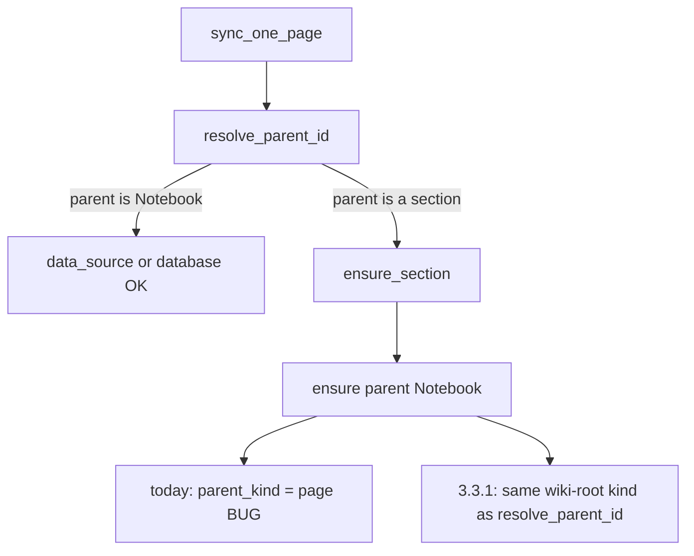

# 3.3.1：修复 Notebook 下新建 section 的 404

范围锁定为 [issue #74](https://github.com/virtualguard101/mkdocs-note/issues/74) 的补丁发布。`pyproject.toml` 已是 `3.3.1`，不改版本号。不混入 `todo.md` 里未完成的 CLI 功能（#33 / #34）。

## 问题

同步新 nav section（例如 `Notebook/音视频`）时，`ensure_section` 先正确把父节点 `Notebook` 解析成 wiki 根（`state.root_page_id` = database ID），但随后无条件设 `parent_kind = "page"`，于是 `create_page` 发出 `{"parent": {"page_id": "<database_id>"}}`，Notion 返回 `404 object_not_found`。

内容页走 [`resolve_parent_id`](src/mkdocs_note/utils/notion/sync.py) 已对 Notebook 做了 `data_source` / `database` 特例，所以已有页面能更新；**只有新建 section** 会炸。



出错位置（当前逻辑）：

```683:690:src/mkdocs_note/utils/notion/sync.py
	if item.parent_key:
		parent_id = ensure_section(...)
		parent_kind = "page"
	else:
		parent_id = state.data_source_id or state.root_page_id
		parent_kind = "data_source" if state.data_source_id else "database"
```

## 推荐实现（确认本计划即视为同意）

抽出两个私有辅助函数，让 `ensure_section` 与 `resolve_parent_id` 共用，避免再次分叉（这正是本次 bug 的成因）：

- `_wiki_root_parent(state) -> (parent_id, kind)`：`data_source_id or root_page_id`，kind 为 `data_source` 或 `database`
- `_is_wiki_root(item, state, page_id)`：`title == "Notebook"` 且无 `parent_key`，**或** `page_id == state.root_page_id`

`ensure_section` 在递归拿到父 id 后：若父是 wiki 根，改用 `_wiki_root_parent`；否则仍用 `parent_kind = "page"`。无 `parent_key` 的顶层 section（如 `Projects`）继续走 wiki 根，行为不变。

只改 [`src/mkdocs_note/utils/notion/sync.py`](src/mkdocs_note/utils/notion/sync.py)。[`create_page`](src/mkdocs_note/utils/notion/client.py) 已支持三种 parent kind，无需改 API。

若你更想「只在 `ensure_section` 里打补丁、不抽函数」，在确认计划时说一声即可。

## 测试

新增 [`tests/test_notion_sync_sections.py`](tests/test_notion_sync_sections.py)，mock `create_page`，不打真实 Notion：

- Notebook 下新建 section：`parent_kind="data_source"`，`parent_id=data_source_id`（不是 database ID）
- 该 section 下再建子 section：`parent_kind="page"`，parent 为上一层真实 page id
- 顶层无父 section（`Projects`）：仍走 wiki 根
- `resolve_parent_id` 对 Notebook 子内容页保持 `data_source`（防回归）

沿用现有 unittest + `sys.path` 写法（见 [`tests/test_notion_checkpoint.py`](tests/test_notion_checkpoint.py)）。用 `uv run pytest tests/test_notion_sync_sections.py tests/test_notion_checkpoint.py` 验证。

## 文档

- [`docs/about/changelog.md`](docs/about/changelog.md)：新增 `## 3.3.1 - 2026-09-07`，`### Fixed` 写清 #74
- [`docs/contributing/todo.md`](docs/contributing/todo.md)：Bug Fixes 记 #74 已修
- 用户手册 [`docs/usage/notion-sync.md`](docs/usage/notion-sync.md) 不写内部 parent kind；架构无 API/依赖变化，[`docs/contributing/architecture.md`](docs/contributing/architecture.md) 不改

## 验收对照 issue

- 新建 `Notebook` 下 section 不再 404
- 顶层 nav section（如 `Projects`）行为不变
- 有覆盖 `ensure_section` + Notebook 父节点的回归测试
