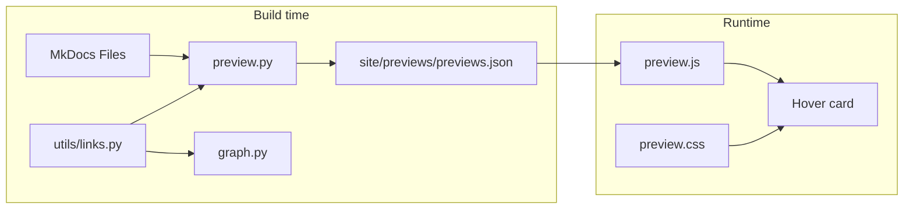

# 3.4.0 Same-site Link Hover Preview

Based on [issue #82](https://github.com/virtualguard101/mkdocs-note/issues/82). Decisions locked: **full Phase 1–4**, **independent `preview.py` + shared `utils/links.py`**, **strict `enabled` gating**, default **`scope: linked_only`**.

Version is already `3.4.0` in [`pyproject.toml`](pyproject.toml); changelog entry will be added on ship.

## Architecture



Mirror the graph feature shape, but gate assets/injection/JSON on `preview_config.enabled` (unlike current graph, which always injects).

## Config

Add to [`src/mkdocs_note/config.py`](src/mkdocs_note/config.py):

```yaml
preview_config:
  enabled: false          # default off — full no-op
  mode: summary           # summary | excerpt
  delay_ms: 300
  max_chars: 200
  include_fragments: true
  mobile: false
  scope: linked_only      # linked_only | all
```

Frontmatter (supported in Phase 1–4 as data is available): `preview: false` skips a page; `description` / `summary` preferred for abstract; optional `preview_image` in Phase 4.

## Shared link util (Decision 2A)

Extract from [`graph.py`](src/mkdocs_note/graph.py) into [`src/mkdocs_note/utils/links.py`](src/mkdocs_note/utils/links.py):

- `LINK_PATTERN`
- `unescape_url`
- `normalize_link(match) -> str | None` (path only; drop query/fragment for edge identity)
- Helpers to resolve relative `.md` / wiki links against a source page, and map to MkDocs page `url`

Refactor `Graph._normalize_link` / `_unescape_url` / `_find_links` to call the util (behavior-preserving). Preview uses the same dialect for target keys in JSON.

## Module layout

| Path | Role |
|------|------|
| `src/mkdocs_note/preview.py` | Build `previews.json`, asset register/copy/inject (gated) |
| `src/mkdocs_note/static/preview.js` | Hover/focus card, fetch JSON, LRU, Esc |
| `src/mkdocs_note/static/preview.css` | Card layout; Material CSS variables |
| `src/mkdocs_note/utils/links.py` | Shared URL normalize |
| Wire in [`plugin.py`](src/mkdocs_note/plugin.py) | Hooks only when `preview_config.enabled` |

Artifact: `{site_dir}/previews/previews.json` keyed by normalized page URL (and fragment keys when `include_fragments`).

---

## Phase 1 — MVP (summary)

**Build**

- Scan documentation pages under plugin scope; for `scope: linked_only`, only pages that appear as markdown/wiki link targets (reuse link scan via `utils/links.py`).
- Per page: `title` + `summary` where summary priority is frontmatter `description` → `summary` → first prose paragraph (strip markdown, truncate to `max_chars`).
- Honor `preview: false` / missing publish as needed consistently with existing note rules.
- Write `previews.json`: `{ "<url>": { "title", "summary" } }`.

**Runtime**

- Bind hover + keyboard focus on `article a[href]` same-site links only (exclude nav/toc/footer/external).
- Delay `delay_ms`; dismiss on pointer leave; `Esc` closes.
- Theme via Material variables (light/dark).
- `mobile: false` → do not attach touch handlers.

**Plugin hooks (gated)**

- `on_config`: register `extra_javascript` / `extra_css` only if enabled
- `on_post_page`: inject `window.preview_options` only if enabled
- `on_post_build`: build JSON + copy `preview.js`/`preview.css` only if enabled

**Docs / tests**

- Usage guide + config table; coexistence note with [Material Instant Previews](https://squidfunk.github.io/mkdocs-material/setup/setting-up-navigation/#instant-previews) (document: prefer one; avoid double popovers).
- Tests: link normalize, summary extraction, config defaults, disabled no-op.

---

## Phase 2 — Fragment-aware excerpt

- When `mode: excerpt` and link has `#heading-id`, store/lookup section payload: title + leading blocks under that heading.
- Align heading IDs with site slugify (pymdownx / Material case rules used by this project).
- Payload: plain text + fenced code as text (no syntax highlight yet).
- Page-level fallback to summary when fragment missing.
- Config: `include_fragments` gates whether fragment keys are emitted.

---

## Phase 3 — Rich excerpt

- Emit limited sanitized HTML snippet (`h1–h6`, `p`, `code`/`pre` only); height-capped scroll in CSS.
- No scripts; rewrite relative asset URLs with `site_url` / `base_path`.
- Style isolation via strict class prefix (e.g. `mkdocs-note-preview__*`); Shadow DOM only if class prefix proves insufficient after implementation.

---

## Phase 4 — Polish

- In-memory LRU + `AbortController` for JSON/neighbor fetches.
- Optional prefetch of graph neighbors when both graph and preview enabled (read edge list from existing `graph.json` or in-memory neighbor set passed via options — keep coupling soft: preview works without graph).
- `prefers-reduced-motion` (instant show / no fade).
- Touch strategy when `mobile: true` (long-press or first-tap preview, second tap navigate — document clearly).
- Optional `preview_image` from frontmatter in the card header.
- Optional: graph node interaction can open the same preview card using shared payload (if cheap; otherwise document as follow-up).

---

## Documentation & release checklist

Update when architecture/hooks change:

- [`docs/contributing/architecture.md`](docs/contributing/architecture.md) — module tree, hook flow, mermaid
- [`docs/usage/config.md`](docs/usage/config.md) + new `docs/usage/link-preview.md`
- [`docs/.nav.yml`](docs/.nav.yml), optional `docs/references/preview-api.md`
- [`docs/about/changelog.md`](docs/about/changelog.md) — `## 3.4.0` Added/Changed
- [`README.md`](README.md) Features bullet
- [`MANIFEST.in`](MANIFEST.in) already recursive-includes `static/*`

## Suggested implementation order

1. `utils/links.py` + graph refactor + tests  
2. Phase 1 end-to-end (config → JSON → JS/CSS → docs)  
3. Phase 2 fragment keys + excerpt mode  
4. Phase 3 rich HTML rendering  
5. Phase 4 polish + changelog / architecture diagrams  

## Out of scope (per issue)

- External OpenGraph / Discord-style cards  
- Requiring Material Instant Navigation  
- Full-page iframe as default UX  

## Acceptance (release bar)

1. `enabled: true` → internal note link hover shows title + summary (and excerpt/rich when configured).  
2. External / chrome links never preview.  
3. `enabled: false` (default) → no assets, no inject, no JSON.  
4. `scope: linked_only` keeps artifact size reasonable.  
5. Docs cover Material Instant Previews coexistence.  
6. Existing graph behavior unchanged after link util extract.
