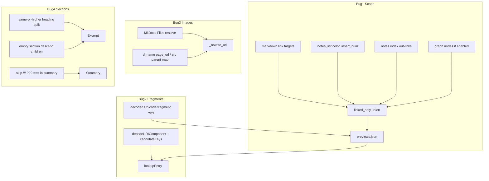

# 3.4.1 Link Preview Bugfixes (#84)

Based on [issue #84](https://github.com/virtualguard101/mkdocs-note/issues/84). Decisions locked:

| Bug | Choice |
|-----|--------|
| 1 scope / recent | **B** — expand `linked_only` |
| 2 CJK fragments | **C** — Unicode keys + decode at lookup |
| 3 image URLs | **C primary**, **B/A fallback** |
| 4 parent heading / `!!!` | **A+B+C** |

Version is already `3.4.1` in [`pyproject.toml`](pyproject.toml); add changelog Fixed section on ship.

---

## Bug 1 — Expand `linked_only` ([`preview.py`](src/mkdocs_note/preview.py), [`plugin.py`](src/mkdocs_note/plugin.py))

Today [`PreviewBuilder.__call__`](src/mkdocs_note/preview.py) only unions markdown/wiki **link targets**.

Change `scope: linked_only` target set to:

1. Existing link targets (unchanged)
2. **Recent notes**: pass `notes_list[:insert_num]` into `PreviewBuilder` when recent notes are enabled (reuse [`MkdocsNotePlugin.notes_list`](src/mkdocs_note/plugin.py))
3. **Notes index out-links**: if a notes index page exists under `notes_root`, scan it with `find_link_targets`
4. **Graph nodes** (soft): if `graph_config.enabled` and graph was built, union node `id`s that map to documentation files — keep coupling soft (preview still works without graph)

Keep `scope: all` as full documentation pages. Document the new `linked_only` meaning in [`docs/usage/link-preview.md`](docs/usage/link-preview.md) and config tables.

Tests: builder with mocked files where a page is only in “recent” set appears in JSON; pure orphans still excluded.

---

## Bug 2 — CJK fragment encoding ([`preview.py`](src/mkdocs_note/preview.py), [`preview.js`](src/mkdocs_note/static/preview.js), [`links.py`](src/mkdocs_note/utils/links.py))

**Build:** `_page_key` / fragment collection store **decoded Unicode** fragments (normalize with `urllib.parse.unquote` when raw link had `%XX`).

**Runtime:** in `normalizeLookupKey`, after reading `url.hash`, `decodeURIComponent` (try/catch) path + fragment before building the key. Extend `candidateKeys` to try both decoded and percent-encoded fragment variants so mixed JSON/href still resolve.

Tests: Python key for `#进程的内存映像`; JS-oriented fixture or pure function test documenting encode/decode pairs. Ensure English `#Stack-and-Heap` still works.

---

## Bug 3 — Image URL rewrite ([`preview.py`](src/mkdocs_note/preview.py))

Replace page-URL-only join in `_rewrite_url` / `_rewrite_html_urls` with:

1. **C (primary):** Given source `File` (abs/src path) + `Files`, resolve relative asset against the markdown file’s directory; if the dest exists in `Files` (or as a static file MkDocs knows), use that file’s `.url` (+ `site_base`). Absolute `http(s):` / `//` / `data:` unchanged (CDN-ready).
2. **B fallback:** If Files miss: for directory-style `page_url`, resolve relative to `dirname(page_url.rstrip('/')) + '/'`.
3. **A fallback:** Map source-parent-relative path into site layout when B still wrong / no Files hit.

Thread `File` / `Files` into `excerpt_html` / `_html` / `_rewrite_*` (PreviewBuilder already has `f` in `_add_page`).

Tests: co-located `assets/foo.png` next to `page.md` → URL under parent dir not under `page/`; absolute CDN URL untouched.

Docs: note that third-party/CDN images should use absolute URLs; preview will not invent site paths for them.

---

## Bug 4 — Section hierarchy + admonition summary ([`preview.py`](src/mkdocs_note/preview.py), optionally [`preview.js`](src/mkdocs_note/static/preview.js))

**A:** Change `_split_sections` so a heading’s body runs until the next heading of **same or higher** level (include nested `###` under `##`).

**B:** When building a fragment entry, if section markdown is blank/whitespace-only, **descend** into first nested child section with content (or concatenate nested content already included by A). Prefer not falling back to whole-page lead for fragment keys.

**C:** In `first_prose_paragraph` / summary extraction, skip lines/blocks starting with `!!!`, `???`, `===` (and continuation indented admonition bodies) so page `summary` is not `!!! abstract`.

Optional small UX: if after A+B both `html` and `excerpt` are empty, omit misleading summary in card body (thin guard; not the main fix).

Tests: `## Parent` + only `### Child` content → parent fragment has child text; page lead starting with `!!! abstract` does not become summary; leaf `#Double-Pointers`-style sections unchanged.

---

## Docs / release

- [`docs/about/changelog.md`](docs/about/changelog.md): `## 3.4.1` **Fixed** bullets citing #84
- [`docs/usage/link-preview.md`](docs/usage/link-preview.md) + [`docs/usage/config.md`](docs/usage/config.md): `linked_only` semantics, fragment encoding, image/CDN note
- Touch [`docs/contributing/architecture.md`](docs/contributing/architecture.md) only if PreviewBuilder inputs/hooks change materially (recent list / Files rewrite)

## Suggested order

1. Bug 4 A+C (pure text/split, unblocks better fixtures) then B  
2. Bug 2 (JS + key normalize)  
3. Bug 3 (rewrite + Files plumbing)  
4. Bug 1 (scope union + plugin wiring + docs)  
5. Changelog / usage docs + full test run (`just check`, `uv run python -m unittest`)

## Out of scope (per #84)

- Double scrollbars / card overflow CSS polish  
- Empty recent-notes link titles (`note_title`)  
- Material Instant Previews coexistence changes  
- Full CDN migration tooling
