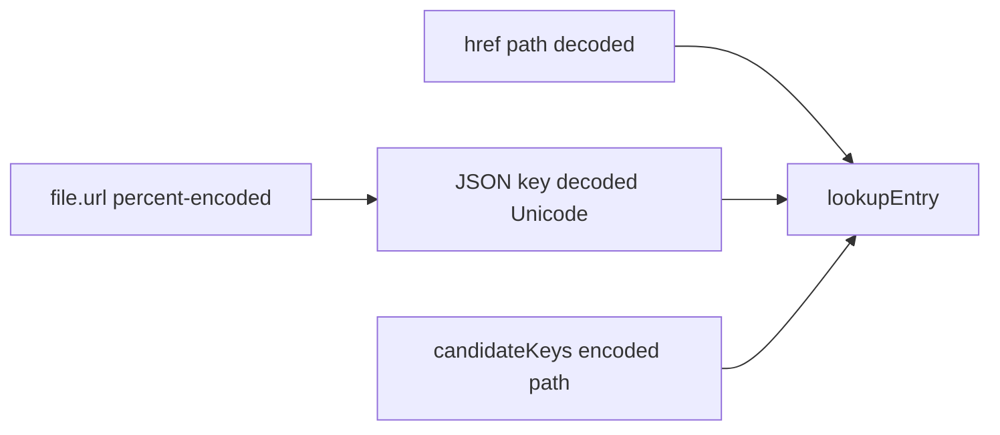

# 3.4.2 Preview Path Encoding Fix (#84 regression)

Based on the [latest comment on #84](https://github.com/virtualguard101/mkdocs-note/issues/84): after 3.4.1, runtime always **decodes** the path, while `previews.json` keys still use MkDocs **percent-encoded** `file.url`. Fragment encode/decode variants work; **path-side is asymmetric**, so any page under CJK dirs misses lookup and the card never shows.

[`pyproject.toml`](pyproject.toml) is already `3.4.2`. Ship as a **Fixed** patch for that version.

**Locked approach (both ends — same dialect as Bug 2’s Unicode keys):**

1. **Build-time:** decode path segments when writing JSON keys  
2. **Runtime:** keep decode for the primary key; also try percent-encoded path forms in `candidateKeys` (covers leftover encoded JSON / mixed hosts)

---

## 1. Build — decode page URL keys

In [`src/mkdocs_note/preview.py`](src/mkdocs_note/preview.py):

- Extend or reuse `decode_fragment`-style `unquote` for the **path** inside `_normalize_page_url` (e.g. `unquote` the stripped URL before trailing-slash rules).
- Result: keys like `obsidian/编程语言/c/C-Generics-and-Function-Pointers/` instead of `obsidian/%E7%BC%96.../`.
- Fragments already go through `decode_fragment`; leave that as-is.
- Keep homepage normalization (`""` / `.` / `./`).

Do **not** change how relative image rewriting uses raw `file.url` / Files API (Bug 3 paths stay separate).

---

## 2. Runtime — path encode variants in `candidateKeys`

In [`src/mkdocs_note/static/preview.js`](src/mkdocs_note/static/preview.js):

- Keep `normalizeLookupKey` decoding path + fragment (primary key stays Unicode).
- Add `encodePathSegments(path)`: split on `/`, `encodeURIComponent` each segment (preserve trailing `/`), so lookup can hit **old** 3.4.1 JSON that still has encoded paths.
- In `candidateKeys`, for non-empty pages, add both decoded and encoded forms (with/without trailing slash), parallel to `fragmentVariants`.
- Do not encode the whole path in one shot (would encode `/`).

---

## 3. Tests

In [`tests/test_preview.py`](tests/test_preview.py):

- `_normalize_page_url` / `_page_key` with percent-encoded CJK directory → decoded Unicode key.
- ASCII-only paths unchanged (`usage/config/`).
- Document encode/decode pair in a small pure helper test or comment mirroring the Node repro from the issue comment.

Optional light JS note in docs only if needed; no separate JS test harness required if Python key + documented candidate algorithm are clear.

---

## 4. Docs / release

- [`docs/about/changelog.md`](docs/about/changelog.md): add `## 3.4.2` **Fixed** — preview lookup under non-ASCII paths (#84 regression after 3.4.1).
- Brief note in [`docs/usage/link-preview.md`](docs/usage/link-preview.md): JSON keys use decoded Unicode for both path and fragment; runtime tries encoded variants.
- Touch architecture only if key-normalization wording is already there and now misleading.

Verify: `just check`, `just test` / `uv run python -m unittest`.

---

## Out of scope

- Reopening Bugs 1/3/4 behavior (already in 3.4.1).
- Card CSS / empty recent-notes titles / Material Instant Previews.
