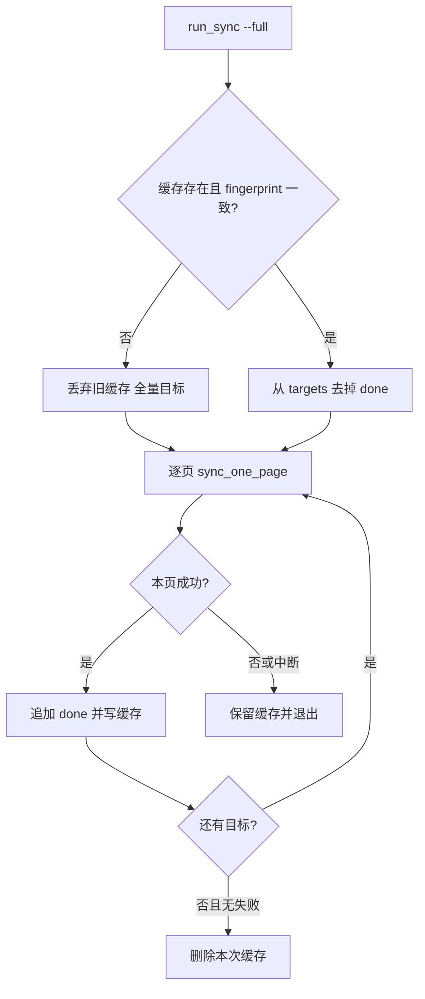

# 3.3.0 Notion 同步：站点图 URL 与断点续传

## 背景（现有行为）

- 本地图默认走占位 + File Upload + image block；`--no-images` 时 [`convert_images`](src/mkdocs_note/utils/notion/convert.py) 已回退到 [`resolve_image_url`](src/mkdocs_note/utils/notion/convert.py)（`site_url` + docs 相对路径）。
- [`run_sync`](src/mkdocs_note/utils/notion/sync.py) 对 `--full` 会重写全部目标页；中断后重跑会从头再 PATCH。`.notion_sync_state.json` 只存页面 id 映射，**不是本次任务进度**。

本版不改变「`--full` = 全量重写」的语义，只跳过**同一次被中断任务里已经成功写完的页**。

## 复用（不平行再实现）

- **站点 URL**：继续用 [`resolve_image_url`](src/mkdocs_note/utils/notion/convert.py) / [`convert_images`](src/mkdocs_note/utils/notion/convert.py)。`site` 模式即 `upload_local=None`（与今日 `--no-images` 走的分支相同）；`upload` 模式仍走现有占位 + [`attach_placeholder_images`](src/mkdocs_note/utils/notion/client.py)。
- **配置组装**：沿用 [`build_sync_options_from_config`](src/mkdocs_note/cli.py) 与 [`SyncOptions`](src/mkdocs_note/utils/notion/sync.py)，只加字段、去掉 `no_images`。
- **进度落盘**：checkpoint 的读写风格对齐现有 [`load_state` / `save_state`](src/mkdocs_note/utils/notion/sync.py)（小 JSON、成功一页就写），不另做存储层；与 `.notion_sync_state.json` **职责分开**（映射 vs 本次 full 进度）。

## 1. 本地图策略：upload vs site

新增配置（默认 **upload**，保持 3.2.0 行为）：

```yaml
plugins:
  - mkdocs-note:
      notion_sync:
        local_images: upload   # 或 site
```

站点 URL 拼接已有：`docs/assets/1.jpg` + [`mkdocs.yml` `site_url`](mkdocs.yml) → `https://virtualguard101.github.io/mkdocs-note/assets/1.jpg`（`docs_dir` 相对路径，与 MkDocs 把 `docs/` 拷到 `site/` 一致）。

规则：

- `upload`：现有占位上传；无本地文件则仍拼站点 URL。
- `site`：不上传；一律 `resolve_image_url`。`site_url` 为空则报错退出（提示配 `notion_sync.site_url` 或顶层 `site_url`）。
- CLI：仅 `--images upload|site` 覆盖配置（默认读 `notion_sync.local_images`）。

**删除 `--no-images`。** 它与 `local_images: site` / `--images site` 完全同义（原先就是关掉 `upload_local`、走站点 URL）。3.3.0 去掉该 flag，避免两套开关。changelog 记为 Removed；若用户仍传 `--no-images`，Click 会报未知选项——文档写明改用 `--images site`。

改动点：[`config.py`](src/mkdocs_note/config.py) 默认 dict；[`SyncOptions`](src/mkdocs_note/utils/notion/sync.py) 用 `local_images` 替换 `no_images`；[`cli.py`](src/mkdocs_note/cli.py) 去掉 `--no-images`（含 `ns` 别名命令）。转换层不新增算法。

## 2. `--full` 断点续传

采用 **页级 checkpoint**（比 rsync 内容哈希更贴合当前 `--full`：全量仍要写未完成页，不把「上次成功过」当成「这次可跳过」）。

缓存目录（类似 `.ruff_cache`，不要求用户改仓库 `.gitignore`）：

- 路径：`<project_root>/.cache/mkdocs-note/notion-sync.json`（可用 `NOTION_SYNC_CACHE` / `notion_sync.cache_dir` 覆盖）。
- 体积：仅 JSON（fingerprint + 已完成 `file_rel` 列表），无图片副本。
- **创建目录时一并写入** `.cache/mkdocs-note/.gitignore`，内容为通配排除（若已存在则不覆盖）：

```
*
!.gitignore
```

这样缓存内容默认不会被 git 跟踪；用户无需在项目根 `.gitignore` 里手动加条目。本插件仓库根 `.gitignore` 也不再为此要求用户操作（开发时若根目录已有 `tmp/` 等即可，不把「请自行 ignore」写进用户手册）。

```json
{
  "version": 1,
  "fingerprint": {
    "full": true,
    "sections": ["obsidian/"],
    "paths": [],
    "local_images": "upload",
    "docs_dir": "...",
    "database_id": "...",
    "data_source_id": "..."
  },
  "done": ["obsidian/Tools/Git.md"]
}
```

行为：



- 仅 **`--full` 或「无 git base → 当作 full」** 启用；增量 / `--paths` 不写此缓存（目标少，且 fingerprint 易变）。
- 每页成功后立刻落盘 `done`（已有 `save_state` 在 create 后写入；checkpoint 与之分离）。
- 正常跑完且 `failed == 0`：删除本次进度文件 `notion-sync.json`，**保留**目录内 `.gitignore`（避免空目录反复被 git 扫到临时文件）。`KeyboardInterrupt` / 非 `--continue-on-error` 的失败：保留进度文件。
- fingerprint 变化（换 section、换 `local_images`、换 wiki id）：视为新任务，丢弃旧进度。
- `--rebuild-state` 仍重建页面映射，但 **不** 清空 `done`（映射与进度分开）；需要强行从头全传时加 `--no-resume`（丢弃缓存）。
- `dry-run` 不读写此缓存。

不在本版做：页内图片块级续传（实现成本高；`site` 模式已能规避「一页很多图」的慢）。

## 3. 测试与文档

- 单测：`resolve_image_url` 在 `site` 模式下的拼接；fingerprint 匹配/不匹配时 skip；成功清空缓存；中断后重跑跳过 `done`。
- 文档：[`docs/usage/notion-sync.md`](docs/usage/notion-sync.md)、[`docs/usage/config.md`](docs/usage/config.md)、[`docs/usage/cli.md`](docs/usage/cli.md)；[`docs/about/changelog.md`](docs/about/changelog.md) 记 **3.3.0**（含 Removed `--no-images`）；架构若补缓存文件则改 [`docs/contributing/architecture.md`](docs/contributing/architecture.md)。
- [`pyproject.toml`](pyproject.toml) 版本 **3.3.0**。
- 单测覆盖：首次写入缓存时目录下出现带 `*` 的 `.gitignore`。

## 实施顺序

1. `local_images` 配置 + CLI `--images`；删除 `--no-images`；`site` 模式校验 `site_url`  
2. checkpoint 读写、fingerprint、`--full` 循环接入、`--no-resume`  
3. 测试 + changelog / 用户文档（缓存目录自带 `.gitignore`，不改用户仓库 ignore）
