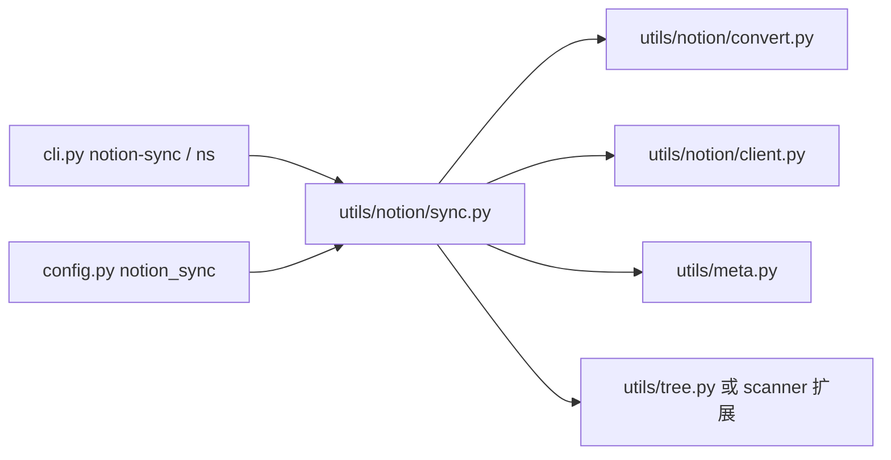

# Notion 同步适配到 mkdocs-note

## 已确认决策（全部）

| # | 决策 |
|---|------|
| 1 | **仅 CLI**：`mkdocs-note notion-sync` + 别名 **`ns`**；不挂 build 钩子 |
| 2 | 页面树：**优先 `.nav.yml`**；缺失则 **`notes_root` 层级扫描**；回退时 WARNING 建议 awesome-nav |
| 3 | 配置主要在 **`mkdocs.yml` → `notion_sync:`**；token 走 env / 本地文件（及可选 MCP） |
| 4 | Cursor MCP 读 token：**默认关**，`allow_cursor_mcp_token` 启用；启用成功取 token 时 WARNING（可用 `silence_mcp_token_warning` 关闭）；**用户手册不写**，开发者/API 可写 |
| 5 | **A′**：共享内核（meta + 目录树）+ Notion 三层 **`convert` / `client` / `sync`** |
| 6 | 根目录 `notion_sync.py` / `NOTION.md` **暂留对照**，文档合入后再删 |
| 复用 | 扩展现有 `meta` / 树构建，禁止平行再实现 frontmatter/扫描 |

---

## 目标结构（A′）



### 共享内核

- **[`utils/meta.py`](src/mkdocs_note/utils/meta.py)**：增加面向 `Path`/`str` 的 frontmatter 解析与 `extract_tags`；保留现有 MkDocs `File` API；Notion convert 调用共享实现。
- **目录→层级树**（新建 `utils/tree.py` 或扩展 scanner）：产出与 `.nav.yml` 解析相同形状的节点（目录→section，`.md`/`.ipynb`→页，跳过 `index.md`）；供 Notion 回退与未来 CLI 复用。

### Notion 包（三层）

| 文件 | 职责 |
|------|------|
| [`utils/notion/convert.py`](src/mkdocs_note/utils/notion/convert.py) | Markdown / ipynb → Notion Enhanced Markdown（纯转换，无网络） |
| [`utils/notion/client.py`](src/mkdocs_note/utils/notion/client.py) | Notion HTTP：建页、markdown PATCH、tags schema、图片 upload/block、重试 |
| [`utils/notion/sync.py`](src/mkdocs_note/utils/notion/sync.py) | 编排：token、`.nav.yml`/树回退、git diff、state、`ensure_section`、`sync_one_page`、`run_sync` |
| [`utils/notion/__init__.py`](src/mkdocs_note/utils/notion/__init__.py) | 导出 `run_sync` |

日后若 convert/client 膨胀或出现第二种变更检测，再从 `sync.py` 拆出 `nav` / `git_diff`。

代码风格：tab 缩进、type hints、docstring；YAML 用 PyYAML。

---

## 配置

```yaml
plugins:
  - mkdocs-note:
      notes_root: docs
      notion_sync:
        docs_dir: docs
        nav_file: docs/.nav.yml
        database_id: ""
        data_source_id: ""
        title_property: "页面"
        tags_property: "标签"
        site_url: ""
        state_path: ".notion_sync_state.json"
        delay: 0.35
        allow_cursor_mcp_token: false
        silence_mcp_token_warning: false
```

- `database_id` / `data_source_id` / `site_url` **无硬编码默认**；可被 `NOTION_WIKI_DATABASE`、`NOTION_WIKI_DATA_SOURCE`、`NOTION_STATE_PATH` 等环境变量覆盖。
- CLI flag（`--full`、`--base`、`--paths`、`--section`、`--dry-run`、`--rebuild-state`、`--no-images`、`--token` 等）覆盖配置。

### MCP token 行为

1. 仅 `allow_cursor_mcp_token: true` 时解析链包含 `~/.cursor/mcp.json`。
2. 从 MCP 取到 token 时 WARNING：不建议使用，除非开发者成员或有特殊需求；并提示可用 `silence_mcp_token_warning: true` 关闭。
3. usage 文档不提；contributing / references 可提。

Token 链：`--token` → env → `.env` / `.notion_token` → `~/.config/notion/token` →（可选）Cursor mcp.json。

---

## CLI

```bash
mkdocs-note notion-sync [...]
mkdocs-note ns [...]
```

从项目根加载 `mkdocs.yml` 插件段；组装参数后调用 `run_sync`。

---

## 行为保留

git 增量、`--full`、本地删除不 prune Notion、`index.md` 不同步、标签 multi_select + schema 合并、本地图占位后 Blocks 上传、429 重试与 delay。

适配：路径与 Wiki ID 配置驱动；页面树双源；复用 meta/树。

---

## 测试与文档

- 单测：`meta` 共用 API；树构建（yml + notes_root）；`convert`；必要时 mock client 烟测。
- 文档：`docs/usage/notion-sync.md` + 更新 cli/config；architecture/changelog（建议 **3.2.0**）；`.nav.yml` 挂页。
- 用户手册不提 MCP；开发者/API 提及。
- 根目录参考文件按 6B **暂留**。

---

## 实施顺序

1. 扩展共享 `meta` + 目录层级树工具  
2. `notion_sync` 配置项 + CLI `notion-sync`/`ns` + `utils/notion` 三层骨架  
3. 迁入 convert → client → sync，打通 dry-run  
4. mkdocs.yml 加载、MCP 开关与警告、对照原脚本行为  
5. 测试 + 分层文档 + architecture/changelog；参考文件暂留  

---

## 风险与边界

- rebuild-state 同父同标题误匹配、tabs 近似等取舍原样保留并写入文档。  
- 本次仅让 notion-sync 正确读 `mkdocs.yml`，不顺便改造 `new`/`move` 的配置加载。  
- 全量 + 大量本地图仍慢；文档强调默认增量。
