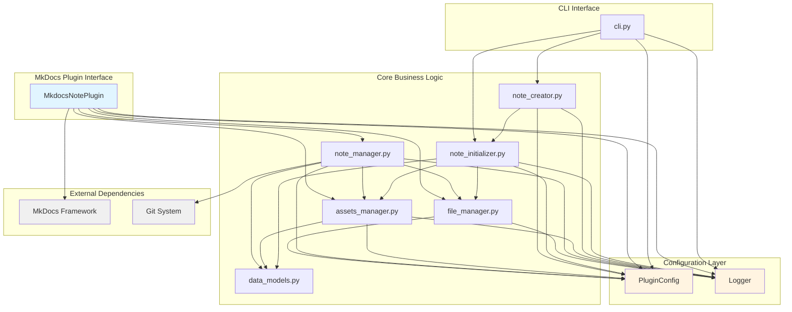
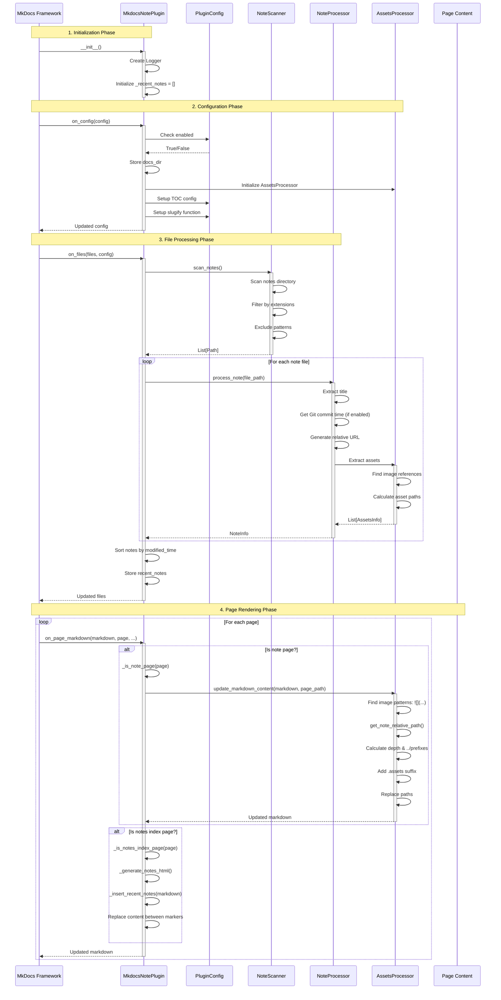
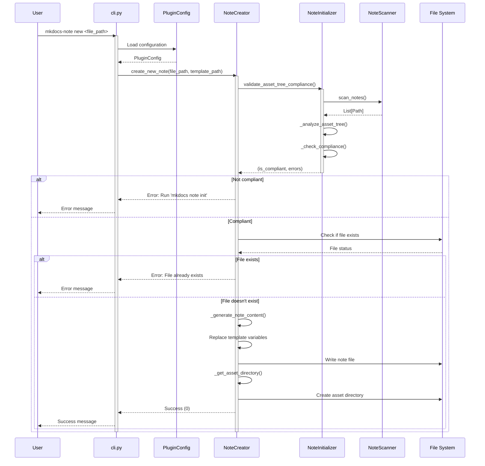
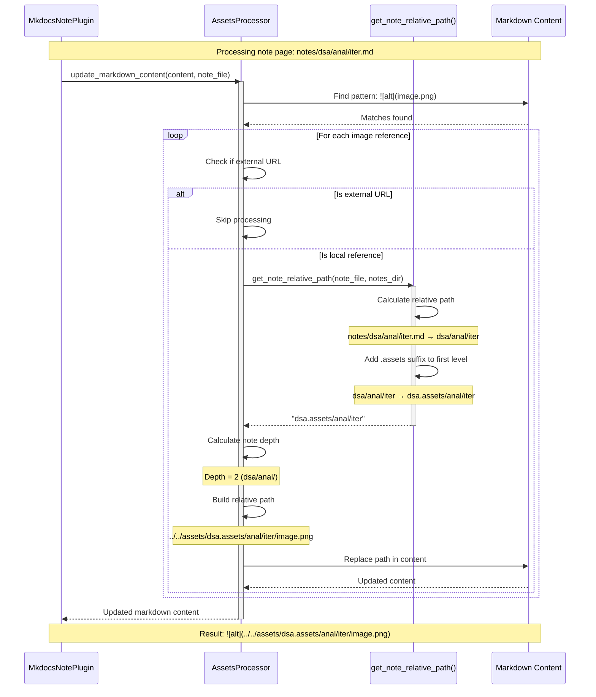

# Contributing to MkDocs-Note

<div align="center">
  <a href="CONTRIBUTING.md">English</a> | <a href="CONTRIBUTING.zh-CN.md">简体中文</a>
</div>

First off, thank you for considering contributing to `MkDocs-Note`! It's people like you that make the open-source community such a great place.

## Project Architecture

This section provides an overview of the MkDocs-Note plugin's architecture and call flow to help contributors understand the codebase structure.

### Overall Architecture

The MkDocs-Note plugin follows a modular architecture with clear separation of concerns:

```
mkdocs_note/
├── __init__.py              # Package initialization
├── plugin.py                # Main MkDocs plugin entry point
├── config.py                # MkDocs configuration management
├── logger.py                # Logging utilities
├── cli.py                   # Command-line interface
└── core/                    # Core business logic
    ├── file_manager.py      # File scanning and validation
    ├── note_manager.py      # Note processing and management
    ├── note_creator.py      # Note creation with templates
    ├── note_initializer.py  # Directory structure initialization
    ├── assets_manager.py    # Assets management (NEW)
    └── data_models.py       # Data models and structures
```

### UML Diagrams

#### Component Dependency Diagram

This diagram shows how different modules depend on each other:



#### Class Diagram

This diagram shows the main classes and their relationships:

```mermaid
classDiagram
    class MkdocsNotePlugin {
        -logger: Logger
        -_recent_notes: List[NoteInfo]
        -_assets_processor: AssetsProcessor
        -_docs_dir: Path
        +on_config(config) MkDocsConfig
        +on_files(files, config) Files
        +on_page_markdown(markdown, page, config, files) str
        -_is_notes_index_page(page) bool
        -_is_note_page(page) bool
        -_insert_recent_notes(markdown) str
        -_process_page_assets(markdown, page) str
        -_generate_notes_html() str
    }
    
    class PluginConfig {
        +enabled: bool
        +notes_dir: Path
        +index_file: Path
        +max_notes: int
        +supported_extensions: Set[str]
        +exclude_patterns: Set[str]
        +exclude_dirs: Set[str]
        +assets_dir: Path
        +notes_template: str
        +use_git_timestamps: bool
        +timestamp_zone: str
        +cache_size: int
    }
    
    class Logger {
        +debug(msg)
        +info(msg)
        +warning(msg)
        +error(msg)
    }
    
    class NoteScanner {
        -config: PluginConfig
        -logger: Logger
        +scan_notes() List[Path]
        -_is_valid_note_file(file_path) bool
    }
    
    class AssetScanner {
        -config: PluginConfig
        -logger: Logger
        +scan_assets() List[Path]
        -_is_valid_asset_file(file_path) bool
    }
    
    class NoteProcessor {
        -config: PluginConfig
        -logger: Logger
        -assets_processor: AssetsProcessor
        -_timezone: timezone
        +process_note(file_path) NoteInfo
        -_extract_title(file_path) str
        -_extract_assets(file_path) List[AssetsInfo]
        -_generate_relative_url(file_path) str
        -_get_git_commit_time(file_path) float
        -_format_timestamp(timestamp) str
    }
    
    class CacheManager {
        -logger: Logger
        -_last_notes_hash: str
        -_last_content_hash: str
        +should_update_notes(notes) bool
        +should_update_content(content) bool
        -_calculate_notes_hash(notes) str
    }
    
    class IndexUpdater {
        -config: PluginConfig
        -logger: Logger
        +update_index(notes) bool
        -_generate_html_list(notes) str
        -_replace_section(content, new_section) str
    }
    
    class RecentNotesUpdater {
        -config: PluginConfig
        -logger: Logger
        -file_scanner: NoteScanner
        -note_processor: NoteProcessor
        -cache_manager: CacheManager
        -index_updater: IndexUpdater
        +update() bool
    }
    
    class AssetsCatalogTree {
        -_root: Path
        -_notes_dir: Path
        -_catalog: Dict[str, List[AssetsInfo]]
        +add_node(note_relative_path, assets_list)
        +get_assets(note_relative_path) List[AssetsInfo]
        +get_all_assets() Dict
        +get_asset_dir_for_note(note_file) Path
    }
    
    class AssetsManager {
        -config: PluginConfig
        -logger: Logger
        -catalog_tree: AssetsCatalogTree
        +catalog_generator(assets_list, note_info) str
        +catalog_updater(catalog) bool
    }
    
    class AssetsProcessor {
        -config: PluginConfig
        -logger: Logger
        -image_pattern: Pattern
        +process_assets(note_info) List[AssetsInfo]
        +update_markdown_content(content, note_file) str
        -_process_image_reference(image_path, note_file, index) AssetsInfo
    }
    
    class NoteCreator {
        -config: PluginConfig
        -logger: Logger
        -initializer: NoteInitializer
        -_timezone: timezone
        +create_new_note(file_path, template_path) int
        +validate_note_creation(file_path) Tuple
        -_generate_note_content(file_path, template_path) str
        -_create_asset_directory(note_file_path)
        -_get_asset_directory(note_file_path) Path
    }
    
    class NoteInitializer {
        -config: PluginConfig
        -logger: Logger
        -file_scanner: NoteScanner
        +initialize_note_directory(notes_dir) int
        +validate_asset_tree_compliance(notes_dir) Tuple
        -_create_basic_structure(notes_dir)
        -_analyze_asset_tree(notes_dir, note_files) List[AssetTreeInfo]
        -_fix_asset_tree(notes_dir, non_compliant)
        -_check_compliance(asset_dir, expected_structure) bool
    }
    
    class NoteInfo {
        +file_path: Path
        +title: str
        +relative_url: str
        +modified_date: str
        +file_size: int
        +modified_time: float
        +assets_list: List[AssetsInfo]
    }
    
    class AssetsInfo {
        +file_path: Path
        +file_name: str
        +relative_path: str
        +index_in_list: int
        +exists: bool
    }
    
    class AssetTreeInfo {
        +note_name: str
        +asset_dir: Path
        +expected_structure: List[Path]
        +actual_structure: List[Path]
        +is_compliant: bool
        +missing_dirs: List[Path]
        +extra_dirs: List[Path]
    }
    
    %% Relationships
    MkdocsNotePlugin --> PluginConfig
    MkdocsNotePlugin --> Logger
    MkdocsNotePlugin --> NoteScanner
    MkdocsNotePlugin --> NoteProcessor
    MkdocsNotePlugin --> AssetsProcessor
    MkdocsNotePlugin --> NoteInfo
    
    NoteScanner --> PluginConfig
    NoteScanner --> Logger
    
    AssetScanner --> PluginConfig
    AssetScanner --> Logger
    
    NoteProcessor --> PluginConfig
    NoteProcessor --> Logger
    NoteProcessor --> AssetsProcessor
    NoteProcessor --> NoteInfo
    NoteProcessor --> AssetsInfo
    
    RecentNotesUpdater --> PluginConfig
    RecentNotesUpdater --> Logger
    RecentNotesUpdater --> NoteScanner
    RecentNotesUpdater --> NoteProcessor
    RecentNotesUpdater --> CacheManager
    RecentNotesUpdater --> IndexUpdater
    
    CacheManager --> Logger
    CacheManager --> NoteInfo
    
    IndexUpdater --> PluginConfig
    IndexUpdater --> Logger
    IndexUpdater --> NoteInfo
    
    AssetsManager --> PluginConfig
    AssetsManager --> Logger
    AssetsManager --> AssetsCatalogTree
    AssetsManager --> AssetsInfo
    AssetsManager --> NoteInfo
    
    AssetsCatalogTree --> AssetsInfo
    
    AssetsProcessor --> PluginConfig
    AssetsProcessor --> Logger
    AssetsProcessor --> NoteInfo
    AssetsProcessor --> AssetsInfo
    
    NoteCreator --> PluginConfig
    NoteCreator --> Logger
    NoteCreator --> NoteInitializer
    
    NoteInitializer --> PluginConfig
    NoteInitializer --> Logger
    NoteInitializer --> NoteScanner
    NoteInitializer --> AssetTreeInfo
```



### Core Components

#### 1. Plugin Entry Point (`plugin.py`)

The `MkdocsNotePlugin` class is the main entry point that integrates with MkDocs:

- **Inherits from**: `BasePlugin[PluginConfig]`

- **Key Methods**:

  - `on_config()`: Configures MkDocs settings (TOC, slugify functions, assets processor)

  - `on_files()`: Scans and processes note files

  - `on_page_markdown()`: Inserts recent notes into index pages and processes asset paths

  - `_is_note_page()`: Identifies note pages for asset processing

  - `_process_page_assets()`: Converts relative asset paths to correct references

#### 2. Configuration Management (`config.py`)

The `PluginConfig` class manages all plugin settings:

- **Configuration Options**:

  - `enabled`: Enable/disable plugin

  - `notes_dir`: Directory containing notes

  - `index_file`: Target index file for recent notes

  - `max_notes`: Maximum number of recent notes to display

  - `supported_extensions`: File types to include (`.md`, `.ipynb`)

  - `exclude_patterns`: Files to exclude from processing

  - `exclude_dirs`: Directories to skip during scanning

  - `assets_dir`: Directory for storing note assets

  - `notes_template`: Template file for new notes

#### 3. File Management (`core/file_manager.py`)

The `FileScanner` class handles file discovery and validation:

- **Responsibilities**:

  - Recursively scan notes directory

  - Filter files by extension and patterns

  - Exclude specified directories and files

  - Return list of valid note files

#### 4. Note Processing (`core/note_manager.py`)

Multiple classes handle note processing and management:

- **`NoteInfo`**: Data class storing note metadata

- **`NoteProcessor`**: Extracts title and metadata from files

- **`CacheManager`**: Manages caching to avoid unnecessary updates

- **`IndexUpdater`**: Updates index files with recent notes

- **`RecentNotesUpdater`**: Main orchestrator class

#### 5. Assets Management (`core/assets_manager.py`) **NEW**

The assets management system uses a tree-based structure to organize note assets:

- **`AssetsCatalogTree`**: Manages assets using hierarchical path structure
  
  - Prevents conflicts between notes with the same name in different directories
  
  - Uses `.assets` suffix for first-level subdirectories (e.g., `dsa.assets/`, `language.assets/`)
  
  - Maps note relative paths to asset directories

- **`AssetsManager`**: Coordinates asset catalog operations
  
  - Generates asset catalogs for notes
  
  - Updates asset information

- **`AssetsProcessor`**: Processes asset references in markdown files
  
  - Detects image references in markdown content
  
  - Converts relative paths to correct asset paths based on note location
  
  - Calculates proper `../` prefixes based on note depth

- **`get_note_relative_path()`**: Utility function for path calculation
  
  - Computes note's relative path from notes directory
  
  - Adds `.assets` suffix to first-level subdirectories
  
  - Handles edge cases (root-level notes, deeply nested notes)

**Asset Structure Example**:
```
notes/
├── dsa/
│   ├── anal/
│   │   └── iter.md          → assets/dsa.assets/anal/iter/
│   └── ds/
│       └── intro.md         → assets/dsa.assets/ds/intro/
├── language/
│   ├── python/
│   │   └── intro.md         → assets/language.assets/python/intro/
│   └── cpp/
│       └── intro.md         → assets/language.assets/cpp/intro/
└── quickstart.md            → assets/quickstart/
```

**Path Conversion**:
- Note at `notes/dsa/anal/iter.md` with ``
- Converted to ``
- MkDocs resolves the path correctly relative to the note file

#### 6. Note Creation (`core/note_creator.py`)

The `NoteCreator` class handles creating new notes with proper asset structure:

- Creates note files from templates with variable substitution

- Automatically creates corresponding asset directories

- Validates directory structure compliance

- Supports custom templates

#### 7. Directory Initialization (`core/note_initializer.py`)

The `NoteInitializer` class manages directory structure:

- Initializes notes directory with proper structure

- Validates asset tree compliance

- Fixes non-compliant structures

- Creates necessary directories and index files

#### 8. Logging (`logger.py`)

The `Logger` class provides colored console logging:

- Uses `colorlog` for enhanced console output

- Supports different log levels (DEBUG, INFO, WARNING, ERROR)

- Configurable log formatting

### Call Flow

The plugin execution follows this sequence:

1. **Initialization** (`__init__`)

   - Plugin instance created

   - Logger initialized

   - Recent notes list initialized

2. **Configuration Phase** (`on_config`)

   - Plugin enabled/disabled check

   - Store `docs_dir` for path resolution

   - Initialize `AssetsProcessor` instance

   - MkDocs TOC configuration setup
   
   - Slugify function configuration (pymdownx or fallback)

3. **File Processing Phase** (`on_files`)

   - FileScanner scans notes directory

   - NoteProcessor extracts metadata from each file

   - Notes sorted by modification time

   - Recent notes list populated

4. **Page Rendering Phase** (`on_page_markdown`)

   - Check if current page is a note page
   
   - If it's a note page: Process asset paths in markdown content
     
     - Identify image references
     
     - Calculate note's relative path from notes directory
     
     - Convert relative asset references to correct paths
     
     - Add `.assets` suffix to first-level directories
     
     - Calculate proper `../` prefixes based on note depth
   
   - Check if current page is the notes index page

   - If it's the index page: Insert recent notes HTML between markers

   - Return modified markdown content

#### Sequence Diagram: Plugin Build Process

This diagram shows the complete execution flow during MkDocs build:



#### Sequence Diagram: Note Creation Process (CLI)

This diagram shows the CLI workflow for creating new notes:



#### Sequence Diagram: Asset Path Processing

This diagram shows how asset paths are processed during page rendering:



### Data Flow

The plugin provides two main features with distinct data flows:

#### Feature 1: Recent Notes Display

```
Notes Directory
    ↓ (NoteScanner)
Valid Note Files
    ↓ (NoteProcessor)
NoteInfo Objects (with assets_list)
    ↓ (Sort by modified_time)
Recent Notes List
    ↓ (HTML Generation)
Index Page Content
```

#### Feature 2: Assets Path Management

```
Note Markdown File
    ↓ (Page Rendering)
Detect Image References: 
    ↓ (get_note_relative_path)
Calculate Note's Relative Path: "dsa/anal/iter"
    ↓ (Add .assets suffix to first level)
Path with .assets: "dsa.assets/anal/iter"
    ↓ (Calculate depth and ../prefixes)
Determine Relative Path: "../../assets/dsa.assets/anal/iter/image.png"
    ↓ (update_markdown_content)
Updated Markdown: 
    ↓ (MkDocs Build)
Correctly Resolved Asset Path
```

### Key Design Patterns

1. **Plugin Pattern**: Integrates with MkDocs plugin system

2. **Strategy Pattern**: Different title extraction for different file types

3. **Template Method**: Consistent note processing workflow

4. **Observer Pattern**: MkDocs event-driven architecture

5. **Data Transfer Object**: NoteInfo for structured data passing

### Extension Points

The architecture supports several extension points:

1. **Custom File Types**: Add new file extensions in `supported_extensions`

2. **Title Extraction**: Extend `NoteProcessor` for new file formats

3. **Output Formatting**: Modify HTML generation in `_generate_notes_html()`

4. **Caching Strategy**: Implement custom caching in `CacheManager`

5. **Filtering Logic**: Customize file filtering in `FileScanner`

6. **Asset Path Calculation**: Extend `AssetsProcessor` for custom path schemes

7. **CLI Commands**: Add new commands in `cli.py`

### Asset Management Design

The asset management system follows these key principles:

1. **Tree-Based Structure**: Assets mirror the notes directory hierarchy
   
   - Prevents naming conflicts between notes in different directories
   
   - Example: `dsa/anal/intro.md` and `language/python/intro.md` can coexist

2. **First-Level Categorization**: Use `.assets` suffix for clarity
   
   - `dsa/` → `assets/dsa.assets/`
   
   - `language/` → `assets/language.assets/`
   
   - Makes asset categories easily identifiable

3. **Relative Path Conversion**: Paths are relative to note file location
   
   - Calculated based on note depth in directory structure
   
   - Ensures MkDocs can correctly resolve asset references
   
   - Example: 2 levels deep → `../../assets/category.assets/path/`

4. **Automatic Processing**: Markdown image references are automatically converted
   
   - Plugin processes all note pages during build
   
   - Original markdown files remain unchanged
   
   - Conversion happens in-memory during MkDocs build

### Testing Strategy

The project includes comprehensive unit tests:

- **Plugin Tests**: Test main plugin functionality

- **Core Tests**: Test individual components

- **Integration Tests**: Test component interactions

- **Mock Usage**: Extensive use of mocks for isolation

### Performance Considerations

1. **File Scanning**: Only scans when necessary

2. **Caching**: Avoids redundant processing

3. **Lazy Loading**: Components initialized on demand

4. **Memory Management**: Efficient data structures for note storage


## How Can I Contribute?

There are many ways to contribute, from writing documentation and tutorials to reporting bugs and submitting code changes.

### Reporting Bugs

If you find a bug, please open an issue and provide the following information:

- A clear and descriptive title.

- A detailed description of the problem, including steps to reproduce it.

- Your `MkDocs` configuration (`mkdocs.yml`).

- Any relevant error messages or logs.

### Suggesting Enhancements

If you have an idea for a new feature or an improvement to an existing one, please open an issue to discuss it. This allows us to coordinate our efforts and avoid duplicating work.

## Development Setup

To get started with local development, follow these steps:

1.  **Fork and Clone the Repository**

    ```bash
    git clone https://github.com/YOUR_USERNAME/mkdocs-note.git
    cd mkdocs-note
    ```

2.  **Set Up the Environment**

    It's strongly recommended to use a virtual environment, and recommended to use [uv](https://docs.astral.sh/uv/) to manage project configuration and virtual environment.

    ```bash
    uv init
    ```

3.  **Install Dependencies**

    Install the project in editable mode along with the development dependencies.

    ```bash
    uv sync
    ```

4.  **Run Tests**

    To make sure everything is set up correctly, run the test suite:

    ```bash
    ./tests/test.sh
    ```

## Pull Request Process

1.  Ensure any new code is covered by tests.

2.  Update the documentation if you've added or changed any features.

3.  Make sure the test suite passes (`pytest`).

4.  Submit your pull request!

Thank you for your contribution!