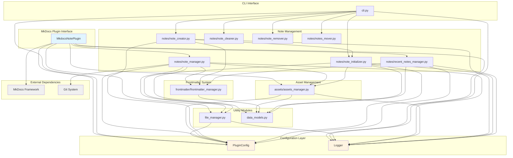
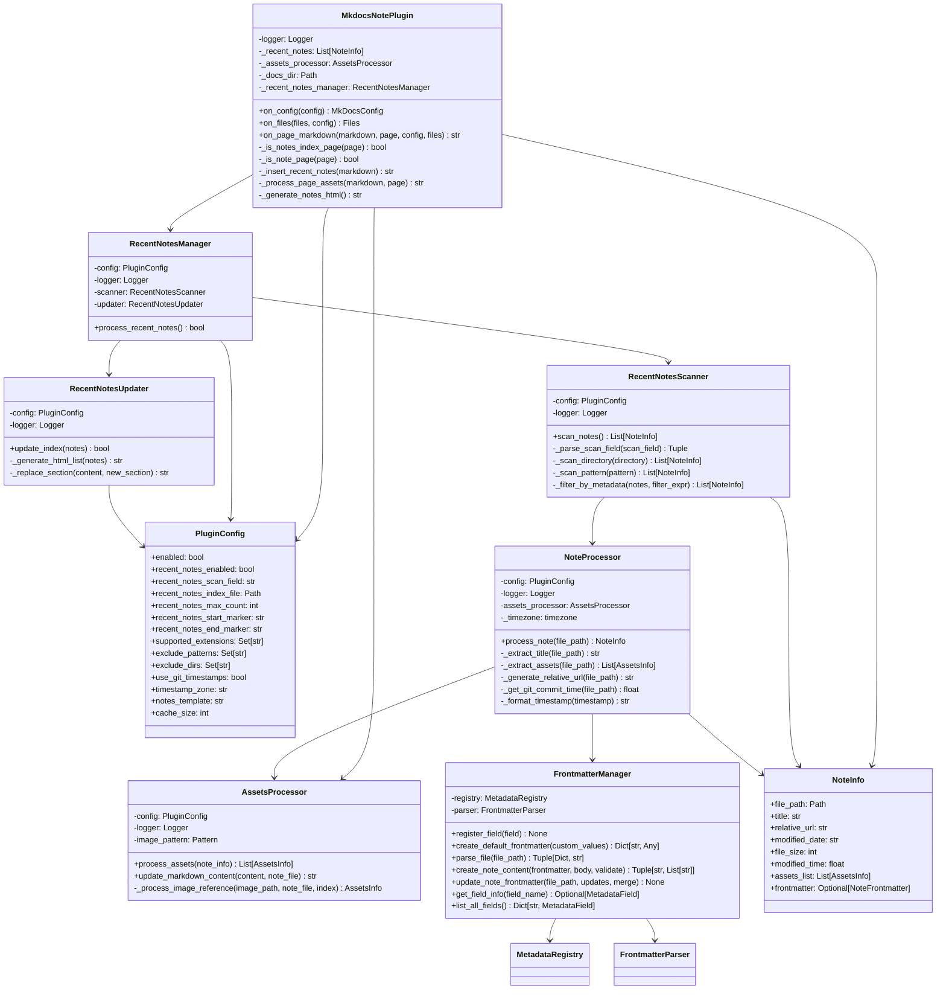
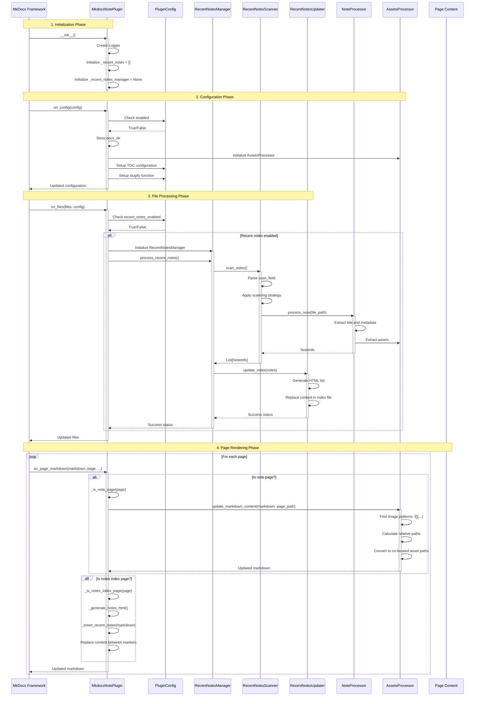

# Contributing to MkDocs-Note

<div align="center">
  <a href="CONTRIBUTING.md">English</a> | <a href="CONTRIBUTING.zh-CN.md">简体中文</a>
</div>

First off, thank you for considering contributing to `MkDocs-Note`! It's people like you that make the open-source community such a great place.

## Project Architecture

This section provides an overview of the MkDocs-Note plugin's architecture and call flow to help contributors understand the codebase structure.

### Overall Architecture

The MkDocs-Note plugin follows a modular architecture with clear separation of concerns:

```
mkdocs_note/
├── __init__.py              # Package initialization
├── plugin.py                # Main MkDocs plugin entry point
├── config.py                # MkDocs configuration management
├── logger.py                # Logging utilities
├── cli.py                   # Command-line interface
└── utils/                   # Utility modules (refactored from core/)
    ├── data_models.py       # Data models and structures
    ├── file_manager.py      # File scanning and validation
    ├── assets/              # Asset management modules
    │   └── assets_manager.py
    ├── frontmatter/         # Frontmatter metadata system
    │   └── frontmatter_manager.py
    └── notes/               # Note management modules
        ├── note_creator.py      # Note creation with templates
        ├── note_initializer.py  # Directory structure initialization
        ├── note_manager.py      # Note processing and management
        ├── note_cleaner.py      # Orphaned assets cleanup
        ├── note_remover.py      # Note removal operations
        ├── notes_mover.py       # Note movement and renaming
        └── recent_notes_manager.py  # Recent notes functionality (NEW)
```

### UML Diagrams

#### Component Dependency Diagram

This diagram shows how different modules depend on each other:


```mermaid
graph TB
    subgraph "MkDocs Plugin Interface"
        Plugin[MkdocsNotePlugin]
    end
    
    subgraph "Configuration Layer"
        Config[PluginConfig]
        Logger[Logger]
    end
    
    subgraph "Utility Modules"
        FileManager[file_manager.py]
        DataModels[data_models.py]
    end
    
    subgraph "Asset Management"
        AssetsManager[assets/assets_manager.py]
    end
    
    subgraph "Frontmatter System"
        FrontmatterManager[frontmatter/frontmatter_manager.py]
    end
    
    subgraph "Note Management"
        NoteManager[notes/note_manager.py]
        NoteCreator[notes/note_creator.py]
        NoteInitializer[notes/note_initializer.py]
        NoteCleaner[notes/note_cleaner.py]
        NoteRemover[notes/note_remover.py]
        NotesMover[notes/notes_mover.py]
        RecentNotesManager[notes/recent_notes_manager.py]
    end
    
    subgraph "CLI Interface"
        CLI[cli.py]
    end
    
    subgraph "External Dependencies"
        MkDocs[MkDocs Framework]
        Git[Git System]
    end
    
    Plugin --> Config
    Plugin --> Logger
    Plugin --> FileManager
    Plugin --> NoteManager
    Plugin --> AssetsManager
    Plugin --> RecentNotesManager
    Plugin --> MkDocs
    
    CLI --> Config
    CLI --> Logger
    CLI --> NoteCreator
    CLI --> NoteInitializer
    CLI --> NoteCleaner
    CLI --> NoteRemover
    CLI --> NotesMover
    
    FileManager --> Config
    FileManager --> Logger
    
    NoteManager --> Config
    NoteManager --> Logger
    NoteManager --> FileManager
    NoteManager --> AssetsManager
    NoteManager --> FrontmatterManager
    NoteManager --> DataModels
    NoteManager --> Git
    
    AssetsManager --> Config
    AssetsManager --> Logger
    AssetsManager --> DataModels
    
    FrontmatterManager --> DataModels
    
    NoteCreator --> Config
    NoteCreator --> Logger
    NoteCreator --> NoteInitializer
    NoteCreator --> FrontmatterManager
    
    NoteInitializer --> Config
    NoteInitializer --> Logger
    NoteInitializer --> FileManager
    NoteInitializer --> AssetsManager
    NoteInitializer --> DataModels
    
    RecentNotesManager --> Config
    RecentNotesManager --> Logger
    RecentNotesManager --> FrontmatterManager
    RecentNotesManager --> DataModels
    
    style Plugin fill:#e1f5ff
    style Config fill:#fff4e1
    style Logger fill:#fff4e1
    style MkDocs fill:#f0f0f0
    style Git fill:#f0f0f0
```

#### Class Diagram

This diagram shows the main classes and their relationships:


```mermaid
classDiagram
    class MkdocsNotePlugin {
        -logger: Logger
        -_recent_notes: List[NoteInfo]
        -_assets_processor: AssetsProcessor
        -_docs_dir: Path
        -_recent_notes_manager: RecentNotesManager
        +on_config(config) MkDocsConfig
        +on_files(files, config) Files
        +on_page_markdown(markdown, page, config, files) str
        -_is_notes_index_page(page) bool
        -_is_note_page(page) bool
        -_insert_recent_notes(markdown) str
        -_process_page_assets(markdown, page) str
        -_generate_notes_html() str
    }
    
    class PluginConfig {
        +enabled: bool
        +recent_notes_enabled: bool
        +recent_notes_scan_field: str
        +recent_notes_index_file: Path
        +recent_notes_max_count: int
        +recent_notes_start_marker: str
        +recent_notes_end_marker: str
        +supported_extensions: Set[str]
        +exclude_patterns: Set[str]
        +exclude_dirs: Set[str]
        +use_git_timestamps: bool
        +timestamp_zone: str
        +notes_template: str
        +cache_size: int
    }
    
    class RecentNotesManager {
        -config: PluginConfig
        -logger: Logger
        -scanner: RecentNotesScanner
        -updater: RecentNotesUpdater
        +process_recent_notes() bool
    }
    
    class RecentNotesScanner {
        -config: PluginConfig
        -logger: Logger
        +scan_notes() List[NoteInfo]
        -_parse_scan_field(scan_field) Tuple
        -_scan_directory(directory) List[NoteInfo]
        -_scan_pattern(pattern) List[NoteInfo]
        -_filter_by_metadata(notes, filter_expr) List[NoteInfo]
    }
    
    class RecentNotesUpdater {
        -config: PluginConfig
        -logger: Logger
        +update_index(notes) bool
        -_generate_html_list(notes) str
        -_replace_section(content, new_section) str
    }
    
    class NoteProcessor {
        -config: PluginConfig
        -logger: Logger
        -assets_processor: AssetsProcessor
        -_timezone: timezone
        +process_note(file_path) NoteInfo
        -_extract_title(file_path) str
        -_extract_assets(file_path) List[AssetsInfo]
        -_generate_relative_url(file_path) str
        -_get_git_commit_time(file_path) float
        -_format_timestamp(timestamp) str
    }
    
    class AssetsProcessor {
        -config: PluginConfig
        -logger: Logger
        -image_pattern: Pattern
        +process_assets(note_info) List[AssetsInfo]
        +update_markdown_content(content, note_file) str
        -_process_image_reference(image_path, note_file, index) AssetsInfo
    }
    
    class FrontmatterManager {
        -registry: MetadataRegistry
        -parser: FrontmatterParser
        +register_field(field) None
        +create_default_frontmatter(custom_values) Dict[str, Any]
        +parse_file(file_path) Tuple[Dict, str]
        +create_note_content(frontmatter, body, validate) Tuple[str, List[str]]
        +update_note_frontmatter(file_path, updates, merge) None
        +get_field_info(field_name) Optional[MetadataField]
        +list_all_fields() Dict[str, MetadataField]
    }
    
    class NoteInfo {
        +file_path: Path
        +title: str
        +relative_url: str
        +modified_date: str
        +file_size: int
        +modified_time: float
        +assets_list: List[AssetsInfo]
        +frontmatter: Optional[NoteFrontmatter]
    }
    
    %% Relationships
    MkdocsNotePlugin --> PluginConfig
    MkdocsNotePlugin --> RecentNotesManager
    MkdocsNotePlugin --> AssetsProcessor
    MkdocsNotePlugin --> NoteInfo
    
    RecentNotesManager --> RecentNotesScanner
    RecentNotesManager --> RecentNotesUpdater
    RecentNotesManager --> PluginConfig
    
    RecentNotesScanner --> NoteProcessor
    RecentNotesScanner --> NoteInfo
    
    RecentNotesUpdater --> PluginConfig
    
    NoteProcessor --> AssetsProcessor
    NoteProcessor --> FrontmatterManager
    NoteProcessor --> NoteInfo
    
    FrontmatterManager --> MetadataRegistry
    FrontmatterManager --> FrontmatterParser
```

### Core Components

#### 1. Plugin Entry Point (`plugin.py`)

The `MkdocsNotePlugin` class is the main entry point that integrates with MkDocs:

- **Inherits from**: `BasePlugin[PluginConfig]`

- **Key Methods**:

  - `on_config()`: Configures MkDocs settings (TOC, slugify functions, assets processor)

  - `on_files()`: Processes recent notes using the new RecentNotesManager

  - `on_page_markdown()`: Inserts recent notes into index pages and processes asset paths

  - `_is_note_page()`: Identifies note pages for asset processing

  - `_process_page_assets()`: Converts relative asset paths to correct references

#### 2. Configuration Management (`config.py`)

The `PluginConfig` class manages all plugin settings:

- **Configuration Options**:

  - `enabled`: Enable/disable plugin

  - `recent_notes_enabled`: Enable/disable recent notes functionality

  - `recent_notes_scan_field`: Flexible scan field (directory, pattern, or metadata filter)

  - `recent_notes_index_file`: Target index file for recent notes

  - `recent_notes_max_count`: Maximum number of recent notes to display

  - `recent_notes_start_marker`: Start marker for notes insertion

  - `recent_notes_end_marker`: End marker for notes insertion

  - `supported_extensions`: File types to include (`.md`, `.ipynb`)

  - `exclude_patterns`: Files to exclude from processing

  - `exclude_dirs`: Directories to skip during scanning

  - `notes_template`: Template file for new notes

#### 3. File Management (`utils/file_manager.py`)

The `NoteScanner` and `AssetScanner` classes handle file discovery and validation (deprecated in favor of RecentNotesManager):

- **Responsibilities**:

  - Recursively scan notes directory

  - Filter files by extension and patterns

  - Exclude specified directories and files

  - Return list of valid note files

#### 4. Recent Notes Management (`utils/notes/recent_notes_manager.py`) **NEW**

The recent notes management system provides decoupled and flexible recent notes functionality:

- **`RecentNotesManager`**: Main orchestrator class for recent notes processing
  
  - Coordinates scanning and updating operations
  
  - Provides unified interface for recent notes functionality
  
  - Handles configuration and error management

- **`RecentNotesScanner`**: Flexible note scanning with multiple strategies
  
  - Supports directory scanning: `'docs/notes'`
  
  - Supports file pattern scanning: `'docs/**/*.md'`
  
  - Supports metadata filtering: `'metadata.publish=true'`
  
  - Supports combined strategies: `'docs/notes+metadata.publish=true'`
  
  - Delegates to `NoteProcessor` for metadata extraction

- **`RecentNotesUpdater`**: Updates index files with recent notes
  
  - Generates HTML list from note information
  
  - Replaces content between markers in index files
  
  - Handles file I/O operations safely

#### 5. Note Processing (`utils/notes/note_manager.py`)

Simplified note processing with core functionality:

- **`NoteInfo`**: Data class storing note metadata

- **`NoteProcessor`**: Extracts title and metadata from files

#### 6. Frontmatter Management (`utils/frontmatter/frontmatter_manager.py`)

The frontmatter management system provides extensible metadata handling for notes:

- **`MetadataRegistry`**: Central registry for managing metadata fields
  
  - Stores field definitions with type information and validators
  
  - Provides registration/unregistration interface
  
  - Validates metadata against registered fields
  
  - Default fields: `date`, `permalink`, `publish`

- **`MetadataField`**: Definition class for metadata fields
  
  - Field name, type, default value, required flag
  
  - Optional custom validator function
  
  - Type checking and validation logic

- **`FrontmatterParser`**: YAML frontmatter parser
  
  - Parses YAML frontmatter from markdown files
  
  - Generates markdown with frontmatter
  
  - Updates existing frontmatter (merge or replace)
  
  - Validates frontmatter structure

- **`FrontmatterManager`**: High-level facade
  
  - Combines registry and parser functionality
  
  - Simplified interface for common operations
  
  - Creates notes with validated frontmatter

- **Global Registry**: Singleton registry instance
  
  - `get_registry()`: Access global registry
  
  - `register_field()`: Register fields globally

**Extensibility**:
- New metadata fields can be added through registration without modifying core code
- Custom validators can enforce field-specific rules
- Type system ensures metadata consistency

**Example: Registering a Custom Field**:
```python
from mkdocs_note.utils.frontmatter.frontmatter_manager import MetadataField, register_field

# Define custom field
author_field = MetadataField(
    name="author",
    field_type=str,
    default="Anonymous",
    required=False,
    description="Note author"
)

# Register globally
register_field(author_field)
```

#### 7. Assets Management (`utils/assets/assets_manager.py`)

The assets management system uses a tree-based structure to organize note assets:

- **`AssetsCatalogTree`**: Manages assets using hierarchical path structure
  
  - Prevents conflicts between notes with the same name in different directories
  
  - Uses `.assets` suffix for first-level subdirectories (e.g., `dsa.assets/`, `language.assets/`)
  
  - Maps note relative paths to asset directories

- **`AssetsManager`**: Coordinates asset catalog operations
  
  - Generates asset catalogs for notes
  
  - Updates asset information

- **`AssetsProcessor`**: Processes asset references in markdown files
  
  - Detects image references in markdown content
  
  - Converts relative paths to correct asset paths based on note location
  
  - Calculates proper `../` prefixes based on note depth

- **`get_note_relative_path()`**: Utility function for path calculation
  
  - Computes note's relative path from notes directory
  
  - Adds `.assets` suffix to first-level subdirectories
  
  - Handles edge cases (root-level notes, deeply nested notes)

**Asset Structure Example**:
```
notes/
├── dsa/
│   ├── anal/
│   │   └── iter.md          → assets/dsa.assets/anal/iter/
│   └── ds/
│       └── intro.md         → assets/dsa.assets/ds/intro/
├── language/
│   ├── python/
│   │   └── intro.md         → assets/language.assets/python/intro/
│   └── cpp/
│       └── intro.md         → assets/language.assets/cpp/intro/
└── quickstart.md            → assets/quickstart/
```

**Path Conversion**:
- Note at `notes/dsa/anal/iter.md` with ``
- Converted to ``
- MkDocs resolves the path correctly relative to the note file

#### 8. Note Creation (`utils/notes/note_creator.py`)

The `NoteCreator` class handles creating new notes with proper asset structure:

- Creates note files from templates with variable substitution

- Automatically creates corresponding asset directories

- Validates directory structure compliance

- Supports custom templates

#### 9. Directory Initialization (`utils/notes/note_initializer.py`)

The `NoteInitializer` class manages directory structure:

- Initializes notes directory with proper structure

- Validates asset tree compliance

- Fixes non-compliant structures

- Creates necessary directories and index files

#### 9. Logging (`logger.py`)

The `Logger` class provides colored console logging:

- Uses `colorlog` for enhanced console output

- Supports different log levels (DEBUG, INFO, WARNING, ERROR)

- Configurable log formatting

### Call Flow

The plugin execution follows this sequence:

1. **Initialization** (`__init__`)

   - Plugin instance created

   - Logger initialized

   - Recent notes list initialized

2. **Configuration Phase** (`on_config`)

   - Plugin enabled/disabled check

   - Store `docs_dir` for path resolution

   - Initialize `AssetsProcessor` instance

   - MkDocs TOC configuration setup
   
   - Slugify function configuration (pymdownx or fallback)

3. **File Processing Phase** (`on_files`)

   - RecentNotesManager processes recent notes functionality

   - RecentNotesScanner scans notes using flexible strategies

   - NoteProcessor extracts metadata from each file

   - Notes sorted by modification time

   - RecentNotesUpdater updates index file with recent notes

4. **Page Rendering Phase** (`on_page_markdown`)

   - Check if current page is a note page
   
   - If it's a note page: Process asset paths in markdown content
     
     - Identify image references
     
     - Calculate note's relative path from notes directory
     
     - Convert relative asset references to correct paths
     
     - Add `.assets` suffix to first-level directories
     
     - Calculate proper `../` prefixes based on note depth
   
   - Check if current page is the notes index page

   - If it's the index page: Insert recent notes HTML between markers

   - Return modified markdown content

#### Sequence Diagram: Plugin Build Process

This diagram shows the complete execution flow during MkDocs build:


```mermaid
sequenceDiagram
    participant MkDocs as MkDocs Framework
    participant Plugin as MkdocsNotePlugin
    participant Config as PluginConfig
    participant RNManager as RecentNotesManager
    participant RNScanner as RecentNotesScanner
    participant RNUpdater as RecentNotesUpdater
    participant Processor as NoteProcessor
    participant AssetsProc as AssetsProcessor
    participant Page as Page Content
    
    Note over MkDocs,Plugin: 1. Initialization Phase
    MkDocs->>Plugin: __init__()
    activate Plugin
    Plugin->>Plugin: Create Logger
    Plugin->>Plugin: Initialize _recent_notes = []
    Plugin->>Plugin: Initialize _recent_notes_manager = None
    deactivate Plugin
    
    Note over MkDocs,AssetsProc: 2. Configuration Phase
    MkDocs->>Plugin: on_config(config)
    activate Plugin
    Plugin->>Config: Check enabled
    Config-->>Plugin: True/False
    Plugin->>Plugin: Store docs_dir
    Plugin->>AssetsProc: Initialize AssetsProcessor
    Plugin->>Config: Setup TOC configuration
    Plugin->>Config: Setup slugify function
    Plugin-->>MkDocs: Updated configuration
    deactivate Plugin
    
    Note over MkDocs,RNUpdater: 3. File Processing Phase
    MkDocs->>Plugin: on_files(files, config)
    activate Plugin
    Plugin->>Config: Check recent_notes_enabled
    Config-->>Plugin: True/False
    
    alt Recent notes enabled
        Plugin->>RNManager: Initialize RecentNotesManager
        activate RNManager
        Plugin->>RNManager: process_recent_notes()
        
        RNManager->>RNScanner: scan_notes()
        activate RNScanner
        RNScanner->>RNScanner: Parse scan_field
        RNScanner->>RNScanner: Apply scanning strategy
        RNScanner->>Processor: process_note(file_path)
        activate Processor
        Processor->>Processor: Extract title and metadata
        Processor->>AssetsProc: Extract assets
        Processor-->>RNScanner: NoteInfo
        deactivate Processor
        RNScanner-->>RNManager: List[NoteInfo]
        deactivate RNScanner
        
        RNManager->>RNUpdater: update_index(notes)
        activate RNUpdater
        RNUpdater->>RNUpdater: Generate HTML list
        RNUpdater->>RNUpdater: Replace content in index file
        RNUpdater-->>RNManager: Success status
        deactivate RNUpdater
        
        RNManager-->>Plugin: Success status
        deactivate RNManager
    end
    
    Plugin-->>MkDocs: Updated files
    deactivate Plugin
    
    Note over MkDocs,Page: 4. Page Rendering Phase
    loop For each page
        MkDocs->>Plugin: on_page_markdown(markdown, page, ...)
        activate Plugin
        
        alt Is note page?
            Plugin->>Plugin: _is_note_page(page)
            Plugin->>AssetsProc: update_markdown_content(markdown, page_path)
            activate AssetsProc
            AssetsProc->>AssetsProc: Find image patterns: ![](...)
            AssetsProc->>AssetsProc: Calculate relative paths
            AssetsProc->>AssetsProc: Convert to co-located asset paths
            AssetsProc-->>Plugin: Updated markdown
            deactivate AssetsProc
        end
        
        alt Is notes index page?
            Plugin->>Plugin: _is_notes_index_page(page)
            Plugin->>Plugin: _generate_notes_html()
            Plugin->>Plugin: _insert_recent_notes(markdown)
            Plugin->>Plugin: Replace content between markers
        end
        
        Plugin-->>MkDocs: Updated markdown
        deactivate Plugin
    end
```

#### Sequence Diagram: Note Creation Process (CLI)

This diagram shows the CLI workflow for creating new notes:

```mermaid

```

#### Sequence Diagram: Asset Path Processing

This diagram shows how asset paths are processed during page rendering:

```mermaid

```

### Data Flow

The plugin provides two main features with distinct data flows:

#### Feature 1: Recent Notes Display

```
Scan Field Configuration
    ↓ (RecentNotesScanner)
Flexible Scanning Strategy
    ↓ (NoteProcessor)
NoteInfo Objects (with assets_list)
    ↓ (Sort by modified_time)
Recent Notes List
    ↓ (RecentNotesUpdater)
Index Page Content
```

#### Feature 2: Assets Path Management

```
Note Markdown File
    ↓ (Page Rendering)
Detect Image References: 
    ↓ (get_note_relative_path)
Calculate Note's Relative Path: "dsa/anal/iter"
    ↓ (Add .assets suffix to first level)
Path with .assets: "dsa.assets/anal/iter"
    ↓ (Calculate depth and ../prefixes)
Determine Relative Path: "../../assets/dsa.assets/anal/iter/image.png"
    ↓ (update_markdown_content)
Updated Markdown: 
    ↓ (MkDocs Build)
Correctly Resolved Asset Path
```

### Key Design Patterns

1. **Plugin Pattern**: Integrates with MkDocs plugin system

2. **Strategy Pattern**: Different title extraction for different file types

3. **Template Method**: Consistent note processing workflow

4. **Observer Pattern**: MkDocs event-driven architecture

5. **Data Transfer Object**: NoteInfo for structured data passing

### Extension Points

The architecture supports several extension points:

1. **Custom File Types**: Add new file extensions in `supported_extensions`

2. **Title Extraction**: Extend `NoteProcessor` for new file formats

3. **Output Formatting**: Modify HTML generation in `RecentNotesUpdater._generate_html_list()`

4. **Scanning Strategies**: Extend `RecentNotesScanner` for custom scanning logic

5. **Metadata Fields**: Register custom fields using `FrontmatterManager.register_field()`

6. **Asset Path Calculation**: Extend `AssetsProcessor` for custom path schemes

7. **CLI Commands**: Add new commands in `cli.py`

8. **Recent Notes Processing**: Extend `RecentNotesManager` for custom processing logic

### Asset Management Design

The asset management system follows these key principles:

1. **Co-Located Structure**: Assets are placed next to their corresponding notes
   
   - Prevents naming conflicts between notes in different directories
   
   - Example: `dsa/anal/intro.md` → `dsa/anal/assets/intro/`
   
   - Example: `language/python/intro.md` → `language/python/assets/intro/`

2. **Simple Pattern**: For any note file, assets are stored in `assets/{note_stem}/` within the same directory
   
   - Note: `docs/usage/contributing.md` → Assets: `docs/usage/assets/contributing/`
   
   - Note: `docs/notes/python/intro.md` → Assets: `docs/notes/python/assets/intro/`
   
   - Note: `docs/notes/quickstart.md` → Assets: `docs/notes/assets/quickstart/`

3. **Relative Path Conversion**: Paths are relative to note file location
   
   - Calculated based on note depth in directory structure
   
   - Ensures MkDocs can correctly resolve asset references
   
   - Example: 2 levels deep → `../../assets/note-name/`

4. **Automatic Processing**: Markdown image references are automatically converted
   
   - Plugin processes all note pages during build
   
   - Original markdown files remain unchanged
   
   - Conversion happens in-memory during MkDocs build

### Testing Strategy

The project includes comprehensive unit tests:

- **Plugin Tests**: Test main plugin functionality

- **Core Tests**: Test individual components

- **Integration Tests**: Test component interactions

- **Mock Usage**: Extensive use of mocks for isolation

### Performance Considerations

1. **File Scanning**: Only scans when necessary

2. **Caching**: Avoids redundant processing

3. **Lazy Loading**: Components initialized on demand

4. **Memory Management**: Efficient data structures for note storage


## How Can I Contribute?

There are many ways to contribute, from writing documentation and tutorials to reporting bugs and submitting code changes.

### Reporting Bugs

If you find a bug, please open an issue and provide the following information:

- A clear and descriptive title.

- A detailed description of the problem, including steps to reproduce it.

- Your `MkDocs` configuration (`mkdocs.yml`).

- Any relevant error messages or logs.

### Suggesting Enhancements

If you have an idea for a new feature or an improvement to an existing one, please open an issue to discuss it. This allows us to coordinate our efforts and avoid duplicating work.

## Development Setup

To get started with local development, follow these steps:

1.  **Fork and Clone the Repository**

    ```bash
    git clone https://github.com/YOUR_USERNAME/mkdocs-note.git
    cd mkdocs-note
    ```

2.  **Set Up the Environment**

    It's strongly recommended to use a virtual environment, and recommended to use [uv](https://docs.astral.sh/uv/) to manage project configuration and virtual environment.

    ```bash
    uv init
    ```

3.  **Install Dependencies**

    Install the project in editable mode along with the development dependencies.

    ```bash
    uv sync --extras dev
    ```

4.  **Run Tests**

    To make sure everything is set up correctly, run the test suite:

    ```bash
    just t
    ```

    If you don't want to use [just](https://github.com/casey/just), you can use the test script directly:
    
    ```bash
    ./tests/test.sh
    ```

## Pull Request Process

1.  Ensure any new code is covered by tests.

2.  Update the documentation if you've added or changed any features.

3.  Make sure the test suite passes (`pytest`).

4.  Submit your pull request!

Thank you for your contribution!
