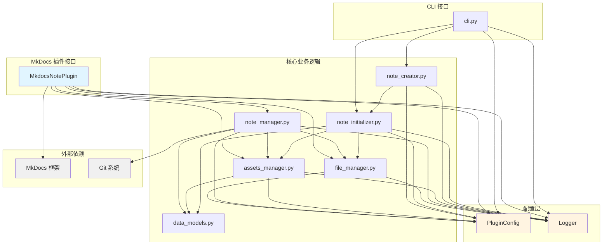
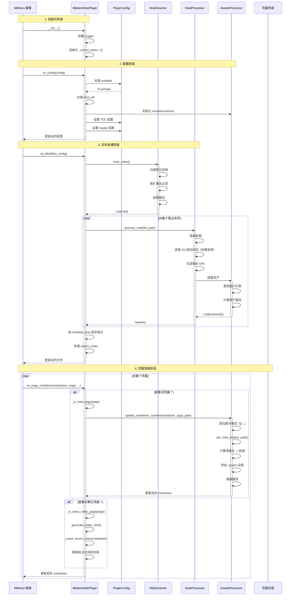
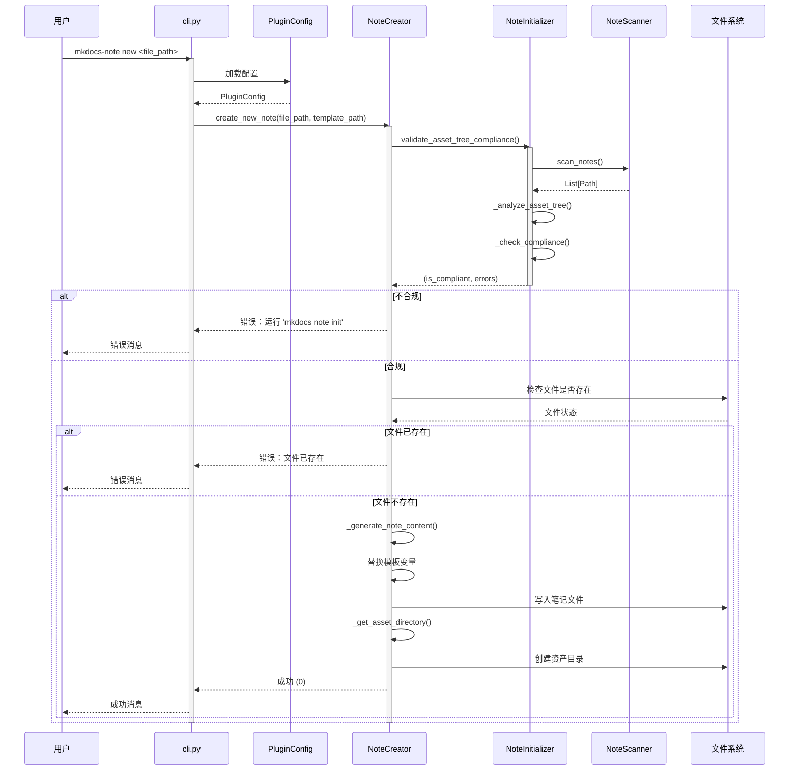
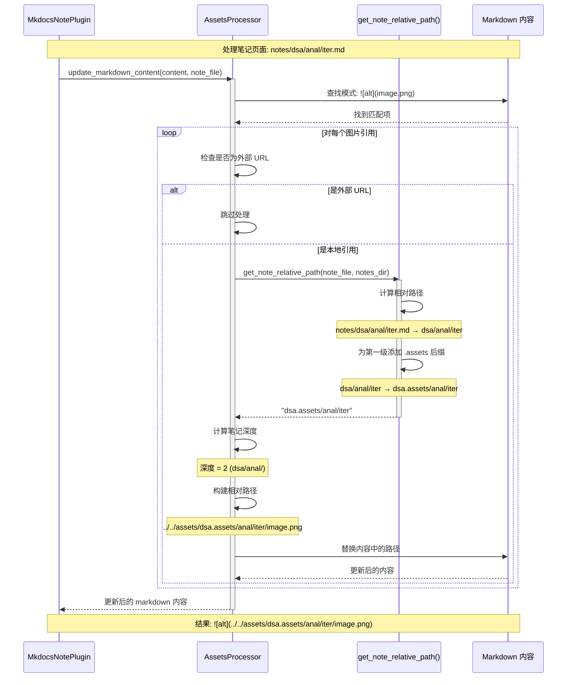

# 为 MkDocs-Note 贡献

首先，感谢您考虑为 `MkDocs-Note` 做出贡献！正是像您这样的人让开源社区变得如此美好。

## 项目架构

本节概述了 MkDocs-Note 插件的架构和调用流程，以帮助贡献者理解代码库结构。

### 整体架构

MkDocs-Note 插件采用模块化架构，具有清晰的关注点分离：

```
mkdocs_note/
├── __init__.py              # 包初始化
├── plugin.py                # MkDocs 插件主入口点
├── config.py                # MkDocs 配置管理
├── logger.py                # 日志工具
├── cli.py                   # 命令行接口
└── core/                    # 核心业务逻辑
    ├── file_manager.py      # 文件扫描和验证
    ├── note_manager.py      # 笔记处理和管理
    ├── note_creator.py      # 使用模板创建笔记
    ├── note_initializer.py  # 目录结构初始化
    ├── assets_manager.py    # 资产管理（新增）
    └── data_models.py       # 数据模型和结构
```

### UML 图

#### 组件依赖图

此图显示不同模块之间的依赖关系：



#### 类图

此图显示主要类及其关系：

```mermaid
classDiagram
    class MkdocsNotePlugin {
        -logger: Logger
        -_recent_notes: List[NoteInfo]
        -_assets_processor: AssetsProcessor
        -_docs_dir: Path
        +on_config(config) MkDocsConfig
        +on_files(files, config) Files
        +on_page_markdown(markdown, page, config, files) str
        -_is_notes_index_page(page) bool
        -_is_note_page(page) bool
        -_insert_recent_notes(markdown) str
        -_process_page_assets(markdown, page) str
        -_generate_notes_html() str
    }
    
    class PluginConfig {
        +enabled: bool
        +notes_dir: Path
        +index_file: Path
        +max_notes: int
        +supported_extensions: Set[str]
        +exclude_patterns: Set[str]
        +exclude_dirs: Set[str]
        +assets_dir: Path
        +notes_template: str
        +use_git_timestamps: bool
        +timestamp_zone: str
        +cache_size: int
    }
    
    class Logger {
        +debug(msg)
        +info(msg)
        +warning(msg)
        +error(msg)
    }
    
    class NoteScanner {
        -config: PluginConfig
        -logger: Logger
        +scan_notes() List[Path]
        -_is_valid_note_file(file_path) bool
    }
    
    class AssetScanner {
        -config: PluginConfig
        -logger: Logger
        +scan_assets() List[Path]
        -_is_valid_asset_file(file_path) bool
    }
    
    class NoteProcessor {
        -config: PluginConfig
        -logger: Logger
        -assets_processor: AssetsProcessor
        -_timezone: timezone
        +process_note(file_path) NoteInfo
        -_extract_title(file_path) str
        -_extract_assets(file_path) List[AssetsInfo]
        -_generate_relative_url(file_path) str
        -_get_git_commit_time(file_path) float
        -_format_timestamp(timestamp) str
    }
    
    class CacheManager {
        -logger: Logger
        -_last_notes_hash: str
        -_last_content_hash: str
        +should_update_notes(notes) bool
        +should_update_content(content) bool
        -_calculate_notes_hash(notes) str
    }
    
    class IndexUpdater {
        -config: PluginConfig
        -logger: Logger
        +update_index(notes) bool
        -_generate_html_list(notes) str
        -_replace_section(content, new_section) str
    }
    
    class RecentNotesUpdater {
        -config: PluginConfig
        -logger: Logger
        -file_scanner: NoteScanner
        -note_processor: NoteProcessor
        -cache_manager: CacheManager
        -index_updater: IndexUpdater
        +update() bool
    }
    
    class AssetsCatalogTree {
        -_root: Path
        -_notes_dir: Path
        -_catalog: Dict[str, List[AssetsInfo]]
        +add_node(note_relative_path, assets_list)
        +get_assets(note_relative_path) List[AssetsInfo]
        +get_all_assets() Dict
        +get_asset_dir_for_note(note_file) Path
    }
    
    class AssetsManager {
        -config: PluginConfig
        -logger: Logger
        -catalog_tree: AssetsCatalogTree
        +catalog_generator(assets_list, note_info) str
        +catalog_updater(catalog) bool
    }
    
    class AssetsProcessor {
        -config: PluginConfig
        -logger: Logger
        -image_pattern: Pattern
        +process_assets(note_info) List[AssetsInfo]
        +update_markdown_content(content, note_file) str
        -_process_image_reference(image_path, note_file, index) AssetsInfo
    }
    
    class NoteCreator {
        -config: PluginConfig
        -logger: Logger
        -initializer: NoteInitializer
        -_timezone: timezone
        +create_new_note(file_path, template_path) int
        +validate_note_creation(file_path) Tuple
        -_generate_note_content(file_path, template_path) str
        -_create_asset_directory(note_file_path)
        -_get_asset_directory(note_file_path) Path
    }
    
    class NoteInitializer {
        -config: PluginConfig
        -logger: Logger
        -file_scanner: NoteScanner
        +initialize_note_directory(notes_dir) int
        +validate_asset_tree_compliance(notes_dir) Tuple
        -_create_basic_structure(notes_dir)
        -_analyze_asset_tree(notes_dir, note_files) List[AssetTreeInfo]
        -_fix_asset_tree(notes_dir, non_compliant)
        -_check_compliance(asset_dir, expected_structure) bool
    }
    
    class NoteInfo {
        +file_path: Path
        +title: str
        +relative_url: str
        +modified_date: str
        +file_size: int
        +modified_time: float
        +assets_list: List[AssetsInfo]
    }
    
    class AssetsInfo {
        +file_path: Path
        +file_name: str
        +relative_path: str
        +index_in_list: int
        +exists: bool
    }
    
    class AssetTreeInfo {
        +note_name: str
        +asset_dir: Path
        +expected_structure: List[Path]
        +actual_structure: List[Path]
        +is_compliant: bool
        +missing_dirs: List[Path]
        +extra_dirs: List[Path]
    }
    
    %% 关系
    MkdocsNotePlugin --> PluginConfig
    MkdocsNotePlugin --> Logger
    MkdocsNotePlugin --> NoteScanner
    MkdocsNotePlugin --> NoteProcessor
    MkdocsNotePlugin --> AssetsProcessor
    MkdocsNotePlugin --> NoteInfo
    
    NoteScanner --> PluginConfig
    NoteScanner --> Logger
    
    AssetScanner --> PluginConfig
    AssetScanner --> Logger
    
    NoteProcessor --> PluginConfig
    NoteProcessor --> Logger
    NoteProcessor --> AssetsProcessor
    NoteProcessor --> NoteInfo
    NoteProcessor --> AssetsInfo
    
    RecentNotesUpdater --> PluginConfig
    RecentNotesUpdater --> Logger
    RecentNotesUpdater --> NoteScanner
    RecentNotesUpdater --> NoteProcessor
    RecentNotesUpdater --> CacheManager
    RecentNotesUpdater --> IndexUpdater
    
    CacheManager --> Logger
    CacheManager --> NoteInfo
    
    IndexUpdater --> PluginConfig
    IndexUpdater --> Logger
    IndexUpdater --> NoteInfo
    
    AssetsManager --> PluginConfig
    AssetsManager --> Logger
    AssetsManager --> AssetsCatalogTree
    AssetsManager --> AssetsInfo
    AssetsManager --> NoteInfo
    
    AssetsCatalogTree --> AssetsInfo
    
    AssetsProcessor --> PluginConfig
    AssetsProcessor --> Logger
    AssetsProcessor --> NoteInfo
    AssetsProcessor --> AssetsInfo
    
    NoteCreator --> PluginConfig
    NoteCreator --> Logger
    NoteCreator --> NoteInitializer
    
    NoteInitializer --> PluginConfig
    NoteInitializer --> Logger
    NoteInitializer --> NoteScanner
    NoteInitializer --> AssetTreeInfo
```



### 核心组件

#### 1. 插件入口点 (`plugin.py`)

`MkdocsNotePlugin` 类是与 MkDocs 集成的主入口点：

- **继承自**: `BasePlugin[PluginConfig]`

- **关键方法**:

  - `on_config()`: 配置 MkDocs 设置（TOC、slugify 函数、资产处理器）

  - `on_files()`: 扫描和处理笔记文件

  - `on_page_markdown()`: 将最近笔记插入索引页面并处理资产路径

  - `_is_note_page()`: 识别需要处理资产的笔记页面

  - `_process_page_assets()`: 将相对资产路径转换为正确的引用

#### 2. 配置管理 (`config.py`)

`PluginConfig` 类管理所有插件设置：

- **配置选项**:

  - `enabled`: 启用/禁用插件

  - `notes_dir`: 包含笔记的目录

  - `index_file`: 最近笔记的目标索引文件

  - `max_notes`: 显示的最大笔记数量

  - `supported_extensions`: 要包含的文件类型（`.md`、`.ipynb`）

  - `exclude_patterns`: 要从处理中排除的文件

  - `exclude_dirs`: 扫描时要跳过的目录

  - `assets_dir`: 存储笔记资产的目录

  - `notes_template`: 新笔记的模板文件

#### 3. 文件管理 (`core/file_manager.py`)

`FileScanner` 类处理文件发现和验证：

- **职责**:

  - 递归扫描笔记目录

  - 按扩展名和模式过滤文件

  - 排除指定的目录和文件

  - 返回有效笔记文件列表

#### 4. 笔记处理 (`core/note_manager.py`)

多个类处理笔记处理和管理：

- **`NoteInfo`**: 存储笔记元数据的数据类

- **`NoteProcessor`**: 从文件中提取标题和元数据

- **`CacheManager`**: 管理缓存以避免不必要的更新

- **`IndexUpdater`**: 使用最近笔记更新索引文件

- **`RecentNotesUpdater`**: 主协调器类

#### 5. 资产管理 (`core/assets_manager.py`) **新增**

资产管理系统使用树状结构来组织笔记资产：

- **`AssetsCatalogTree`**: 使用层次化路径结构管理资产
  
  - 防止不同目录中同名笔记之间的冲突
  
  - 为第一级子目录使用 `.assets` 后缀（例如 `dsa.assets/`、`language.assets/`）
  
  - 将笔记相对路径映射到资产目录

- **`AssetsManager`**: 协调资产目录操作
  
  - 为笔记生成资产目录
  
  - 更新资产信息

- **`AssetsProcessor`**: 处理 markdown 文件中的资产引用
  
  - 检测 markdown 内容中的图片引用
  
  - 根据笔记位置将相对路径转换为正确的资产路径
  
  - 根据笔记深度计算正确的 `../` 前缀

- **`get_note_relative_path()`**: 路径计算工具函数
  
  - 计算笔记相对于笔记目录的相对路径
  
  - 为第一级子目录添加 `.assets` 后缀
  
  - 处理边界情况（根级笔记、深度嵌套的笔记）

**资产结构示例**：
```
notes/
├── dsa/
│   ├── anal/
│   │   └── iter.md          → assets/dsa.assets/anal/iter/
│   └── ds/
│       └── intro.md         → assets/dsa.assets/ds/intro/
├── language/
│   ├── python/
│   │   └── intro.md         → assets/language.assets/python/intro/
│   └── cpp/
│       └── intro.md         → assets/language.assets/cpp/intro/
└── quickstart.md            → assets/quickstart/
```

**路径转换**：
- 位于 `notes/dsa/anal/iter.md` 的笔记中有 ``
- 转换为 ``
- MkDocs 相对于笔记文件正确解析路径

#### 6. 笔记创建 (`core/note_creator.py`)

`NoteCreator` 类处理创建具有适当资产结构的新笔记：

- 从模板创建笔记文件，支持变量替换

- 自动创建相应的资产目录

- 验证目录结构合规性

- 支持自定义模板

#### 7. 目录初始化 (`core/note_initializer.py`)

`NoteInitializer` 类管理目录结构：

- 使用适当的结构初始化笔记目录

- 验证资产树合规性

- 修复不合规的结构

- 创建必要的目录和索引文件

#### 8. 日志记录 (`logger.py`)

`Logger` 类提供彩色控制台日志记录：

- 使用 `colorlog` 增强控制台输出

- 支持不同的日志级别（DEBUG、INFO、WARNING、ERROR）

- 可配置的日志格式

### 调用流程

插件执行遵循以下序列：

1. **初始化** (`__init__`)

   - 创建插件实例

   - 初始化日志记录器

   - 初始化最近笔记列表

2. **配置阶段** (`on_config`)

   - 插件启用/禁用检查

   - 存储 `docs_dir` 以进行路径解析

   - 初始化 `AssetsProcessor` 实例

   - MkDocs TOC 配置设置

   - Slugify 函数配置（pymdownx 或回退）

3. **文件处理阶段** (`on_files`)

   - FileScanner 扫描笔记目录

   - NoteProcessor 从每个文件提取元数据

   - 按修改时间排序笔记

   - 填充最近笔记列表等

4. **页面渲染阶段** (`on_page_markdown`)

   - 检查当前页面是否为笔记页面
   
   - 如果是笔记页面：处理 markdown 内容中的资产路径
     
     - 识别图片引用
     
     - 计算笔记相对于笔记目录的相对路径
     
     - 将相对资产引用转换为正确的路径
     
     - 为第一级目录添加 `.assets` 后缀
     
     - 根据笔记深度计算正确的 `../` 前缀
   
   - 检查当前页面是否为笔记索引页面

   - 如果是索引页面：在标记之间插入最近笔记 HTML

   - 返回修改后的 markdown 内容

#### 序列图：插件构建过程

此图显示 MkDocs 构建期间的完整执行流程：



#### 序列图：笔记创建过程（CLI）

此图显示创建新笔记的 CLI 工作流：



#### 序列图：资产路径处理

此图显示页面渲染期间如何处理资产路径：



### 数据流

插件提供两个主要功能，具有不同的数据流：

#### 功能1：最近笔记显示

```
笔记目录
    ↓ (NoteScanner)
有效笔记文件
    ↓ (NoteProcessor)
NoteInfo 对象（含 assets_list）
    ↓ (按修改时间排序)
最近笔记列表
    ↓ (HTML 生成)
索引页面内容
```

#### 功能2：资产路径管理

```
笔记 Markdown 文件
    ↓ (页面渲染)
检测图片引用：
    ↓ (get_note_relative_path)
计算笔记的相对路径："dsa/anal/iter"
    ↓ (为第一级添加 .assets 后缀)
带 .assets 的路径："dsa.assets/anal/iter"
    ↓ (计算深度和 ../ 前缀)
确定相对路径："../../assets/dsa.assets/anal/iter/image.png"
    ↓ (update_markdown_content)
更新后的 Markdown：
    ↓ (MkDocs 构建)
正确解析的资产路径
```

### 关键设计模式

1. **插件模式**: 与 MkDocs 插件系统集成

2. **策略模式**: 不同文件类型的不同标题提取

3. **模板方法**: 一致的笔记处理工作流

4. **观察者模式**: MkDocs 事件驱动架构

5. **数据传输对象**: NoteInfo 用于结构化数据传递

### 扩展点

架构支持几个扩展点：

1. **自定义文件类型**: 在 `supported_extensions` 中添加新文件扩展名

2. **标题提取**: 为新文件格式扩展 `NoteProcessor`

3. **输出格式**: 修改 `_generate_notes_html()` 中的 HTML 生成

4. **缓存策略**: 在 `CacheManager` 中实现自定义缓存

5. **过滤逻辑**: 在 `FileScanner` 中自定义文件过滤

6. **资产路径计算**: 扩展 `AssetsProcessor` 以支持自定义路径方案

7. **CLI 命令**: 在 `cli.py` 中添加新命令

### 资产管理设计

资产管理系统遵循以下关键原则：

1. **树状结构**：资产镜像笔记目录层次结构
   
   - 防止不同目录中笔记之间的命名冲突
   
   - 示例：`dsa/anal/intro.md` 和 `language/python/intro.md` 可以共存

2. **第一级分类**：使用 `.assets` 后缀以提高清晰度
   
   - `dsa/` → `assets/dsa.assets/`
   
   - `language/` → `assets/language.assets/`
   
   - 使资产类别易于识别

3. **相对路径转换**：路径相对于笔记文件位置
   
   - 根据笔记在目录结构中的深度计算
   
   - 确保 MkDocs 可以正确解析资产引用
   
   - 示例：深度 2 级 → `../../assets/category.assets/path/`

4. **自动处理**：Markdown 图片引用自动转换
   
   - 插件在构建期间处理所有笔记页面
   
   - 原始 markdown 文件保持不变
   
   - 转换在 MkDocs 构建期间在内存中进行

### 测试策略

项目包含全面的单元测试：

- **插件测试**: 测试主要插件功能

- **核心测试**: 测试各个组件

- **集成测试**: 测试组件交互

- **模拟使用**: 广泛使用模拟进行隔离

### 性能考虑

1. **文件扫描**: 仅在必要时扫描

2. **缓存**: 避免冗余处理

3. **延迟加载**: 按需初始化组件

4. **内存管理**: 高效的笔记存储数据结构

## 如何贡献？

有很多贡献方式，从编写文档和教程到报告错误和提交代码更改。

### 报告错误

如果您发现错误，请打开一个问题并提供以下信息：

- 清晰描述性的标题。

- 问题的详细描述，包括重现步骤。

- 您的 `MkDocs` 配置（`mkdocs.yml`）。

- 任何相关的错误消息或日志。

### 建议增强

如果您对新功能或现有功能的改进有想法，请打开一个问题进行讨论。这允许我们协调工作并避免重复工作。

## 开发设置

要开始本地开发，请按照以下步骤操作：

1.  **Fork 和克隆仓库**

    ```bash
    git clone https://github.com/YOUR_USERNAME/mkdocs-note.git
    cd mkdocs-note
    ```

2.  **设置环境**

    强烈建议使用虚拟环境，并推荐使用 [uv](https://docs.astral.sh/uv/) 来管理项目配置和虚拟环境。

    ```bash
    uv init
    ```

3.  **安装依赖**

    以可编辑模式安装项目以及开发依赖。

    ```bash
    uv sync
    ```

4.  **运行测试**

    为确保一切设置正确，运行测试套件：

    ```bash
    ./tests/test.sh
    ```

## 拉取请求流程

1.  确保任何新代码都被测试覆盖。

2.  如果您添加或更改了任何功能，请更新文档。

3.  确保测试套件通过（`pytest`）。

4.  提交您的拉取请求！

感谢您的贡献！
