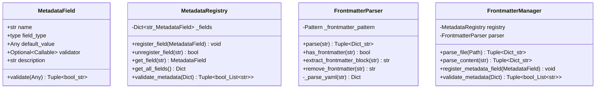

# Architecture Introduction in Chinese

本文档详细描述了 MkDocs-Note 插件的完整架构，包括特性、模块结构、数据流、工作流程和版本历史。

## 目录

- [1. 项目概述](#1-项目概述)
- [2. 特性与功能](#2-特性与功能)
- [3. 配置选项](#3-配置选项)
- [4. 模块架构](#4-模块架构)
- [5. 数据模型](#5-数据模型)
- [6. 数据流与工作流](#6-数据流与工作流)
- [7. 向后兼容性](#7-向后兼容性)
- [8. 版本历史与特性](#8-版本历史与特性)

---

## 1. 项目概述

### 1.1 项目定位

MkDocs-Note 是一个 MkDocs 插件，专为使用 MkDocs 与 Material for MkDocs 主题管理学习笔记或类笔记文档的用户设计。插件提供了自动化的笔记管理、资源管理和元数据处理功能。

### 1.2 核心设计理念

- **模块化设计**：清晰的模块职责划分，易于维护和扩展
- **Co-located 资源管理**：资源文件与笔记文件放置在一起，便于管理和移动
- **元数据驱动**：基于 frontmatter 的元数据系统，支持扩展
- **CLI 友好**：完善的命令行工具，支持笔记的全生命周期管理

---

## 2. 特性与功能

### 2.1 核心特性

#### 2.1.1 最近笔记展示
- **功能**：在笔记索引页面自动展示最近修改的笔记列表
- **排序方式**：
  - 优先使用 Git 提交时间（确保跨环境一致性）
  - 回退到文件系统修改时间
- **时区支持**：可配置时区显示，确保不同环境下时间戳一致

#### 2.1.2 多格式支持
- **Markdown (.md)**：标准笔记格式
- **Jupyter Notebook (.ipynb)**：支持交互式笔记

#### 2.1.3 智能过滤
- 排除索引文件（index.md）
- 排除 README 文件
- 自定义排除模式
- 排除特定目录（如 `__pycache__`、`.git`、`node_modules`）

#### 2.1.4 资源管理

**Co-located 资源结构**（v2.0.0+）：
```
docs/notes/dsa/anal/iter.md
docs/notes/dsa/anal/assets/iter/
    ├── diagram.png
    └── recursion_tree.png
```

**特点**：
- 资源目录与笔记文件同级放置
- 自动路径转换：`` → `assets/iter/diagram.png`
- 无命名冲突风险
- 易于移动和管理

#### 2.1.5 模板系统

**模板变量**：
- `{{title}}`：笔记标题（从文件名派生）
- `{{date}}`：当前日期时间
- `{{note_name}}`：原始笔记文件名

**默认模板**：
```markdown
---
date: {{date}}
title: {{title}}
permalink: 
publish: true
---

# {{title}}

Start writing your note content...
```

**支持**：
- 自定义模板
- Frontmatter 元数据
- 变量替换（仅在 frontmatter 部分）

#### 2.1.6 Frontmatter 元数据系统（v2.0.0+）

**标准字段**：
- `date`：创建或发布日期
- `permalink`：自定义永久链接
- `publish`：是否发布（布尔值）

**扩展性**：
- 支持自定义字段注册
- 类型验证
- 自定义验证器

#### 2.1.7 CLI 工具

**命令列表**：

| 命令 | 别名 | 功能 | 示例 |
|------|------|------|------|
| `init` | - | 初始化笔记目录结构 | `mkdocs-note init` |
| `new` | - | 创建新笔记 | `mkdocs-note new docs/notes/test.md` |
| `validate` | - | 验证资源树结构 | `mkdocs-note validate` |
| `template` | - | 管理模板文件 | `mkdocs-note template --create` |
| `remove` | `rm` | 删除笔记和资源 | `mkdocs-note rm docs/notes/test.md` |
| `clean` | - | 清理孤立资源 | `mkdocs-note clean --dry-run` |
| `move` | `mv` | 移动/重命名笔记 | `mkdocs-note mv old.md new.md` |

**CLI 特性**：
- 自动加载 `mkdocs.yml` 配置
- 交互式确认提示
- 干运行模式（dry-run）
- 彩色输出和 emoji 提示

---

## 3. 配置选项

### 3.1 插件配置

在 `mkdocs.yml` 中配置：

```yaml
plugins:
  - mkdocs-note:
      # 插件开关
      enabled: true
      
      # 目录配置
      notes_dir: "docs/notes"
      index_file: "docs/notes/index.md"
      assets_dir: "docs/notes/assets"  # v2.0.0+ 已弃用，但保留兼容性
      
      # 笔记展示配置
      max_notes: 11
      start_marker: "<!-- recent_notes_start -->"
      end_marker: "<!-- recent_notes_end -->"
      
      # 文件过滤
      supported_extensions: [".md", ".ipynb"]
      exclude_patterns: ["index.md", "README.md"]
      exclude_dirs: ["__pycache__", ".git", "node_modules"]
      
      # 时间戳配置
      use_git_timestamps: true
      timestamp_zone: "UTC+8"
      git_date_format: "%a %b %d %H:%M:%S %Y %z"
      output_date_format: "%Y-%m-%d %H:%M:%S"
      
      # 模板配置
      notes_template: "overrides/templates/default.md"
      
      # 性能优化
      cache_size: 256
```

### 3.2 配置选项详解

| 选项 | 类型 | 默认值 | 说明 |
|------|------|--------|------|
| `enabled` | bool | `true` | 是否启用插件 |
| `notes_dir` | Path | `"docs"` | 笔记目录 |
| `index_file` | Path | `"docs/index.md"` | 索引文件路径 |
| `max_notes` | int | `11` | 最大展示笔记数（包含索引页） |
| `start_marker` | str | `"<!-- recent_notes_start -->"` | 笔记插入起始标记 |
| `end_marker` | str | `"<!-- recent_notes_end -->"` | 笔记插入结束标记 |
| `supported_extensions` | Set[str] | `{".md", ".ipynb"}` | 支持的文件扩展名 |
| `exclude_patterns` | Set[str] | `{"index.md", "README.md"}` | 排除的文件模式 |
| `exclude_dirs` | Set[str] | `{"__pycache__", ".git", "node_modules"}` | 排除的目录 |
| `use_git_timestamps` | bool | `true` | 使用 Git 提交时间排序 |
| `timestamp_zone` | str | `"UTC+0"` | 时间戳时区 |
| `assets_dir` | Path | `"docs/notes/assets"` | 资源目录（v2.0.0+ 已弃用） |
| `notes_template` | Path | `"overrides/templates/default.md"` | 笔记模板文件 |
| `cache_size` | int | `256` | 缓存大小 |

---

## 4. 模块架构

### 4.1 整体架构

```
mkdocs-note/
├── src/mkdocs_note/
│   ├── __init__.py              # 包初始化
│   ├── plugin.py                # MkDocs 插件入口点
│   ├── config.py                # 配置管理
│   ├── logger.py                # 日志工具
│   ├── cli.py                   # 命令行界面
│   └── core/                    # 核心业务逻辑
│       ├── __init__.py
│       ├── data_models.py       # 数据模型
│       ├── file_manager.py      # 文件扫描
│       ├── note_manager.py      # 笔记处理
│       ├── assets_manager.py    # 资源管理
│       ├── frontmatter_manager.py  # 元数据管理
│       ├── note_creator.py      # 笔记创建
│       ├── note_initializer.py  # 结构初始化
│       ├── note_remover.py      # 笔记删除
│       ├── note_cleaner.py      # 资源清理
│       └── notes_mover.py       # 笔记移动
└── tests/                       # 测试套件
```

### 4.2 模块依赖关系图


### 4.3 核心类与方法

#### 4.3.1 plugin.py - MkdocsNotePlugin

**主要职责**：MkDocs 插件系统的入口点，协调各个模块完成插件功能。

**类图**：


**主要方法**：

| 方法 | 功能 | 调用时机 |
|------|------|----------|
| `on_config()` | 初始化插件配置，设置 TOC slugify | MkDocs 加载配置时 |
| `on_files()` | 扫描笔记文件，收集最近笔记 | MkDocs 处理文件列表时 |
| `on_page_markdown()` | 处理页面 Markdown：插入笔记列表、转换资源路径 | 处理每个页面时 |

**工作流程**：
1. `on_config`：初始化 `AssetsProcessor`，配置 TOC
2. `on_files`：扫描笔记文件 → 提取元数据 → 排序 → 保存最近笔记
3. `on_page_markdown`：
   - 如果是索引页：插入最近笔记列表
   - 如果是笔记页：转换资源路径

#### 4.3.2 config.py - PluginConfig

**主要职责**：管理插件配置，提供配置加载和验证。

**类图**：


**主要函数**：

| 函数 | 功能 |
|------|------|
| `load_config_from_mkdocs_yml()` | 从 mkdocs.yml 加载插件配置 |
| `_find_mkdocs_yml()` | 自动查找 mkdocs.yml 文件 |
| `_extract_plugin_config()` | 提取插件配置字典 |

#### 4.3.3 core/file_manager.py

**主要职责**：文件扫描和验证。

**类图**：


**主要方法**：

| 类 | 方法 | 功能 |
|------|------|------|
| `NoteScanner` | `scan_notes()` | 递归扫描笔记目录，返回所有有效笔记文件 |
| `NoteScanner` | `_is_valid_note_file()` | 验证文件是否为有效笔记（扩展名、排除规则） |
| `AssetScanner` | `scan_assets()` | 扫描资源目录 |
| `AssetScanner` | `_is_valid_asset_file()` | 验证文件是否为有效资源 |

#### 4.3.4 core/note_manager.py

**主要职责**：笔记处理、元数据提取、时间戳管理。

**类图**：


**主要方法**：

| 类 | 方法 | 功能 |
|------|------|------|
| `NoteProcessor` | `process_note()` | 处理单个笔记文件，提取所有元数据 |
| `NoteProcessor` | `_extract_frontmatter()` | 提取 frontmatter 元数据 |
| `NoteProcessor` | `_extract_title()` | 提取笔记标题 |
| `NoteProcessor` | `_get_git_commit_time()` | 获取 Git 提交时间 |
| `CacheManager` | `should_update_notes()` | 检查笔记列表是否需要更新 |
| `IndexUpdater` | `update_index()` | 更新索引文件 |

#### 4.3.5 core/assets_manager.py

**主要职责**：资源管理、路径转换、Co-located 结构支持。

**类图**：


**主要方法**：

| 类 | 方法 | 功能 |
|------|------|------|
| `AssetsCatalogTree` | `add_node()` | 添加笔记的资源到目录树 |
| `AssetsCatalogTree` | `get_asset_dir_for_note()` | 获取笔记的资源目录路径 |
| `AssetsProcessor` | `process_assets()` | 处理笔记中的资源引用 |
| `AssetsProcessor` | `update_markdown_content()` | 更新 Markdown 中的资源路径 |

**核心函数**：
```python
def get_note_relative_path(note_file: Path, notes_dir: Path, use_assets_suffix: bool = True) -> str:
    """
    获取笔记相对于笔记目录的相对路径（用作唯一标识符）
    
    示例:
        get_note_relative_path(Path("docs/notes/dsa/anal/iter.md"), Path("docs/notes"))
        返回: 'dsa.assets/anal/iter'  (旧系统，已弃用)
        
        v2.0.0+ Co-located:
        笔记: docs/notes/dsa/anal/iter.md
        资源: docs/notes/dsa/anal/assets/iter/
    """
```

#### 4.3.6 core/frontmatter_manager.py

**主要职责**：Frontmatter 元数据管理、注册系统、验证。

**类图**：


**主要方法**：

| 类 | 方法 | 功能 |
|------|------|------|
| `MetadataField` | `validate()` | 验证字段值的类型和约束 |
| `MetadataRegistry` | `register_field()` | 注册新的元数据字段 |
| `MetadataRegistry` | `validate_metadata()` | 验证整个元数据字典 |
| `FrontmatterParser` | `parse()` | 解析 frontmatter 和内容 |
| `FrontmatterManager` | `parse_file()` | 从文件解析 frontmatter |

**标准字段定义**：
```python
# 标准 frontmatter 字段
date_field = MetadataField(name='date', field_type=str, default_value=None)
permalink_field = MetadataField(name='permalink', field_type=str, default_value=None)
publish_field = MetadataField(name='publish', field_type=bool, default_value=True)
```

#### 4.3.7 core/note_creator.py

**主要职责**：笔记创建、模板处理、结构验证。

**类图**：


**主要方法**：

| 方法 | 功能 |
|------|------|
| `create_new_note()` | 创建新笔记文件和资源目录 |
| `validate_note_creation()` | 验证笔记创建的前置条件 |
| `_substitute_variables()` | 模板变量替换 |
| `_substitute_in_frontmatter()` | 仅在 frontmatter 中替换变量 |

**工作流程**：
1. 验证笔记目录结构合规
2. 加载模板（自定义或默认）
3. 替换模板变量（仅在 frontmatter 部分）
4. 创建笔记文件
5. 创建对应的资源目录

#### 4.3.8 core/note_initializer.py

**主要职责**：笔记目录初始化、结构验证和修复。

**类图**：


**主要方法**：

| 方法 | 功能 |
|------|------|
| `initialize_note_directory()` | 初始化笔记目录，创建基础结构 |
| `validate_asset_tree_compliance()` | 验证资源树结构合规性 |
| `_analyze_asset_tree()` | 分析当前资源树结构 |
| `_fix_asset_tree()` | 修复不合规的资源树结构 |

**Co-located 验证规则**（v2.0.0+）：
- 笔记：`/path/to/note.md`
- 资源目录：`/path/to/assets/note/`
- 验证：资源目录是否存在且结构正确

#### 4.3.9 core/note_remover.py

**主要职责**：笔记删除、资源清理、目录清理。

**类图**：


**主要方法**：

| 方法 | 功能 |
|------|------|
| `remove_note()` | 删除笔记文件和资源目录 |
| `remove_multiple_notes()` | 批量删除笔记 |
| `_cleanup_empty_parent_dirs()` | 递归清理空父目录 |

#### 4.3.10 core/note_cleaner.py

**主要职责**：孤立资源检测和清理。

**类图**：


**主要方法**：

| 方法 | 功能 |
|------|------|
| `find_orphaned_assets()` | 查找没有对应笔记的资源目录 |
| `clean_orphaned_assets()` | 清理孤立资源（支持 dry-run） |

**检测逻辑**：
1. 扫描所有笔记文件
2. 构建预期资源目录集合
3. 扫描所有 `assets/` 子目录
4. 找出不在预期集合中的资源目录

#### 4.3.11 core/notes_mover.py

**主要职责**：笔记移动/重命名、目录移动、资源同步移动。

**类图**：


**主要方法**：

| 方法 | 功能 |
|------|------|
| `move_note_or_directory()` | 移动笔记或目录（模拟 shell `mv`） |
| `move_directory()` | 移动整个目录及其中所有笔记 |
| `move_note()` | 移动单个笔记文件和资源 |

**Shell `mv` 行为模拟**：
- 目标不存在：重命名源到目标
- 目标是目录：将源移动到目标目录内
- 自动创建父目录
- 清理空目录
- 支持回滚机制

#### 4.3.12 cli.py

**主要职责**：命令行界面、用户交互、配置加载。

**命令结构**：


**CLI 特性**：
- Click 框架
- 自动配置加载
- 彩色输出
- 交互式确认
- 错误处理和友好提示

---

## 5. 数据模型

### 5.1 核心数据类

#### 5.1.1 NoteFrontmatter

```python
@dataclass
class NoteFrontmatter:
    """Frontmatter 元数据
    
    属性：
        date: 创建或发布日期
        permalink: 自定义永久链接
        publish: 是否发布
        custom: 自定义字段字典
    """
    date: Optional[str] = None
    permalink: Optional[str] = None
    publish: Optional[bool] = True
    custom: Dict[str, Any] = field(default_factory=dict)
    
    def to_dict(self) -> Dict[str, Any]: ...
    
    @classmethod
    def from_dict(cls, data: Dict[str, Any]) -> 'NoteFrontmatter': ...
```

**用途**：
- 存储笔记的 YAML frontmatter 数据
- 支持标准字段和自定义字段
- 提供序列化和反序列化方法

#### 5.1.2 NoteInfo

```python
@dataclass
class NoteInfo:
    """笔记信息
    
    属性：
        file_path: 笔记文件路径
        title: 标题
        relative_url: 相对 URL
        modified_date: 修改日期（格式化字符串）
        file_size: 文件大小（字节）
        modified_time: 修改时间（Unix 时间戳）
        assets_list: 资源列表
        frontmatter: Frontmatter 元数据（可选）
    """
    file_path: Path
    title: str
    relative_url: str
    modified_date: str
    file_size: int
    modified_time: float
    assets_list: List['AssetsInfo']
    frontmatter: Optional[NoteFrontmatter] = None
```

**用途**：
- 笔记的完整元数据表示
- 用于排序、展示、处理
- 包含 frontmatter 元数据（v2.0.0+）

#### 5.1.3 AssetsInfo

```python
@dataclass
class AssetsInfo:
    """资源信息
    
    属性：
        file_path: 资源文件路径
        file_name: 文件名
        relative_path: 相对路径
        index_in_list: 在列表中的索引
        exists: 文件是否存在
    """
    file_path: Path
    file_name: str
    relative_path: str
    index_in_list: int
    exists: bool = True
```

**用途**：
- 表示笔记中引用的单个资源
- 跟踪资源存在性
- 用于路径转换

#### 5.1.4 AssetTreeInfo

```python
@dataclass
class AssetTreeInfo:
    """资源树结构信息
    
    属性：
        note_name: 笔记名称
        asset_dir: 资源目录路径
        expected_structure: 预期结构
        actual_structure: 实际结构
        is_compliant: 是否合规
        missing_dirs: 缺失的目录
        extra_dirs: 额外的目录
    """
    note_name: str
    asset_dir: Path
    expected_structure: List[Path]
    actual_structure: List[Path]
    is_compliant: bool
    missing_dirs: List[Path]
    extra_dirs: List[Path]
```

**用途**：
- 资源树结构分析结果
- 用于验证和修复资源结构

### 5.2 数据流图


---

## 6. 数据流与工作流

### 6.1 插件构建时数据流

#### 6.1.1 旧数据系统（文件元数据流）

**场景**：MkDocs 构建文档时，插件处理笔记文件


**数据流说明**：

1. **配置阶段**：
   - 输入：MkDocs 配置
   - 处理：初始化插件组件
   - 输出：更新的配置

2. **文件扫描阶段**：
   - 输入：笔记目录
   - 处理：扫描、过滤、验证
   - 输出：笔记文件列表

3. **元数据提取阶段**：
   - 输入：笔记文件
   - 处理：提取标题、时间戳、URL
   - 输出：NoteInfo 对象

4. **索引更新阶段**：
   - 输入：NoteInfo 列表
   - 处理：排序、生成 HTML、替换标记
   - 输出：更新的索引页面

5. **资源处理阶段**：
   - 输入：笔记 Markdown 内容
   - 处理：扫描图片引用、转换路径
   - 输出：更新的 Markdown 内容

#### 6.1.2 新元数据系统（Frontmatter 流）

**场景**：处理带有 frontmatter 的笔记文件（v2.0.0+）


**元数据流说明**：

1. **Frontmatter 解析**：
   - 输入：笔记文件内容
   - 处理：提取 YAML frontmatter 块
   - 输出：frontmatter 字典 + 正文

2. **元数据验证**：
   - 输入：frontmatter 字典
   - 处理：类型检查、自定义验证
   - 输出：验证结果

3. **对象构建**：
   - 输入：验证后的 frontmatter
   - 处理：构建 NoteFrontmatter 对象
   - 输出：包含元数据的 NoteInfo

### 6.2 CLI 命令工作流

#### 6.2.1 init 命令流程


#### 6.2.2 new 命令流程


#### 6.2.3 move 命令流程


#### 6.2.4 remove 命令流程


#### 6.2.5 clean 命令流程

```mermaid
sequenceDiagram
    participant User
    participant CLI
    participant Cleaner as NoteCleaner
    participant Scanner as NoteScanner
    participant FileSystem
    
    User->>CLI: mkdocs-note clean
    CLI->>CLI: 加载配置
    CLI->>Cleaner: find_orphaned_assets()
    activate Cleaner
    
    Cleaner->>Scanner: scan_notes()
    Scanner-->>Cleaner: note_files[]
    
    Cleaner->>Cleaner: 构建预期资源目录集合
    loop 对每个笔记文件
        Cleaner->>Cleaner: 计算资源目录路径
        Cleaner->>Cleaner: 添加到 expected_asset_dirs
    end
    
    Cleaner->>FileSystem: 扫描所有 assets 目录
    loop 对每个 assets 子目录
        Cleaner->>FileSystem: iterdir()
        loop 对每个叶子目录
            alt 不在预期集合中
                Cleaner->>Cleaner: 添加到 orphaned_dirs
            end
        end
    end
    
    Cleaner-->>CLI: orphaned_dirs[]
    deactivate Cleaner
    
    alt 无孤立资源
        CLI-->>User: 无孤立资源
        CLI->>CLI: 返回
    end
    
    CLI->>User: 显示孤立资源列表
    
    alt 非 dry-run 模式
        alt 需要确认 (--yes 未设置)
            CLI->>User: 请求确认
            User-->>CLI: 确认/取消
            
            alt 取消
                CLI-->>User: 操作取消
                CLI->>CLI: 返回
            end
        end
    end
    
    CLI->>Cleaner: clean_orphaned_assets(dry_run)
    activate Cleaner
    
    loop 对每个孤立目录
        alt dry-run 模式
            Cleaner-->>CLI: 记录将要删除
        else 正常模式
            Cleaner->>FileSystem: 删除目录
            Cleaner->>Cleaner: _cleanup_empty_parent_dirs()
        end
    end
    
    Cleaner-->>CLI: (count, removed_dirs)
    deactivate Cleaner
    
    CLI-->>User: 显示结果
```

---

## 7. 向后兼容性

### 7.1 资源目录结构变更（v2.0.0）

#### 7.1.1 变更说明

从 v2.0.0 开始，插件采用 **Co-located 资源结构**，替代了之前的集中式资源树结构：

**旧结构（v1.x）**：
```
docs/notes/
├── dsa/
│   └── anal/
│       └── iter.md
└── assets/
    └── dsa.assets/
        └── anal/
            └── iter/
                └── image.png
```

**新结构（v2.0.0+）**：
```
docs/notes/
└── dsa/
    └── anal/
        ├── iter.md
        └── assets/
            └── iter/
                └── image.png
```

#### 7.1.2 迁移指南

1. **手动迁移现有资源**：
   ```bash
   # 旧位置：docs/notes/assets/dsa.assets/anal/iter/
   # 新位置：docs/notes/dsa/anal/assets/iter/
   
   # 示例迁移命令
   mv docs/notes/assets/dsa.assets/anal/iter/ docs/notes/dsa/anal/assets/
   ```

2. **配置兼容性**：
   - `assets_dir` 配置选项保留但已弃用
   - 插件自动使用 co-located 模式，不再依赖 `assets_dir`

3. **验证迁移**：
   ```bash
   mkdocs-note validate
   ```

#### 7.1.3 兼容性处理

插件内部的兼容性处理：

- **AssetsProcessor**：
  - `_process_image_reference()` 方法使用新的 co-located 路径计算
  - `update_markdown_content()` 自动转换路径格式

- **NoteCreator/Remover/Mover**：
  - `_get_asset_directory()` 方法统一使用新模式
  - 不再依赖 `notes_dir` 和 `assets_dir` 的相对关系

- **NoteCleaner**：
  - `find_orphaned_assets()` 方法扫描所有 `assets/` 子目录
  - 支持查找新旧两种结构中的孤立资源

### 7.2 Frontmatter 元数据系统（v2.0.0）

#### 7.2.1 向后兼容

- **无 frontmatter 的笔记**：完全兼容，插件正常处理
- **标题提取**：优先从 frontmatter 的 `title` 字段读取，回退到第一个 H1 标题
- **模板系统**：同时支持新旧两种模板格式

#### 7.2.2 模板兼容性

**旧式模板（仍然支持）**：
```markdown
# {{title}}

笔记内容...
```

**新式模板（推荐）**：
```markdown
---
date: {{date}}
title: {{title}}
permalink: 
publish: true
---

# {{title}}

笔记内容...
```

插件自动检测模板类型，变量替换只在 frontmatter 中进行。

### 7.3 配置文件兼容性

#### 7.3.1 配置加载

CLI 工具自动加载 `mkdocs.yml` 配置，搜索路径：
1. 当前工作目录
2. 上层目录（最多3层）
3. `--config` 参数指定的路径

#### 7.3.2 弃用配置选项

| 配置项 | 状态 | 说明 |
|--------|------|------|
| `assets_dir` | 已弃用（v2.0.0） | 保留以兼容旧配置，但不再使用 |

---

## 8. 版本历史与特性

### 8.1 版本发布时间线

以下按发布时间降序列出主要版本：

#### v2.0.0 (Unreleased - Breaking Changes)

**发布日期**：开发中（hot-refactor 分支）

**重大变更**：
- ✨ **Co-located 资源结构**：资源目录与笔记文件放在一起
- ✨ **Frontmatter 元数据系统**：完整的 YAML frontmatter 支持
- ✨ **可扩展元数据注册**：通过注册接口添加自定义字段
- ⚠️ **Breaking Change**：需要手动迁移现有资源到新位置

**新增模块**：
- `frontmatter_manager.py`：元数据管理系统
  - `MetadataRegistry`：元数据字段注册中心
  - `MetadataField`：字段定义与验证
  - `FrontmatterParser`：YAML 解析器
  - `FrontmatterManager`：统一门面接口

**更新模块**：
- `data_models.py`：新增 `NoteFrontmatter` 数据类
- `NoteProcessor`：集成 frontmatter 提取
- `NoteCreator`：支持 frontmatter 模板
- 所有资源管理模块：采用 co-located 模式

#### v1.2.5 (2025-10-13)

**发布日期**：2025年10月13日

**修复**：
- 修复 `pyproject.toml` 中的依赖问题

**变更**：
- 移除 `setup.py` 和 `requirements.txt`
- 统一使用 `pyproject.toml` 管理依赖

#### v1.2.4 (2025-10-13)

**发布日期**：2025年10月13日

**修复**：
- 添加 `mkdocs-material>=9.6.4` 依赖

#### v1.2.3 (2025-10-13)

**发布日期**：2025年10月13日

**修复**：
- 添加多个缺失的依赖：
  - `mkdocs-material>=9.6.14`
  - `mkdocs-jupyter>=0.25.1`
  - `mkdocs-minify-plugin>=0.8.0`
  - `mkdocs-git-revision-date-localized-plugin>=1.4.0`

#### v1.2.2 (2025-10-13)

**发布日期**：2025年10月13日

**修复**：
- 添加 `pyyaml>=6.0` 和 `pymdown-extensions>=10.15` 依赖

#### v1.2.1 (2025-10-13)

**发布日期**：2025年10月13日

**修复** (#23)：
- CLI 配置加载问题：CLI 命令现在正确读取 `mkdocs.yml` 中的自定义配置
- 实现 `load_config_from_mkdocs_yml()` 函数
- 自动发现当前和父目录中的 `mkdocs.yml`
- 添加配置加载的完整单元测试

**核心文件变更**：
- `config.py`：新增配置加载函数

#### v1.2.0 (2025-10-11)

**发布日期**：2025年10月11日

**新增特性** (#19)：

1. **CLI 笔记删除命令** (`mkdocs-note remove` / `rm`)：
   - 删除笔记文件和资源目录
   - `--keep-assets`：保留资源目录
   - `--yes` / `-y`：跳过确认提示
   - 自动清理空父目录

2. **CLI 孤立资源清理命令** (`mkdocs-note clean`)：
   - 扫描并清理无对应笔记的资源目录
   - `--dry-run`：预览模式
   - `--yes` / `-y`：跳过确认提示

3. **CLI 笔记移动命令** (`mkdocs-note move` / `mv`)：
   - 移动/重命名笔记文件或整个目录
   - 模仿 shell `mv` 命令行为
   - 支持移动单个笔记或整个目录（包含所有笔记）
   - `--keep-source-assets`：保留源资源目录
   - `--yes` / `-y`：跳过确认提示
   - 自动创建必要的父目录
   - 带回滚机制

**新增模块**：
- `note_remover.py`：笔记删除功能
- `note_cleaner.py`：孤立资源清理
- `notes_mover.py`：笔记移动/重命名

**用户体验改进**：
- 添加 emoji 视觉反馈（✅, ❌, ⚠️, 📝, 📁, 🔍）
- 清晰的确认提示
- 改进错误消息和建议

#### v1.1.4 (2025-10-09)

**发布日期**：2025年10月9日

**修复** (#14)：
- 修复 `mkdocs-note new` 命令验证逻辑问题
- `create_new_note()` 和 `validate_note_creation()` 现在使用统一的 `notes_dir`
- 确保 `validate` 和 `new` 命令使用相同的验证逻辑

#### v1.1.3 (2025-10-08)

**发布日期**：2025年10月8日

**新增**：
- `timestamp_zone` 配置选项（默认：`UTC+0`）
- 确保跨环境时间戳显示一致
- 无效时区格式时自动回退到 UTC

**修复**：
- 时间戳显示问题：插件现在使用配置的时区

#### v1.1.2 (2025-10-06)

**发布日期**：2025年10月6日

**修复**：
- 修复 `mkdocs-note init` 命令，正确使用树状资源目录结构
- 更新 `_check_compliance()` 方法，正确验证带 `.assets` 后缀的树状结构
- 确保 `init` 和 `new` 命令创建一致的目录结构

#### v1.1.1 (2025-10-06)

**发布日期**：2025年10月6日

**重大变更** ⚠️：
- **树状路径结构**：资源按笔记的相对路径组织
- 第一级子目录添加 `.assets` 后缀（如 `assets/dsa.assets/anal/intro/`）
- 防止同名笔记在不同子目录中的冲突

**更新模块**：
- `AssetsCatalogTree`：支持层次化路径管理
- `AssetsProcessor`：基于笔记相对位置计算资源路径
- `NoteCreator`：使用新路径结构创建资源目录
- Plugin：使用正确的相对路径进行资源路径转换

**修复** (#10)：
- 修复同名笔记的资源目录冲突
- 修复笔记文件中的资源链接替换问题

#### v1.1.0 (2025-10-05)

**发布日期**：2025年10月5日

**新增特性**：

1. **命令行界面**：
   - `mkdocs note init`：初始化笔记目录
   - `mkdocs note new`：创建新笔记
   - `mkdocs note validate`：验证资源树结构
   - `mkdocs note template`：管理笔记模板

2. **资源管理系统**：
   - 自动为每个笔记创建资源目录
   - 资源树结构验证和合规性检查
   - 构建时资源路径处理和链接
   - 支持图片引用和媒体文件

3. **模板系统**：
   - 可配置的笔记模板，支持 `{{title}}`、`{{date}}` 和 `{{note_name}}` 变量
   - 默认模板
   - CLI 自定义模板支持
   - 模板验证和创建工具

4. **笔记初始化器**：
   - 资源树分析和合规性检查
   - 非合规目录的自动结构修复
   - 创建带有适当标记的索引文件
   - 模板文件管理

5. **笔记创建器**：
   - 基于模板的笔记生成
   - 资源目录创建
   - 结构合规性验证
   - 自定义模板支持

6. **增强配置**：
   - `assets_dir`：存储笔记资源的目录
   - `notes_template`：新笔记的模板文件
   - `cache_size`：性能优化缓存大小

**变更**：
- **资源集成**：无缝资源管理集成
  - Markdown 内容中的自动资源路径处理
  - 资源目录结构强制执行
  - 改进资源链接和组织

- **模板处理**：增强的模板系统
  - 适当格式的变量替换
  - 回退模板支持
  - 模板验证和错误处理

**修复**：
- **测试覆盖率**：全面的测试套件改进
  - 修复模板内容生成测试
  - 增强新组件的测试覆盖率
  - 提高测试可靠性和准确性

- **文档**：完整的文档更新
  - 更新 README 以包含新功能
  - 添加 CLI 使用示例
  - 增强配置文档
  - 改进故障排除指南

**核心文件**：
- 新增：`note_initializer.py`、`note_creator.py`
- 更新：`assets_manager.py`、`config.py`、`cli.py`

#### v1.0.3 (2025-10-04)

**发布日期**：2025年10月4日

**新增**：
- 添加 PyPI CI
- 添加冒烟测试脚本
- 添加发布脚本

#### v1.0.2 (2025-10-03)

**发布日期**：2025年10月3日

**修复**：
- 修复本地开发和远程部署环境之间的排序不一致
- 解决已部署站点上笔记按字母顺序而不是修改时间排序的问题

**新增**：
- `use_git_timestamps` 配置选项（默认：`true`）用于一致排序
- Git 不可用时自动回退到文件系统时间戳
- 排序行为和部署考虑的完整文档

**变更**：
- 修改笔记处理逻辑，优先使用 Git 提交时间戳而非文件系统时间戳
- 增强不同部署平台（Vercel、Netlify、GitHub Pages）的排序可靠性
- 更新 README，详细说明排序行为和配置选项

**核心文件**：
- `note_manager.py`：添加 Git 时间戳支持

#### v1.0.1 (2025-10-03)

**发布日期**：2025年10月3日

**修复**：
- 修复配置验证问题 (#2)

#### v1.0.0 (2025-10-02)

**发布日期**：2025年10月2日

**移除**：
- 所有旧版本功能

**变更**：
- 重构底层文件管理和笔记管理逻辑
- 重构笔记管理的调用逻辑和数据流
- 现在只实现了一个功能：在笔记本目录的索引页面插入最近笔记
- 所有功能将逐步恢复

**修复**：
- 记录常见配置问题，特别是导致"无效配置选项"错误的 YAML 缩进错误

**新增**：
- 添加全面的[故障排除指南](troubleshooting.md)用于常见配置问题
- 在 README 文档中添加配置格式警告
- 记录 Jupyter DeprecationWarning 说明（不是插件错误）

**核心文件**：
- 重写：`plugin.py`、`config.py`、`note_manager.py`、`file_manager.py`
- 新增：`data_models.py`、`assets_manager.py`

#### v0.0.1 (2025-09-05)

**发布日期**：2025年9月5日

**新增**：
- 项目初始化
- 初始框架基于 [stalomeow/note](https://github.com/stalomeow/note/blob/5fa56a9fdfa4c9b6511c5dc0c3d3620ae0aa04c3/scripts/obsidian.py)
- 然而，对于我来说，框架和功能过于冗余，无法独立继续开发和维护

---

### 8.2 版本特性对照表

| 版本 | 发布日期 | 核心特性 | Breaking Changes |
|------|----------|----------|------------------|
| v2.0.0 | 开发中 | Co-located 资源、Frontmatter 系统 | ⚠️ 资源目录结构变更 |
| v1.2.5 | 2025-10-13 | 依赖管理改进 | - |
| v1.2.4 | 2025-10-13 | 依赖修复 | - |
| v1.2.3 | 2025-10-13 | 依赖修复 | - |
| v1.2.2 | 2025-10-13 | 依赖修复 | - |
| v1.2.1 | 2025-10-13 | CLI 配置加载 | - |
| v1.2.0 | 2025-10-11 | move/remove/clean 命令 | - |
| v1.1.4 | 2025-10-09 | 验证逻辑修复 | - |
| v1.1.3 | 2025-10-08 | 时区配置 | - |
| v1.1.2 | 2025-10-06 | init 命令修复 | - |
| v1.1.1 | 2025-10-06 | 树状路径结构 | ⚠️ 资源路径计算变更 |
| v1.1.0 | 2025-10-05 | CLI 工具、资源管理、模板系统 | - |
| v1.0.3 | 2025-10-04 | CI/CD 改进 | - |
| v1.0.2 | 2025-10-03 | Git 时间戳排序 | - |
| v1.0.1 | 2025-10-03 | 配置验证修复 | - |
| v1.0.0 | 2025-10-02 | 完全重构 | ⚠️ 架构重写 |
| v0.0.1 | 2025-09-05 | 项目初始化 | - |

### 8.3 功能演进时间线

```mermaid
timeline
    title MkDocs-Note 功能演进
    
    section 2025年9月
        2025-09-05 : v0.0.1
                    : 项目初始化
    
    section 2025年10月初
        2025-10-02 : v1.0.0
                    : 架构重构
                    : 最近笔记展示
        2025-10-03 : v1.0.1-v1.0.2
                    : 配置修复
                    : Git 时间戳
        2025-10-04 : v1.0.3
                    : CI/CD
        2025-10-05 : v1.1.0
                    : CLI 工具
                    : 资源管理
                    : 模板系统
        2025-10-06 : v1.1.1-v1.1.2
                    : 树状结构
                    : 修复 init
        2025-10-08 : v1.1.3
                    : 时区配置
        2025-10-09 : v1.1.4
                    : 验证修复
    
    section 2025年10月中
        2025-10-11 : v1.2.0
                    : move 命令
                    : remove 命令
                    : clean 命令
        2025-10-13 : v1.2.1-v1.2.5
                    : CLI 配置
                    : 依赖修复
    
    section 开发中
        hot-refactor : v2.0.0
                      : Co-located 资源
                      : Frontmatter 系统
                      : 元数据注册
```

---

## 9. 总结与展望

### 9.1 项目现状

MkDocs-Note 已经发展成为一个功能完善的笔记管理插件，具备：

- ✅ **完整的 CLI 工具链**：覆盖笔记全生命周期管理
- ✅ **智能资源管理**：Co-located 模式，便于维护
- ✅ **元数据系统**：基于 frontmatter 的可扩展架构
- ✅ **跨环境一致性**：Git 时间戳、时区配置
- ✅ **良好的测试覆盖**：完整的单元测试和集成测试

### 9.2 架构优势

1. **模块化设计**：清晰的职责划分，易于扩展和维护
2. **数据模型驱动**：使用 dataclass 定义数据结构，类型安全
3. **分层架构**：配置层、业务逻辑层、接口层分离
4. **可扩展性**：元数据注册机制、插件钩子支持

### 9.3 未来规划

基于 v2.0.0 的开发方向：

1. **元数据增强**：
   - 更多标准元数据字段（tags、categories、authors）
   - 元数据索引和搜索
   - 元数据验证和约束

2. **资源管理增强**：
   - 自动优化图片（压缩、格式转换）
   - 死链检测和修复
   - 资源使用统计

3. **笔记关系**：
   - 双向链接支持
   - 笔记关系图谱
   - 标签系统

4. **性能优化**：
   - 增量构建支持
   - 缓存机制优化
   - 并发处理

5. **用户体验**：
   - 交互式 init 向导
   - 更丰富的模板库
   - 自动化迁移工具

---

## 附录

### A. 关键术语表

| 术语 | 说明 |
|------|------|
| Co-located | 资源文件与笔记文件放置在同一目录层级 |
| Frontmatter | Markdown 文件开头的 YAML 元数据块 |
| Asset Tree | 资源文件的目录树结构 |
| Tree-based Structure | 基于树状层次的资源组织方式（v1.1.1引入，v2.0.0弃用） |
| Orphaned Assets | 没有对应笔记文件的资源目录 |
| Git Timestamps | 使用 Git 提交时间代替文件系统修改时间 |

### B. 相关链接

- **项目仓库**：https://github.com/virtualguard101/mkdocs-note
- **PyPI 包**：https://pypi.org/project/mkdocs-note/
- **文档站点**：https://wiki.virtualguard101.com/notes/
- **问题反馈**：https://github.com/virtualguard101/mkdocs-note/issues
- **贡献指南**：[CONTRIBUTING.md](contributing.md)
- **故障排除**：[TROUBLESHOOTING.md](troubleshooting.md)

### C. 开发者资源

- **Python 版本**：>= 3.12
- **包管理器**：uv（推荐）
- **测试框架**：pytest
- **代码风格**：PEP 8
- **类型检查**：Type Hints

### D. 致谢

本项目的初始架构灵感来自 [stalomeow/note](https://github.com/stalomeow/note)，在此表示感谢。

---

**文档版本**：v2.0（基于 hot-refactor 分支）  
**最后更新**：2025年10月15日  
**维护者**：virtualguard101
