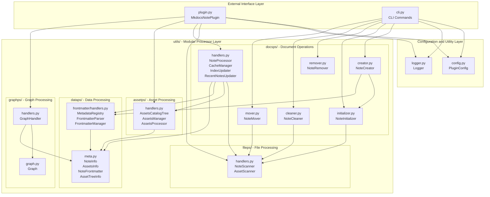
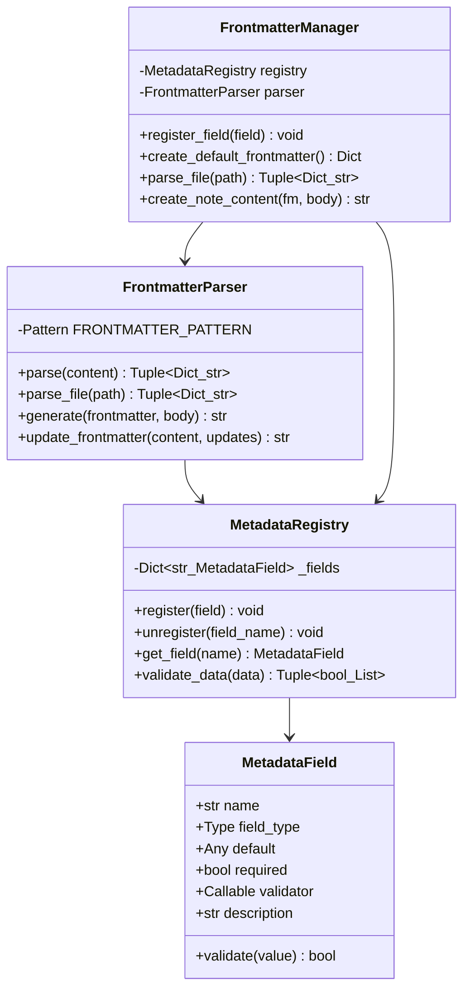
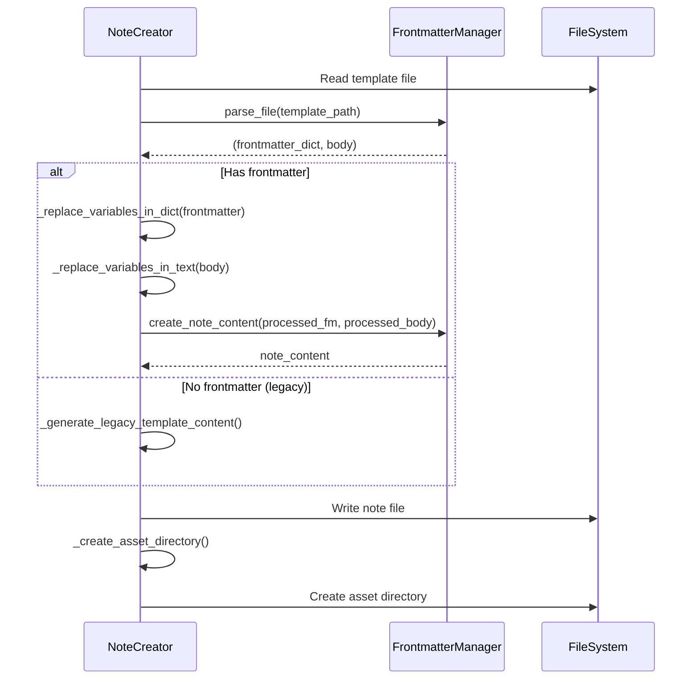
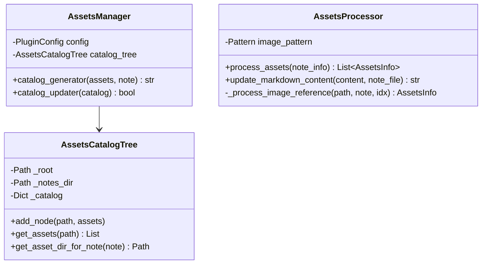
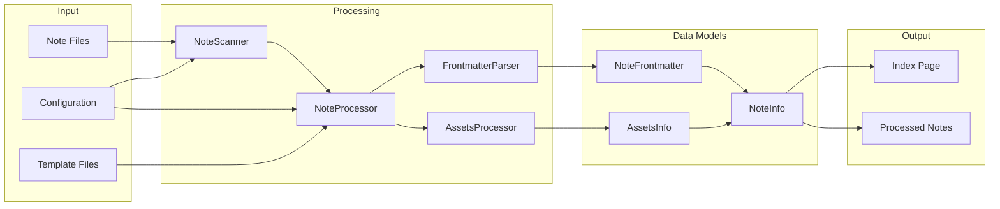
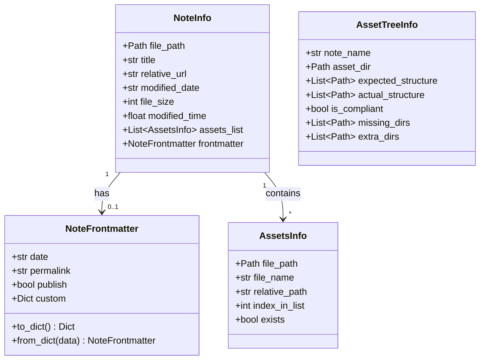
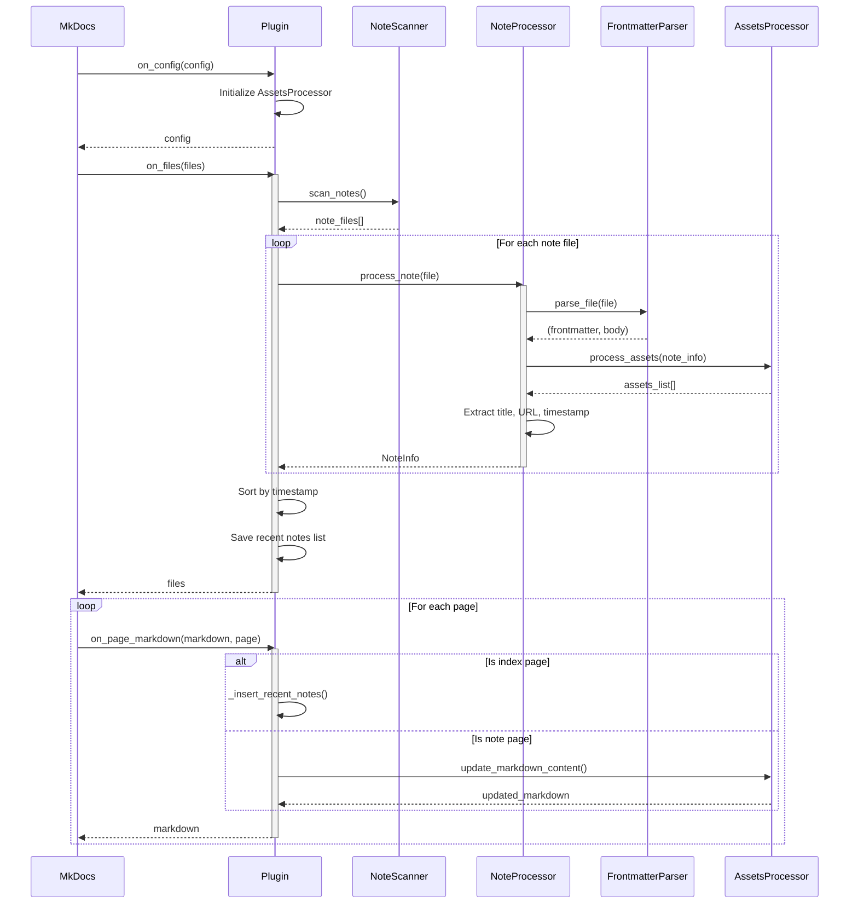
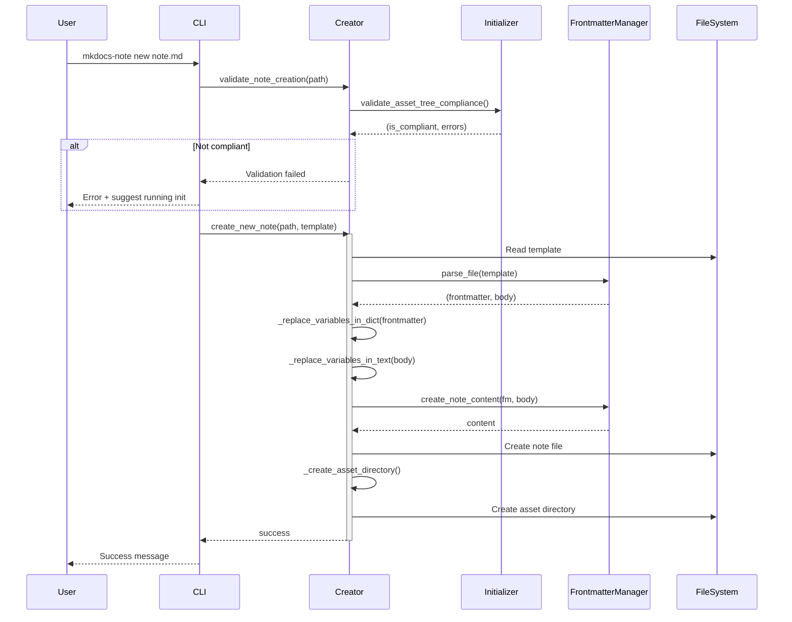
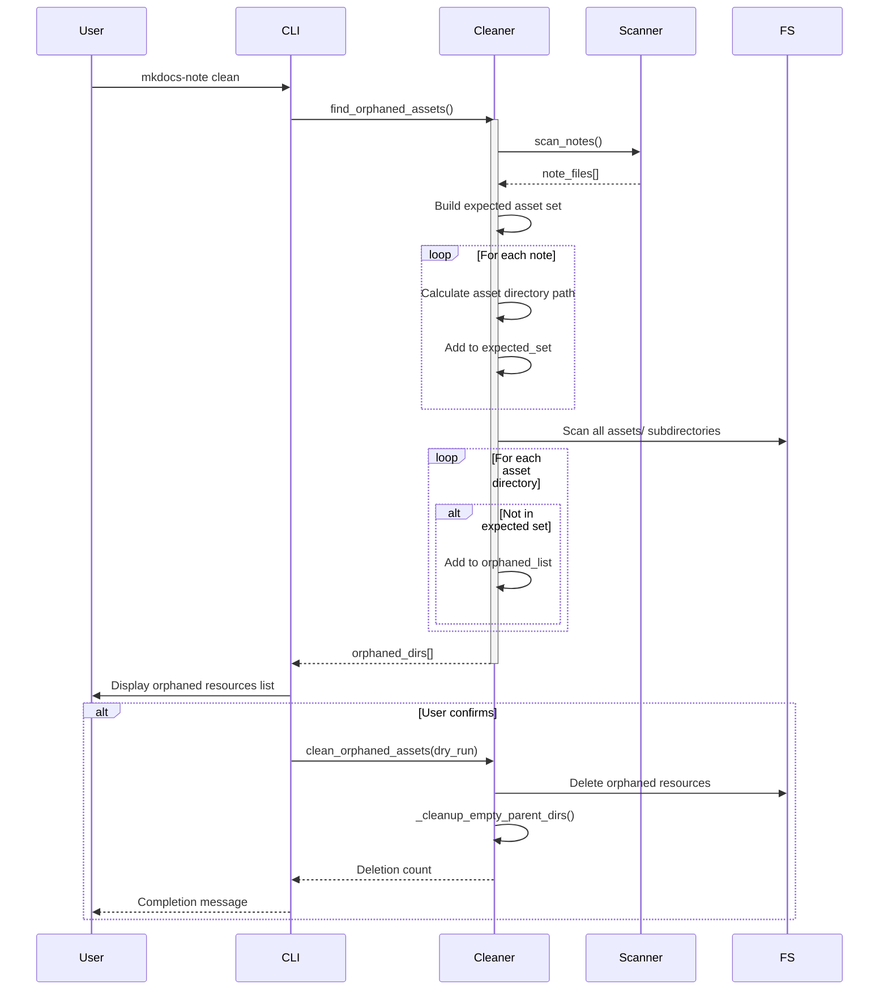

# Architecture Overview (v2.0.0+)

This document describes the complete architecture of the MkDocs-Note plugin in v2.0.0+, including modular refactoring, frontmatter metadata system, and co-located resource management.

---

## 1. Project Overview

### 1.1 Project Positioning

MkDocs-Note is a note management plugin designed specifically for MkDocs and Material for MkDocs theme. Through modular architecture and extensible metadata system, it provides users with powerful and flexible note and document management capabilities.

### 1.2 Core Design Philosophy

- **Modular Layering**: Modules are divided by functional domains with clear responsibilities and easy extensibility

- **Co-located Resources**: Resources are placed alongside note files for easy management and movement

- **Metadata-driven**: Extensible metadata system based on frontmatter

- **Interface-friendly**: Complete CLI tools and plugin API

---

## 2. Architecture Evolution

### 2.1 From v1.x to v2.0.0

- **v1.x Architecture Issues**:

    - Single `core/` directory containing all business logic

    - Unclear module responsibilities

    - Adding new features required modifying core code

- **v2.0.0 Architecture Improvements**:

    - **Modular Refactoring**: Split `core/` by functional domains into `utils/` subpackages

    - **Clear Layering**: Separation of data layer, processing layer, and operation layer

    - **Open-Closed Principle**: Extend functionality through registration mechanism without modifying core

### 2.2 Refactoring Motivation

Based on [Issue #15](https://github.com/virtualguard101/mkdocs-note/issues/15), the following goals were achieved:

1. ✅ Use frontmatter to manage note metadata

2. ✅ Template variables are replaced only in frontmatter, keeping content clean

3. ✅ Improve project extensibility and maintainability

---

## 3. Modular Architecture

### 3.1 Overall Architecture Diagram

```
mkdocs-note/
├── src/mkdocs_note/
│   ├── __init__.py              # Package initialization
│   ├── plugin.py                # MkDocs plugin entry point
│   ├── config.py                # Configuration management
│   ├── logger.py                # Logging utilities
│   ├── cli.py                   # Command-line interface
│   │
│   └── utils/                   # Utility and processor modules (new architecture)
│       ├── assetps/             # Asset Processors
│       │   ├── __init__.py
│       │   └── handlers.py      # AssetsCatalogTree, AssetsManager, AssetsProcessor
│       │
│       ├── dataps/              # Data Processors
│       │   ├── __init__.py
│       │   ├── meta.py          # Data models: NoteInfo, AssetsInfo, NoteFrontmatter, AssetTreeInfo
│       │   └── frontmatter/     # Frontmatter management subsystem
│       │       ├── __init__.py
│       │       └── handlers.py  # MetadataRegistry, FrontmatterParser, FrontmatterManager
│       │
│       ├── docsps/              # Document Processors
│       │   ├── __init__.py
│       │   ├── handlers.py      # NoteProcessor, CacheManager, IndexUpdater, RecentNotesUpdater
│       │   ├── creator.py       # NoteCreator - note creation
│       │   ├── cleaner.py       # NoteCleaner - orphaned resource cleanup
│       │   ├── initializer.py   # NoteInitializer - structure initialization
│       │   ├── remover.py       # NoteRemover - note deletion
│       │   └── mover.py         # NoteMover - note movement
│       │
│       ├── fileps/              # File Processors
│       │   ├── __init__.py
│       │   └── handlers.py      # NoteScanner, AssetScanner - file scanning
│       │
│       ├── graphps/             # Graph Processors
│       │   ├── __init__.py
│       │   ├── graph.py         # Network graph underlying engine, which migrated from mkdocs-network-graph-plugin
│       │   └── handlers.py      # GraphHandler - network graph management, configuration, static asset copying
│       └── pathps/              # Path Processors
│           └── __init__.py      # Path utilities (reserved)
│
└── tests/                       # Test suite
    ├── core/                    # Core functionality tests
    ├── smoke_test.py            # Smoke tests
    ├── test_config.py           # Configuration tests
    ├── test_plugin.py           # Plugin tests
    └── test.sh                  # Test runner script
```

### 3.2 Module Naming Convention

**`ps` Suffix Meaning**: Processors

Module responsibility domains:

| Module | Responsibility | Contents |
|--------|---------------|----------|
| `assetps/` | Asset processing | Asset scanning, directory management, path conversion |
| `dataps/` | Data processing | Data models, metadata management, frontmatter system |
| `docsps/` | Document operations | Note processing, creation, deletion, movement, cleanup |
| `fileps/` | File I/O | File scanning, validation |
| `graphps/` | Graph processing | Network graph generation, link detection, visualization |
| `pathps/` | Path processing | Path calculation, standardization (reserved for extension) |

### 3.3 Dependency Diagram



---

## 4. Core Modules

### 4.1 dataps/ - Data Processing Layer

#### 4.1.1 meta.py - Data Models

**Responsibility**: Define core data structures

**Core Classes**:

```python
@dataclass
class NoteFrontmatter:
    """Frontmatter metadata"""
    date: Optional[str] = None
    permalink: Optional[str] = None
    publish: Optional[bool] = True
    custom: Dict[str, Any] = field(default_factory=dict)

@dataclass
class NoteInfo:
    """Complete note information"""
    file_path: Path
    title: str
    relative_url: str
    modified_date: str
    file_size: int
    modified_time: float
    assets_list: List['AssetsInfo']
    frontmatter: Optional[NoteFrontmatter] = None

@dataclass
class AssetsInfo:
    """Asset file information"""
    file_path: Path
    file_name: str
    relative_path: str
    index_in_list: int
    exists: bool = True

@dataclass
class AssetTreeInfo:
    """Asset tree structure analysis information"""
    note_name: str
    asset_dir: Path
    expected_structure: List[Path]
    actual_structure: List[Path]
    is_compliant: bool
    missing_dirs: List[Path]
    extra_dirs: List[Path]
```

#### 4.1.2 frontmatter/handlers.py - Metadata Management System

**Responsibility**: Provide extensible frontmatter metadata management

**Core Components**:



- **Design Highlights**:

    - ✅ **Open-Closed Principle**: Extend fields through registration mechanism without modifying core code

    - ✅ **Type Safety**: Field definitions include type and validation

    - ✅ **Global Registry**: Unified management of all metadata fields

### 4.2 docsps/ - Document Operations Layer

#### 4.2.1 handlers.py - Core Note Processing

**Responsibility**: Note processing, index updates, cache management

**Core Classes**:

| Class | Responsibility | Key Methods |
|-------|---------------|-------------|
| `NoteProcessor` | Note metadata extraction | `process_note()`, `_extract_frontmatter()`, `_get_git_commit_time()` |
| `CacheManager` | Cache and change detection | `should_update_notes()`, `should_update_content()` |
| `IndexUpdater` | Index file updates | `update_index()`, `_generate_html_list()` |
| `RecentNotesUpdater` | Recent notes update orchestration | `update()` |

#### 4.2.2 creator.py - Note Creator

**Responsibility**: Create new notes based on templates

- **Core Features**:

    - Template loading and variable substitution

    - Frontmatter template support

    - Automatic asset directory creation

    - Structure compliance validation

**Template Processing Flow**:



#### 4.2.3 Other Processors

| Module | Class | Responsibility |
|--------|-------|---------------|
| `cleaner.py` | `NoteCleaner` | Find and clean orphaned resources |
| `initializer.py` | `NoteInitializer` | Initialize directory structure, validate compliance |
| `remover.py` | `NoteRemover` | Delete notes and resources |
| `mover.py` | `NoteMover` | Move/rename notes and directories |

### 4.3 assetps/ - Asset Processing Layer

#### 4.3.1 handlers.py - Asset Management

**Core Classes**:



**Co-located Resource Pattern** (v2.0.0+):

```python
def _get_asset_directory(note_file_path: Path) -> Path:
    """
    Asset directory calculation rule:
    note_file.parent / "assets" / note_file.stem
    
    Example:
        Note: docs/notes/dsa/anal/iter.md
        Assets: docs/notes/dsa/anal/assets/iter/
    """
    return note_file_path.parent / "assets" / note_file_path.stem
```

### 4.4 fileps/ - File Processing Layer

#### 4.4.1 handlers.py - File Scanning

**Responsibility**: File scanning and validation

**Core Classes**:

| Class | Method | Function |
|-------|--------|----------|
| `NoteScanner` | `scan_notes()` | Recursively scan notes directory |
| `NoteScanner` | `_is_valid_note_file()` | Validate file validity |
| `AssetScanner` | `scan_assets()` | Scan asset files |

**Filtering Rules**:
- ✅ Extension check: `.md`, `.ipynb`
- ✅ Exclusion patterns: `index.md`, `README.md`
- ✅ Exclusion directories: `__pycache__`, `.git`, `node_modules`

### 4.5 pathps/ - Path Processing Layer

**Status**: Reserved for extension, currently empty

- **Planned Usage**:

    - Path standardization

    - Relative path calculation

    - Cross-platform path processing

---

## 5. Data Models

### 5.1 Data Flow Diagram



### 5.2 Data Model Relationships



---

## 6. Workflows and Data Flow

### 6.1 Plugin Build-time Workflow



### 6.2 CLI Command Workflows

#### 6.2.1 new Command (Note Creation)



#### 6.2.2 clean Command (Orphaned Resource Cleanup)



---

## 7. Design Principles

### 7.1 Modular Design

- **Separation of Concerns**:

    - `dataps/`: Data definition and metadata management

    - `docsps/`: Document-level business logic

    - `assetps/`: Asset processing logic

    - `fileps/`: Low-level file I/O

- **Advantages**:

    - ✅ Single Responsibility Principle

    - ✅ Easy unit testing

    - ✅ Reduced coupling

    - ✅ Easy extensibility

### 7.2 Open-Closed Principle

- **Implementation**:

    - `MetadataRegistry`: Add new fields through registration without modifying core

    - `FrontmatterManager`: Provides facade interface, hiding implementation details

**Extension Example**:
```python
from mkdocs_note.utils.dataps.frontmatter.handlers import (
    MetadataField, 
    register_field
)

# Register custom field
custom_field = MetadataField(
    name="author",
    field_type=str,
    default=None,
    required=False,
    description="Note author"
)
register_field(custom_field)
```

### 7.3 Dependency Inversion Principle

- **Implementation**:

    - High-level modules (`docsps/handlers.py`) depend on abstractions (data models)

    - Low-level modules (`fileps/handlers.py`) implement specific functionality

    - Decoupled through interfaces and data classes

### 7.4 Test-First

- **Test Coverage**:

    - ✅ Unit tests: 227 tests, 100% pass rate

    - ✅ Smoke tests: Basic functionality verification

    - ✅ Integration tests: Complete workflow verification

- **Testing Principles**:

    - Use temporary files to avoid polluting project files

    - Mock external dependencies (Git, file system)

    - Independent and repeatable

---

## 8. Key Technical Decisions

### 8.1 Why Choose Modular Refactoring?

- **Problems**:

    - v1.x's `core/` directory contained all logic, making it difficult to maintain

    - Adding new features required modifying multiple core files

    - Unclear boundaries between modules

- **Solution**:

    - Split by functional domains: assets, data, documents, files

    - Use `ps` suffix to establish naming convention

    - Each subpackage focuses on single responsibility

- **Benefits**:

    - Code is easier to understand and maintain

    - New feature development is faster

    - Tests are easier to write

### 8.2 Why Adopt Co-located Resource Structure?

**v1.x Problems** (Centralized structure):
```
docs/notes/assets/dsa.assets/anal/iter/  # Resources in centralized directory
docs/notes/dsa/anal/iter.md              # Note in original location
```

- Easy to miss resources when moving notes

- Complex path calculation

- Difficult to manage intuitively

**v2.0.0 Solution** (Co-located):
```
docs/notes/dsa/anal/iter.md          # Note
docs/notes/dsa/anal/assets/iter/     # Resources right next to it
```

- ✅ Notes and resources are together, easy to see at a glance

- ✅ Move together when relocating

- ✅ Simple path calculation

- ✅ Intuitive

### 8.3 Why Use Frontmatter?

- **Advantages**:

    - ✅ **Standard Format**: YAML frontmatter is the standard in Markdown ecosystem

    - ✅ **Extensible**: Add new fields through registration mechanism

    - ✅ **Type Safe**: Field definitions include type validation

    - ✅ **Separation of Concerns**: Metadata separated from content

- **Design**:

    - Variable substitution only occurs in frontmatter

    - Content body remains clean, free from template syntax

    - Supports legacy notes without frontmatter

---

## 9. Performance Optimization

### 9.1 Caching Mechanism

```python
class CacheManager:
    """Cache Manager
    
    Detects changes through hash values to avoid unnecessary updates
    """
    def should_update_notes(self, notes: List[NoteInfo]) -> bool:
        current_hash = self._calculate_notes_hash(notes)
        if self._last_notes_hash != current_hash:
            self._last_notes_hash = current_hash
            return True
        return False
```

### 9.2 Git Timestamp Caching

- Git commands have timeout protection (5 seconds)

- Automatically falls back to file system time on failure

- Avoids repeated Git calls

---

## 10. Migration Guide

### 10.1 Migrating from v1.x to v2.0.0

#### Step 1: Migrate Asset Files

```bash
# Old structure (v1.x)
docs/notes/assets/dsa.assets/anal/iter/

# New structure (v2.0.0)
docs/notes/dsa/anal/assets/iter/

# Migration command example
mv docs/notes/assets/dsa.assets/anal/iter/ docs/notes/dsa/anal/assets/
```

#### Step 2: Update Configuration (Optional)

```yaml
plugins:
  - mkdocs-note:
      notes_dir: "docs/notes"  # Required
      # assets_dir: "..."       # Can be removed, deprecated
```

#### Step 3: Validate Migration

```bash
mkdocs-note validate
```

### 10.2 Code Import Updates

If your code directly imports internal plugin modules:

```python
# v1.x (old)
from mkdocs_note.core.note_manager import NoteProcessor
from mkdocs_note.core.data_models import NoteInfo
from mkdocs_note.core.frontmatter_manager import FrontmatterManager

# v2.0.0 (new)
from mkdocs_note.utils.docsps.handlers import NoteProcessor
from mkdocs_note.utils.dataps.meta import NoteInfo
from mkdocs_note.utils.dataps.frontmatter.handlers import FrontmatterManager
```

---
