# Architecture Overview (v3.0.0+)

This document describes the complete architecture of the MkDocs-Note plugin in v3.0.0+, which adopts a simplified, lightweight design philosophy focused on core documentation needs.

---

## Project Overview

### Project Positioning

MkDocs Note is now a **lightweight documentation plugin** designed specifically for MkDocs and Material for MkDocs theme. It focuses on essential note management features with minimal complexity.

It just a simple python-based tool that help you manage your notes in MkDocs documentation site, why not make it simpler and concise?

### Core Design Philosophy

- **Simplicity First**: Minimal code, focused features, easy to understand and maintain

- **Co-located Resources**: Asset directories placed alongside note files following the pattern `note_file.parent / "assets" / note_file.stem`

- **Metadata-driven**: Simple frontmatter-based metadata (date, title, publish status)

- **MkDocs Integration**: Seamless integration with MkDocs ecosystem, leveraging existing infrastructure

---

## Architecture Evolution

### Architecture Timeline

| Version | Date | Philosophy | Code Size | Complexity |
|---------|------|------------|-----------|------------|
| v1.x | Early | Basic functionality | ~3,000 lines | Low |
| v2.0.0 | Oct, 2025 | Feature-rich, modular | ~12,000 lines | High |
| v3.0.0 | 2025-11-04 | Lightweight, simple | ~2,700 lines | Low |

### From v2.x to v3.0.0 (Major Simplification)

**v2.x Problems**:

- ❌ Over-engineered: Complex modular architecture (`assetps/`, `dataps/`, `docsps/`, `fileps/`, `graphps/`)

- ❌ Too many abstractions: 9,300+ lines of code, hard to maintain

- ❌ Feature creep: Template system, validation, initialization commands

- ❌ High maintenance burden: Many moving parts, potential bugs

**v3.0.0 Solutions** ([PR #60](https://github.com/virtualguard101/mkdocs-note/pull/60)):

- ✅ **Flat Structure**: Moved core modules to package root

- ✅ **Minimal Utils**: Only essential utilities (`meta.py`, `scanner.py`, `cli/`)

- ✅ **Removed Features**: Asset management system, template system, validation commands

- ✅ **Retained Core**: Recent notes, network graph, basic CLI commands

- ✅ **Code Reduction**: From ~12,000 to ~2,700 lines (77% reduction)

### Design Trade-offs

**What We Removed**:

- ❌ Asset management subsystem (`utils/assetps/`)

- ❌ Data models and frontmatter system (`utils/dataps/`)

- ❌ Document operations (creator, cleaner, mover, remover - `utils/docsps/`)

- ❌ File I/O abstraction layer (`utils/fileps/`)

- ❌ Advanced CLI commands (`init`, `validate`, `template`)

- ❌ Custom logging module

**What We Kept**:

- ✅ Recent notes display

- ✅ Network graph visualization

- ✅ Basic CLI: `new`, `remove`, `move`, `clean`

- ✅ Simple metadata extraction

---

## Simplified Architecture (v3.0.0+)

### Overall Structure Diagram

```
mkdocs-note/
├── src/mkdocs_note/
│   ├── __init__.py              # Package initialization
│   ├── plugin.py                # MkDocs plugin entry point
│   ├── cli.py                   # Command-line interface entry point
│   ├── config.py                # Configuration management
│   ├── graph.py                 # Network graph functionality
│   │
│   ├── static/                  # Static assets for graph visualization
│   │   ├── graph.js
│   │   └── graph.css
│   │
│   └── utils/                   # Minimal utility modules
│       ├── __init__.py
│       ├── meta.py              # Metadata extraction (title, date, frontmatter validation)
│       ├── scanner.py           # File scanning
│       └── cli/                 # CLI command implementations
│           ├── __init__.py
│           ├── commands.py      # NewCommand, RemoveCommand, MoveCommand, CleanCommand
│           └── common.py        # Common utilities (asset paths, directory cleanup)
│
└── tests/                       # Test suite
    ├── __init__.py
    ├── smoke_test.py            # Smoke tests
    ├── test_config.py           # Configuration tests
    ├── test_plugin.py           # Plugin tests
    ├── test_cli_*.py            # CLI tests
    └── test.sh                  # Test runner script
```

### Module Responsibilities

| Module | Responsibility | Key Functions |
|--------|---------------|---------------|
| `plugin.py` | MkDocs plugin integration | File processing, recent notes insertion, graph integration |
| `cli.py` | CLI entry point | Command registration, argument parsing, error handling |
| `config.py` | Configuration | Plugin settings (`notes_root`, `recent_notes_config`, `graph_config`) |
| `graph.py` | Network graph | Node/edge creation, link detection, static asset management |
| `utils/meta.py` | Metadata | Frontmatter validation, title/date extraction |
| `utils/scanner.py` | File scanning | Note file discovery and validation |
| `utils/cli/commands.py` | CLI commands | `new`, `remove`, `move`, `clean` implementations |
| `utils/cli/common.py` | CLI utilities | Asset directory paths, directory cleanup |

### Dependency Diagram


---

## Core Modules Detail

### plugin.py - MkDocs Plugin Entry

**Responsibility**: MkDocs plugin integration and orchestration

**Key Components**:

```python
class MkdocsNotePlugin(BasePlugin[MkdocsNoteConfig]):
    """MkDocs Note Plugin entry point."""
    
    notes_list: list[File] = []
    
    # Event Hooks:
    def on_config(config)           # Add static resources for graph
    def on_pre_build(config)        # Initialize graph if enabled
    def on_files(files, config)     # Scan and validate notes
    def on_nav(nav, config, files)  # Store files reference
    def on_page_markdown(markdown)  # Insert recent notes
    def on_post_page(output)        # Inject graph script
    def on_post_build(config)       # Build graph, copy static assets
```

**Recent Notes Insertion**:
- Scans notes using `scanner.scan_notes()`
- Validates frontmatter with `meta.validate_frontmatter()`
- Sorts by `note_date` (extracted from frontmatter)
- Replaces marker with HTML list

### cli.py - Command Line Interface

**Responsibility**: Standalone CLI for note management

**Architecture**:
```python
@click.group()
def cli():
    """MkDocs Note CLI - Manage notes and their assets structure."""
    
# Commands:
@cli.command("new")      # Create new note
@cli.command("remove")   # Remove note (alias: rm)
@cli.command("move")     # Move/rename note (alias: mv)
@cli.command("clean")    # Clean orphaned assets
```

**Key Features**:
- Custom command grouping (aliases shown together)
- Configuration loading from `mkdocs.yml` or defaults
- Rich feedback with emojis (✅ ❌ 📝 📁)
- Confirmation prompts (skip with `--yes`)
- Dry-run support for `clean` command

### config.py - Configuration Management

**Responsibility**: Plugin configuration schema

**Configuration Options**:

```python
class MkdocsNoteConfig(Config):
    enabled: bool = True
    notes_root: Path = "docs"
    
    recent_notes_config: dict = {
        "enabled": False,
        "insert_marker": "<!-- recent_notes -->",
        "insert_num": 10,
    }
    
    graph_config: dict = {
        "enabled": False,
        "name": "title",      # or "file_name"
        "debug": False,
    }
```

### graph.py - Network Graph Visualization

**Responsibility**: Generate and visualize note relationships

**Core Class**:

```python
class Graph:
    LINK_PATTERN = r"\[[^\]]+\]\((?P<url>.*?)\)|\[\[(?P<wikilink>[^\]]+)\]\]"
    
    def _create_nodes(files)         # Create nodes from documentation pages
    def _create_edges(files)         # Parse markdown for links
    def _find_links(markdown)        # Extract links using regex
    def to_dict()                    # Export graph data
```

**Supporting Functions**:
- `add_static_resources()`: Add D3.js and custom JS/CSS to MkDocs config
- `inject_graph_script()`: Inject graph options into HTML
- `copy_static_assets()`: Copy graph.js and graph.css to site directory

**Link Detection**:
- Markdown links: `[text](url)`
- Wiki links: `[[page]]`
- Handles URL escaping, query strings, fragments

### utils/meta.py - Metadata Extraction

**Responsibility**: Simple frontmatter validation and metadata extraction

**Key Functions**:

```python
def validate_frontmatter(f: File) -> bool:
    """Validate frontmatter, extract date and title.
    
    Required fields:
    - date: datetime object
    - title: string
    - publish: bool (default True)
    
    Side effects: Sets f.note_date and f.note_title
    """

def extract_date(f: File) -> Optional[datetime]:
    """Extract date from validated file."""

def extract_title(f: File) -> Optional[str]:
    """Extract title from validated file."""
```

**Validation Rules**:
- ❌ Skip if `publish: false`
- ❌ Error if missing `date` or `title`
- ❌ Error if wrong type
- ✅ Store metadata as file attributes

### utils/scanner.py - File Scanning

**Responsibility**: Scan and filter note files

**Key Function**:

```python
def scan_notes(files: Files, config) -> tuple[list[File], list[File]]:
    """Scan notes directory, return (valid_notes, invalid_files).
    
    Filtering:
    1. Only documentation pages (is_documentation_page())
    2. Within notes_root directory
    3. Valid frontmatter (validate_frontmatter())
    
    Returns:
        (valid_notes, invalid_files)
    """
```

**MkDocs Integration**:
- Uses `mkdocs.structure.files.Files`
- Leverages `is_documentation_page()` for file type filtering
- Works with MkDocs' path resolution

### utils/cli/commands.py - CLI Command Implementations

**Command Classes**:

| Class | Responsibility | Key Methods |
|-------|---------------|-------------|
| `NewCommand` | Create new note | `_generate_note_basic_meta()`, `execute()` |
| `RemoveCommand` | Remove note and assets | `_remove_single_document()`, `_remove_docs_directory()` |
| `MoveCommand` | Move/rename note and assets | `_move_single_document()`, `_move_docs_directory()` |
| `CleanCommand` | Clean orphaned assets | `_scan_note_files()`, `_find_orphaned_assets()` |

**Common Pattern**:
```python
class XxxCommand:
    def _validate_before_execution() -> int
        # Returns 0 (fail), 1 (single file), 2 (directory)
    
    def execute(path) -> None
        # Main execution logic
```

### utils/cli/common.py - CLI Utilities

**Utility Functions**:

```python
def get_asset_directory(note_path: Path) -> Path:
    """Co-located asset structure: note.parent / 'assets' / note.stem"""
    return note_path.parent / "assets" / note_path.stem

def cleanup_empty_directories(start_dir: Path, stop_at: Path):
    """Recursively remove empty parent directories."""
    
def ensure_parent_directory(path: Path):
    """Create parent directory if needed."""
```

**Asset Directory Pattern**:
```
docs/notes/python/intro.md
                 └─ assets/intro/  (asset directory)
```

---

## Data Models (Simplified)

### Core Data Structure

In v3.0.0+, we **leverage MkDocs' existing data structures** instead of creating custom models:

**Primary Data Object**: `mkdocs.structure.files.File`

```python
# MkDocs File object (extended by plugin)
class File:
    src_path: str              # Source path relative to docs_dir
    abs_src_path: str          # Absolute source path
    url: str                   # URL path for the file
    content_string: str        # File content
    page: Optional[Page]       # Associated Page object
    
    # Plugin-added attributes (via setattr):
    note_date: datetime        # From frontmatter
    note_title: str            # From frontmatter
```

### Frontmatter Schema

**Minimal Required Fields**:

```yaml
---
date: 2025-11-05 12:00:00    # datetime (required)
title: My Note Title         # string (required)
permalink:                   # string (optional)
publish: true                # bool (default: true)
---
```

**Processed by MkDocs**:
- Uses `mkdocs.utils.meta.get_data()` for parsing
- YAML frontmatter automatically converted to Python types
- `date` becomes `datetime` object

### Graph Data Model

**Graph JSON Structure**:

```json
{
  "nodes": [
    {
      "id": "notes/python/intro.md",
      "path": "/abs/path/to/notes/python/intro.md",
      "name": "Python Introduction",
      "url": "notes/python/intro/"
    }
  ],
  "edges": [
    {
      "source": "notes/python/intro.md",
      "target": "notes/python/basics.md"
    }
  ]
}
```

### Data Flow Diagram


---

## Workflows and Data Flow

### Plugin Build-time Workflow (v3.0.0+)


### CLI Command Workflows (v3.0.0+)

#### new Command (Note Creation)


#### clean Command (Orphaned Asset Cleanup)

```mermaid
sequenceDiagram
    participant User
    participant CLI
    participant CleanCmd as CleanCommand
    participant Common
    participant FS
    
    User->>CLI: mkdocs-note clean [--dry-run] [--yes]
    CLI->>CLI: Load config
    CLI->>CleanCmd: new CleanCommand()
    
    CLI->>CleanCmd: _scan_note_files(notes_root)
    activate CleanCmd
    CleanCmd->>FS: Scan for .md, .ipynb
    CleanCmd-->>CLI: note_files[]
    
    CLI->>CleanCmd: _find_orphaned_assets(note_files)
    
    loop For each note
        CleanCmd->>Common: get_asset_directory(note)
        CleanCmd->>CleanCmd: Add to expected_set
    end
    
    CleanCmd->>FS: Scan all assets/ directories
    loop For each asset dir
        alt Not in expected_set
            CleanCmd->>CleanCmd: Add to orphaned_list
        end
    end
    
    CleanCmd-->>CLI: orphaned_dirs[]
    deactivate CleanCmd
    
    alt No orphans
        CLI-->>User: ✅ No orphaned assets
    end
    
    CLI-->>User: Show orphaned directories
    
    alt --dry-run
        CLI-->>User: 💡 Run without --dry-run to remove
    else User confirms (or --yes)
        CLI->>CleanCmd: execute(dry_run=False)
        CleanCmd->>FS: Remove orphaned directories
        CleanCmd->>Common: cleanup_empty_directories()
        CleanCmd-->>CLI: success
        CLI-->>User: ✅ Removed N directories
    else User cancels
        CLI-->>User: ⚠️ Cancelled
    end
```



#### move Command (Note Move/Rename)

```mermaid
sequenceDiagram
    participant User
    participant CLI
    participant MoveCmd as MoveCommand
    participant Common
    participant FS
    
    User->>CLI: mkdocs-note mv source.md dest.md [--yes]
    CLI->>CLI: Load config
    CLI->>MoveCmd: new MoveCommand()
    
    alt Source doesn't exist
        CLI-->>User: ❌ Source does not exist
    end
    
    alt User confirms (or --yes)
        CLI->>MoveCmd: execute(source, dest)
        activate MoveCmd
        
        MoveCmd->>MoveCmd: _validate_before_execution()
        
        MoveCmd->>Common: ensure_parent_directory(dest)
        MoveCmd->>Common: get_asset_directory(source)
        Common-->>MoveCmd: source_asset_dir
        MoveCmd->>Common: get_asset_directory(dest)
        Common-->>MoveCmd: dest_asset_dir
        
        MoveCmd->>FS: Move source → dest
        
        alt Assets exist
            MoveCmd->>FS: Move source_asset_dir → dest_asset_dir
            MoveCmd->>Common: cleanup_empty_directories()
        end
        
        MoveCmd-->>CLI: success
        deactivate MoveCmd
        
        CLI-->>User: ✅ Successfully moved<br/>📝 From: source<br/>📝 To: dest<br/>📁 Assets moved
    else User cancels
        CLI-->>User: ⚠️ Cancelled
    end
```



---

## Design Principles (v3.0.0+)

### Simplicity First

**Core Philosophy**: Minimal complexity, maximum clarity

- ✅ **Flat Structure**: Core modules at package root, not buried in nested subpackages

- ✅ **Direct Dependencies**: Minimize abstraction layers

- ✅ **Standard Library**: Prefer Python/MkDocs built-ins over custom solutions

- ✅ **Code Minimalism**: ~2,700 lines vs. ~12,000 lines in v2.x

**Example**:
```python
# v3.0.0: Direct, simple
from mkdocs.utils import meta
frontmatter, body = meta.get_data(content)

# v2.x: Over-abstracted
from mkdocs_note.utils.dataps.frontmatter.handlers import FrontmatterParser
parser = FrontmatterParser()
frontmatter, body = parser.parse(content)
```

### Leverage MkDocs Infrastructure

**Principle**: Don't reinvent what MkDocs provides

- ✅ **Use MkDocs File objects**: Extend with `setattr()` instead of custom wrappers

- ✅ **Use MkDocs logging**: `get_plugin_logger(__name__)` instead of custom logger

- ✅ **Use MkDocs meta parsing**: `mkdocs.utils.meta.get_data()` for frontmatter

- ✅ **Follow MkDocs conventions**: Plugin hooks, configuration schema

**Benefits**:
- Better compatibility with MkDocs ecosystem
- Less maintenance burden
- Familiar API for MkDocs developers

### Co-located Resources

**Pattern**: Assets live next to their notes

```
docs/notes/python/intro.md
                └─ assets/intro/  (assets for intro.md)
```

**Implementation**:
```python
def get_asset_directory(note_path: Path) -> Path:
    return note_path.parent / "assets" / note_path.stem
```

**Advantages**:

- ✅ Easy to understand and manage

- ✅ Move note → assets move with it (CLI commands handle this)

- ✅ No complex path calculations

- ✅ Intuitive for users

### Fail Fast, Fail Clear

**Principle**: Clear error messages, early validation

```python
# Frontmatter validation
if not frontmatter.get("publish", False):
    logger.debug(f"Skipping {f.src_uri} because it is not published")
    return False

if "date" not in frontmatter:
    logger.error(f"Invalid frontmatter for {f.src_uri}: 'date' is required")
    return False
```

**CLI Error Handling**:
```python
if not note_path.exists():
    click.echo(f"❌ Error: File does not exist: {note_path}", err=True)
    sys.exit(1)
```

### Testing Strategy

**Test Coverage**:

- ✅ Plugin tests: Core MkDocs integration

- ✅ CLI tests: Command execution, argument parsing

- ✅ Smoke tests: End-to-end workflows

- ✅ Config tests: Configuration validation

**Testing Principles**:

- Use temporary directories for file operations

- Test both success and failure paths

- Clear, descriptive test names

- Minimal test fixtures

---

## Key Technical Decisions (v3.0.0+)

### Why Simplify from v2.x to v3.0.0?

**Problem Statement**: v2.x was over-engineered for the actual use cases

**v2.x Issues**:

- ❌ **Complexity**: 9+ subpackages, 12,000+ lines of code

- ❌ **Maintenance Burden**: Many abstractions, hard to debug

- ❌ **Feature Creep**: Template system, validation, initialization - rarely used

- ❌ **Learning Curve**: New contributors struggled to understand architecture

**v3.0.0 Solution**:

- ✅ **Radical Simplification**: Removed 77% of code

- ✅ **Focus on Core**: Kept only essential features (recent notes, graph, basic CLI)

- ✅ **Flat Structure**: Easy to navigate and understand

- ✅ **Better Integration**: Leverage MkDocs infrastructure instead of reimplementing

**Result**:

- Faster build times

- Easier to maintain

- Clearer purpose

- Better reliability

### Why Keep Co-located Asset Structure?

**Decision**: Retain co-located pattern from v2.x

```
docs/notes/python/intro.md
                └─ assets/intro/  (co-located)
```

**Rationale**:

- ✅ **User-friendly**: Easy to understand and manage

- ✅ **Portable**: Move note → assets move with it

- ✅ **Simple**: One function, one rule

- ✅ **Proven**: Worked well in v2.x

**Implementation**:
```python
# Single source of truth
def get_asset_directory(note_path: Path) -> Path:
    return note_path.parent / "assets" / note_path.stem
```

### Why Use MkDocs' Built-in Frontmatter Parsing?

**Decision**: Use `mkdocs.utils.meta.get_data()` instead of custom parser

**Rationale**:

- ✅ **Standard**: MkDocs already has YAML frontmatter support

- ✅ **Type Conversion**: Automatic conversion (dates, booleans)

- ✅ **Well-tested**: Proven by MkDocs ecosystem

- ✅ **Less Code**: No need to maintain custom parser

**Comparison**:
```python
# v2.x: Custom parser (~200 lines)
from mkdocs_note.utils.dataps.frontmatter.handlers import FrontmatterParser
parser = FrontmatterParser()
fm, body = parser.parse_file(path)

# v3.0.0: Built-in (~5 lines)
from mkdocs.utils import meta
with open(path) as f:
    fm, body = meta.get_data(f.read())
```

### Why Remove Template System?

**Decision**: Remove template system with variable substitution

**v2.x Template System**:

- Template files with `{date}`, `{title}` placeholders

- Complex variable replacement logic

- Template registry and loading mechanism

**Why Remove**:

- ❌ **Low Usage**: Most users used default template

- ❌ **Complexity**: ~500 lines of code for rare feature

- ❌ **Maintenance**: Breaking changes when frontmatter changed

**v3.0.0 Approach**:
```python
# Simple, direct frontmatter generation
def _generate_note_basic_meta(self, file_path: Path) -> str:
    return f"""---
date: {datetime.now().strftime('%Y-%m-%d %H:%M:%S')}
title: {file_path.stem.replace('-', ' ').title()}
permalink: 
publish: true
---
"""
```

**Benefits**:

- ✅ **Maintainable**: 10 lines vs. 500 lines

- ✅ **Flexible**: Users can edit after creation

### Why Keep Network Graph?

**Decision**: Retain graph visualization despite simplification

**Rationale**:
- ✅ **Self-contained**: `graph.py` is independent, ~190 lines

- ✅ **Migrated Code**: Already ported from mkdocs-network-graph-plugin

- ✅ **Low Maintenance**: Stable, minimal dependencies

**Integration**:

- Uses D3.js for rendering (CDN)

- Generates `graph.json` with nodes and edges

- Injects JavaScript configuration via HTML hook

---

## Migration Guide

### Migrating from v2.x to v3.0.0

!!! warning "Breaking Changes"
    `v3.0.0` removes many features from `v2.x`.
    Please review the [changelog](../about/changelog.md#300---2025-11-04-Architecture-Simplification) before upgrading.

#### Step 1: Review Removed Features

**No longer available in v3.0.0**:

- ❌ Template system (`notes_template` config)

- ❌ Asset management system

- ❌ `init` and `validate` CLI commands

- ❌ Custom frontmatter registry

- ❌ `assets_dir` configuration option

**Still available**:

- ✅ Recent notes display

- ✅ Network graph visualization

- ✅ Basic CLI: `new`, `remove`, `move`, `clean`

- ✅ Frontmatter metadata (`date`, `title`, `publish`, `permalink`)

#### Step 2: Update Configuration

**Old (v2.x) config**:
```yaml
plugins:
  - mkdocs-note:
      notes_root: "docs/notes"
      assets_dir: "docs/notes/assets"  # ❌ Removed
      notes_template: "template.md"    # ❌ Removed
      recent_notes_config:
        enabled: true
        insert_num: 10
```

**New (v3.0.0) config**:
```yaml
plugins:
  - mkdocs-note:
      notes_root: "docs/notes"  # ✅ Still supported
      recent_notes_config:      # ✅ Still supported
        enabled: true
        insert_num: 10
      graph_config:             # ✅ Enhanced
        enabled: true
        name: "title"
```

#### Step 3: Update Frontmatter (if needed)

**v3.0.0 requires** these fields:
```yaml
---
date: 2025-11-05 12:00:00  # Required: datetime
title: My Note              # Required: string
publish: true               # Optional: bool (default: true)
permalink:                  # Optional: string
---
```

Notes without valid frontmatter will be **excluded** from builds.

#### Step 4: Test Your Build

```bash
# Clean previous builds
rm -rf site/

# Build with v3.0.0
mkdocs build

# Check for errors
# - Missing frontmatter errors
# - Invalid date/title errors
```

### For Plugin Developers

**Module path changes**:

```python
# v2.x: Complex paths
from mkdocs_note.utils.dataps.meta import NoteInfo
from mkdocs_note.utils.docsps.handlers import NoteProcessor
from mkdocs_note.utils.dataps.frontmatter.handlers import FrontmatterManager

# v3.0.0: Simplified (or don't import internals)
# Most internal APIs are NOT intended for external use
# Use plugin configuration instead
```

**Recommendation**: Don't depend on internal APIs. Use:
- Plugin configuration (`mkdocs.yml`)
- CLI commands
- Frontmatter metadata

---

## References

### External Resources

- [MkDocs Documentation](https://www.mkdocs.org/)

- [Material for MkDocs](https://squidfunk.github.io/mkdocs-material/)

- [MkDocs Network Graph Plugin](https://github.com/develmusa/mkdocs-network-graph-plugin) (graph.py origin)

- [Keep a Changelog](https://keepachangelog.com/)

- [Semantic Versioning](https://semver.org/)

### Design Philosophy References

- [YAGNI (You Aren't Gonna Need It)](https://en.wikipedia.org/wiki/You_aren%27t_gonna_need_it)

- [KISS (Keep It Simple, Stupid)](https://en.wikipedia.org/wiki/KISS_principle)

- [The Zen of Python](https://peps.python.org/pep-0020/) ("Simple is better than complex")

---
