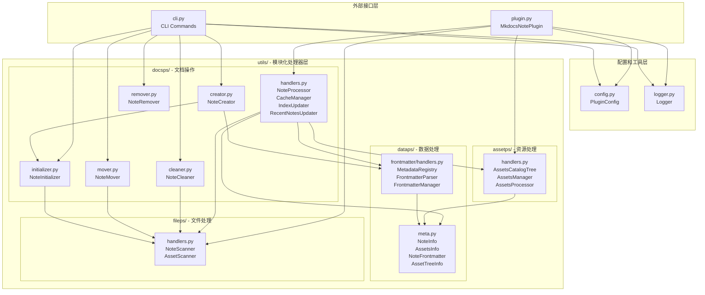
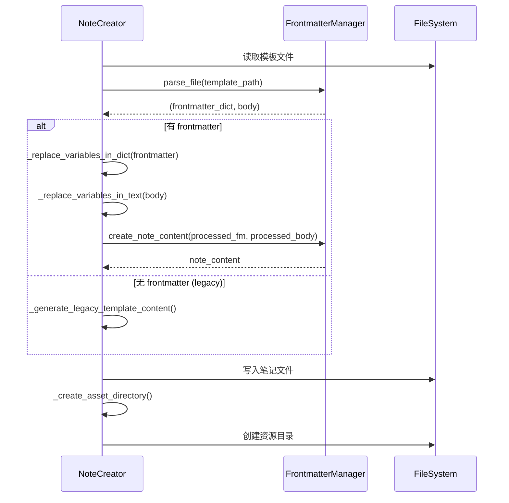
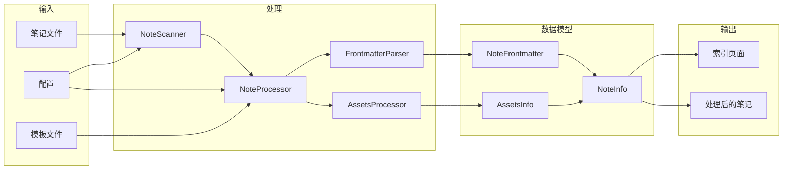
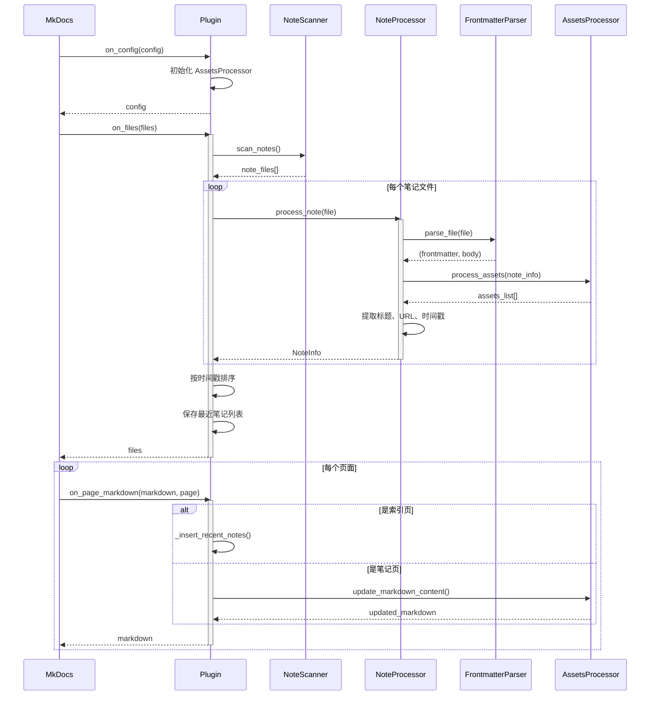
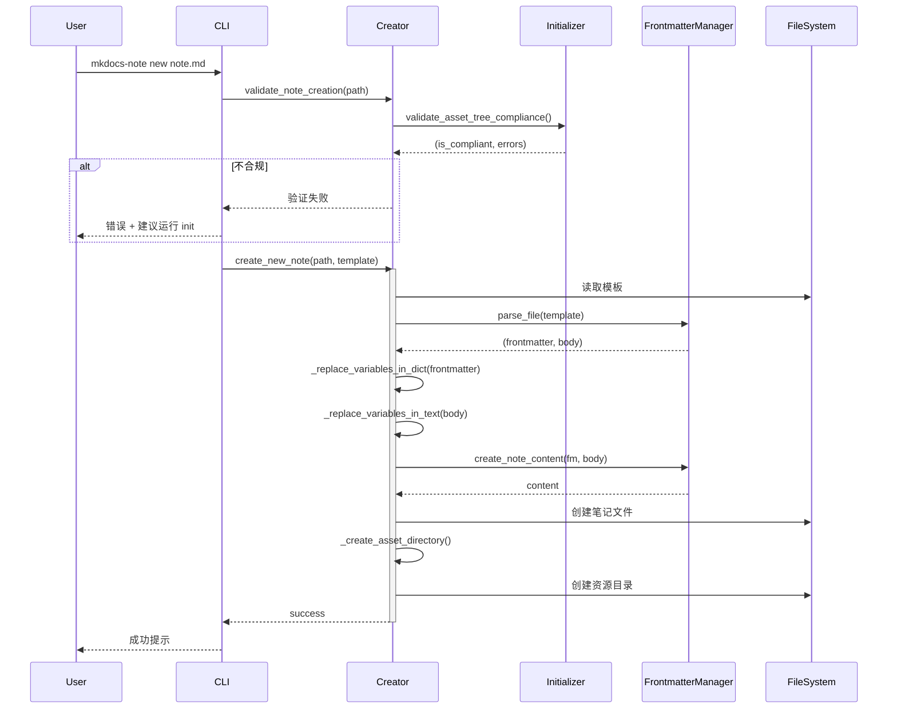
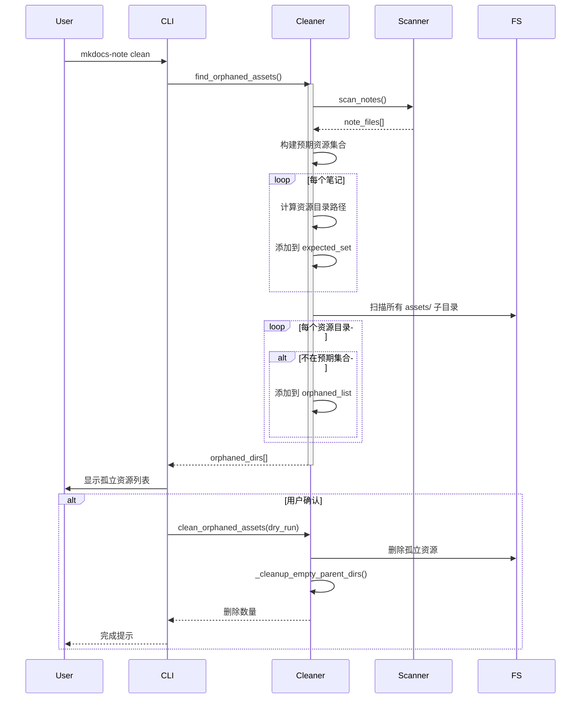

# Architecture Documentation in Chinese (v2.0.0+)

本文档描述了 MkDocs-Note 插件在 v2.0.0+ 版本的完整架构，包括模块化重构、frontmatter 元数据系统和 co-located 资源管理。

## 目录

- [1. 项目概述](#1-项目概述)
- [2. 架构演进](#2-架构演进)
- [3. 模块化架构](#3-模块化架构)
- [4. 核心模块详解](#4-核心模块详解)
- [5. 数据模型](#5-数据模型)
- [6. 工作流与数据流](#6-工作流与数据流)
- [7. 设计原则](#7-设计原则)

---

## 1. 项目概述

### 1.1 项目定位

MkDocs-Note 是一个专为 MkDocs 和 Material for MkDocs 主题设计的笔记管理插件。通过模块化架构和可扩展的元数据系统，为用户提供强大而灵活的笔记和文档管理能力。

### 1.2 核心设计理念

- **模块化分层**：按功能域划分模块，职责清晰，易于扩展
- **Co-located 资源**：资源与笔记文件放在一起，便于管理和移动
- **元数据驱动**：基于 frontmatter 的可扩展元数据系统
- **接口友好**：完善的 CLI 工具和插件 API

---

## 2. 架构演进

### 2.1 从 v1.x 到 v2.0.0

**v1.x 架构问题**：
- 单一 `core/` 目录包含所有业务逻辑
- 模块职责不够清晰
- 扩展新功能需要修改核心代码

**v2.0.0 架构改进**：
- **模块化重构**：将 `core/` 按功能域拆分到 `utils/` 的子包
- **分层清晰**：数据层、处理层、操作层分离
- **开放-封闭**：通过注册机制扩展功能，无需修改核心

### 2.2 重构动机

基于 [Issue #15](https://github.com/virtualguard101/mkdocs-note/issues/15)，实现以下目标：

1. ✅ 使用 frontmatter 管理笔记元数据
2. ✅ 模板变量仅在 frontmatter 中替换，保持正文纯净
3. ✅ 提升项目可扩展性和可维护性

---

## 3. 模块化架构

### 3.1 整体架构图

```
mkdocs-note/
├── src/mkdocs_note/
│   ├── __init__.py              # 包初始化
│   ├── plugin.py                # MkDocs 插件入口
│   ├── config.py                # 配置管理
│   ├── logger.py                # 日志工具
│   ├── cli.py                   # 命令行界面
│   │
│   └── utils/                   # 工具和处理器模块（新架构）
│       ├── assetps/             # 资源处理器 (Assets Processors)
│       │   ├── __init__.py
│       │   └── handlers.py      # AssetsCatalogTree, AssetsManager, AssetsProcessor
│       │
│       ├── dataps/              # 数据处理器 (Data Processors)
│       │   ├── __init__.py
│       │   ├── meta.py          # 数据模型: NoteInfo, AssetsInfo, NoteFrontmatter, AssetTreeInfo
│       │   └── frontmatter/     # Frontmatter 管理子系统
│       │       ├── __init__.py
│       │       └── handlers.py  # MetadataRegistry, FrontmatterParser, FrontmatterManager
│       │
│       ├── docsps/              # 文档操作器 (Docs Processors)
│       │   ├── __init__.py
│       │   ├── handlers.py      # NoteProcessor, CacheManager, IndexUpdater, RecentNotesUpdater
│       │   ├── creator.py       # NoteCreator - 笔记创建
│       │   ├── cleaner.py       # NoteCleaner - 孤立资源清理
│       │   ├── initializer.py   # NoteInitializer - 结构初始化
│       │   ├── remover.py       # NoteRemover - 笔记删除
│       │   └── mover.py         # NoteMover - 笔记移动
│       │
│       ├── fileps/              # 文件处理器 (File Processors)
│       │   ├── __init__.py
│       │   └── handlers.py      # NoteScanner, AssetScanner - 文件扫描
│       │
│       └── pathps/              # 路径处理器 (Path Processors)
│           └── __init__.py      # 路径工具（预留）
│
└── tests/                       # 测试套件
    ├── core/                    # 核心功能测试
    ├── smoke_test.py            # 冒烟测试
    ├── test_config.py           # 配置测试
    ├── test_plugin.py           # 插件测试
    └── test.sh                  # 测试运行脚本
```

### 3.2 模块命名约定

**`ps` 后缀含义**：Processors（处理器）

各模块的职责域：

| 模块 | 职责 | 包含内容 |
|------|------|---------|
| `assetps/` | 资源处理 | 资源扫描、目录管理、路径转换 |
| `dataps/` | 数据处理 | 数据模型、元数据管理、frontmatter 系统 |
| `docsps/` | 文档操作 | 笔记处理、创建、删除、移动、清理 |
| `fileps/` | 文件I/O | 文件扫描、验证 |
| `pathps/` | 路径处理 | 路径计算、标准化（预留扩展） |

### 3.3 依赖关系图



---

## 4. 核心模块详解

### 4.1 dataps/ - 数据处理层

#### 4.1.1 meta.py - 数据模型

**职责**：定义核心数据结构

**核心类**：

```python
@dataclass
class NoteFrontmatter:
    """Frontmatter 元数据"""
    date: Optional[str] = None
    permalink: Optional[str] = None
    publish: Optional[bool] = True
    custom: Dict[str, Any] = field(default_factory=dict)

@dataclass
class NoteInfo:
    """笔记完整信息"""
    file_path: Path
    title: str
    relative_url: str
    modified_date: str
    file_size: int
    modified_time: float
    assets_list: List['AssetsInfo']
    frontmatter: Optional[NoteFrontmatter] = None

@dataclass
class AssetsInfo:
    """资源文件信息"""
    file_path: Path
    file_name: str
    relative_path: str
    index_in_list: int
    exists: bool = True

@dataclass
class AssetTreeInfo:
    """资源树结构分析信息"""
    note_name: str
    asset_dir: Path
    expected_structure: List[Path]
    actual_structure: List[Path]
    is_compliant: bool
    missing_dirs: List[Path]
    extra_dirs: List[Path]
```

#### 4.1.2 frontmatter/handlers.py - 元数据管理系统

**职责**：提供可扩展的 frontmatter 元数据管理

**核心组件**：


**设计亮点**：
- ✅ **开放-封闭原则**：通过注册机制扩展字段，无需修改核心代码
- ✅ **类型安全**：字段定义包含类型和验证器
- ✅ **全局注册中心**：统一管理所有元数据字段

### 4.2 docsps/ - 文档操作层

#### 4.2.1 handlers.py - 核心笔记处理

**职责**：笔记处理、索引更新、缓存管理

**核心类**：

| 类 | 职责 | 关键方法 |
|---|------|---------|
| `NoteProcessor` | 笔记元数据提取 | `process_note()`, `_extract_frontmatter()`, `_get_git_commit_time()` |
| `CacheManager` | 缓存和变更检测 | `should_update_notes()`, `should_update_content()` |
| `IndexUpdater` | 索引文件更新 | `update_index()`, `_generate_html_list()` |
| `RecentNotesUpdater` | 最近笔记更新编排 | `update()` |

#### 4.2.2 creator.py - 笔记创建器

**职责**：基于模板创建新笔记

**核心功能**：
- 模板加载和变量替换
- Frontmatter 模板支持
- 资源目录自动创建
- 结构合规性验证

**模板处理流程**：



#### 4.2.3 其他操作器

| 模块 | 类 | 职责 |
|------|-----|------|
| `cleaner.py` | `NoteCleaner` | 查找和清理孤立资源 |
| `initializer.py` | `NoteInitializer` | 初始化目录结构、验证合规性 |
| `remover.py` | `NoteRemover` | 删除笔记和资源 |
| `mover.py` | `NoteMover` | 移动/重命名笔记和目录 |

### 4.3 assetps/ - 资源处理层

#### 4.3.1 handlers.py - 资源管理

**核心类**：


**Co-located 资源模式**（v2.0.0+）：

```python
def _get_asset_directory(note_file_path: Path) -> Path:
    """
    资源目录计算规则：
    note_file.parent / "assets" / note_file.stem
    
    示例：
        笔记: docs/notes/dsa/anal/iter.md
        资源: docs/notes/dsa/anal/assets/iter/
    """
    return note_file_path.parent / "assets" / note_file_path.stem
```

### 4.4 fileps/ - 文件处理层

#### 4.4.1 handlers.py - 文件扫描

**职责**：文件扫描和验证

**核心类**：

| 类 | 方法 | 功能 |
|---|------|------|
| `NoteScanner` | `scan_notes()` | 递归扫描笔记目录 |
| `NoteScanner` | `_is_valid_note_file()` | 验证文件有效性 |
| `AssetScanner` | `scan_assets()` | 扫描资源文件 |

**过滤规则**：
- ✅ 扩展名检查：`.md`, `.ipynb`
- ✅ 排除模式：`index.md`, `README.md`
- ✅ 排除目录：`__pycache__`, `.git`, `node_modules`

### 4.5 pathps/ - 路径处理层

**状态**：预留扩展，当前为空

**规划用途**：
- 路径标准化
- 相对路径计算
- 跨平台路径处理

---

## 5. 数据模型

### 5.1 数据流转图



### 5.2 数据模型关系


---

## 6. 工作流与数据流

### 6.1 插件构建时工作流



### 6.2 CLI 命令工作流

#### 6.2.1 new 命令（笔记创建）



#### 6.2.2 clean 命令（清理孤立资源）



---

## 7. 设计原则

### 7.1 模块化设计

**职责分离**：
- `dataps/`：数据定义和元数据管理
- `docsps/`：文档级业务逻辑
- `assetps/`：资源处理逻辑
- `fileps/`：底层文件I/O

**优势**：
- ✅ 单一职责原则
- ✅ 便于单元测试
- ✅ 降低耦合度
- ✅ 易于扩展

### 7.2 开放-封闭原则

**体现**：
- `MetadataRegistry`：通过注册添加新字段，无需修改核心
- `FrontmatterManager`：提供门面接口，隐藏实现细节

**扩展示例**：
```python
from mkdocs_note.utils.dataps.frontmatter.handlers import (
    MetadataField, 
    register_field
)

# 注册自定义字段
custom_field = MetadataField(
    name="author",
    field_type=str,
    default=None,
    required=False,
    description="Note author"
)
register_field(custom_field)
```

### 7.3 依赖倒置原则

**体现**：
- 高层模块（`docsps/handlers.py`）依赖抽象（数据模型）
- 低层模块（`fileps/handlers.py`）实现具体功能
- 通过接口和数据类解耦

### 7.4 测试优先

**测试覆盖**：
- ✅ 单元测试：227 个测试，100% 通过
- ✅ 冒烟测试：基本功能验证
- ✅ 集成测试：完整工作流验证

**测试原则**：
- 使用临时文件，避免污染项目文件
- Mock 外部依赖（Git、文件系统）
- 独立且可重复

---

## 8. 关键技术决策

### 8.1 为什么选择模块化重构？

**问题**：
- v1.x 的 `core/` 目录包含所有逻辑，难以维护
- 添加新功能需要修改多个核心文件
- 模块之间的边界不清晰

**解决方案**：
- 按功能域拆分：资源、数据、文档、文件
- 使用 `ps` 后缀建立命名约定
- 每个子包专注于单一职责

**收益**：
- 代码更易理解和维护
- 新功能开发更快速
- 测试更容易编写

### 8.2 为什么采用 Co-located 资源结构？

**v1.x 问题**（集中式结构）：
```
docs/notes/assets/dsa.assets/anal/iter/  # 资源在集中目录
docs/notes/dsa/anal/iter.md              # 笔记在原位置
```
- 移动笔记时容易遗漏资源
- 路径计算复杂
- 难以直观管理

**v2.0.0 解决方案**（Co-located）：
```
docs/notes/dsa/anal/iter.md          # 笔记
docs/notes/dsa/anal/assets/iter/     # 资源就在旁边
```
- ✅ 笔记和资源在一起，一目了然
- ✅ 移动时一起移动
- ✅ 路径计算简单
- ✅ 符合直觉

### 8.3 为什么使用 Frontmatter？

**优势**：
- ✅ **标准格式**：YAML frontmatter 是 Markdown 生态的标准
- ✅ **可扩展**：通过注册机制添加新字段
- ✅ **类型安全**：字段定义包含类型验证
- ✅ **分离关注点**：元数据与内容分离

**设计**：
- 变量替换仅在 frontmatter 进行
- 正文保持纯净，无模板语法残留
- 支持旧式无 frontmatter 的笔记

---

## 9. 性能优化

### 9.1 缓存机制

```python
class CacheManager:
    """缓存管理器
    
    通过哈希值检测变更，避免不必要的更新
    """
    def should_update_notes(self, notes: List[NoteInfo]) -> bool:
        current_hash = self._calculate_notes_hash(notes)
        if self._last_notes_hash != current_hash:
            self._last_notes_hash = current_hash
            return True
        return False
```

### 9.2 Git 时间戳缓存

- Git 命令有超时保护（5秒）
- 失败时自动回退到文件系统时间
- 避免重复的 Git 调用

---

## 10. 迁移指南

### 10.1 从 v1.x 迁移到 v2.0.0

#### 步骤 1: 迁移资源文件

```bash
# 旧结构（v1.x）
docs/notes/assets/dsa.assets/anal/iter/

# 新结构（v2.0.0）
docs/notes/dsa/anal/assets/iter/

# 迁移命令示例
mv docs/notes/assets/dsa.assets/anal/iter/ docs/notes/dsa/anal/assets/
```

#### 步骤 2: 更新配置（可选）

```yaml
plugins:
  - mkdocs-note:
      notes_dir: "docs/notes"  # 必需
      # assets_dir: "..."       # 可以移除，已弃用
```

#### 步骤 3: 验证迁移

```bash
mkdocs-note validate
```

### 10.2 代码导入更新

如果你的代码直接导入了插件的内部模块：

```python
# v1.x (旧)
from mkdocs_note.core.note_manager import NoteProcessor
from mkdocs_note.core.data_models import NoteInfo
from mkdocs_note.core.frontmatter_manager import FrontmatterManager

# v2.0.0 (新)
from mkdocs_note.utils.docsps.handlers import NoteProcessor
from mkdocs_note.utils.dataps.meta import NoteInfo
from mkdocs_note.utils.dataps.frontmatter.handlers import FrontmatterManager
```

---

## 11. 测试架构

### 11.1 测试组织

```
tests/
├── core/                         # 核心功能测试
│   ├── test_assets_manager.py   # 资源管理测试 (29 tests)
│   ├── test_file_manager.py     # 文件扫描测试 (18 tests)
│   ├── test_frontmatter_manager.py  # Frontmatter 测试 (31 tests)
│   ├── test_note_cleaner.py     # 清理功能测试 (16 tests)
│   ├── test_note_creator.py     # 创建功能测试 (19 tests)
│   ├── test_note_initializer.py # 初始化测试 (13 tests)
│   ├── test_note_manager.py     # 笔记处理测试 (34 tests)
│   └── test_note_remover.py     # 删除功能测试 (6 tests)
├── smoke_test.py                # 冒烟测试 (4 tests)
├── test_config.py               # 配置测试 (23 tests)
├── test_plugin.py               # 插件测试 (29 tests)
└── test_help.py                 # 帮助命令测试 (5 tests)
```

**总计**：227 个测试，100% 通过率

### 11.2 测试覆盖率

| 模块 | 覆盖率 | 说明 |
|------|--------|------|
| `utils/dataps/meta.py` | 100% | 数据模型完全覆盖 |
| `utils/fileps/handlers.py` | 100% | 文件扫描完全覆盖 |
| `utils/assetps/handlers.py` | 97% | 资源处理高覆盖 |
| `utils/dataps/frontmatter/handlers.py` | 91% | Frontmatter 核心覆盖 |
| `utils/docsps/handlers.py` | 84% | 笔记处理覆盖 |
| **整体** | **71%** | 良好的测试覆盖 |

---

## 12. 未来规划

### 12.1 短期目标

1. **完善 pathps/ 模块**
   - 路径标准化工具
   - 跨平台路径处理

2. **元数据增强**
   - 更多标准字段（tags, categories, author）
   - 元数据索引和搜索

3. **测试覆盖提升**
   - 目标：80% 以上
   - 增加边界条件测试

### 12.2 长期规划

1. **笔记关系系统**
   - 双向链接
   - 关系图谱
   - 标签网络

2. **资源优化**
   - 图片自动压缩
   - 死链检测
   - 资源使用统计

3. **性能优化**
   - 增量构建
   - 并发处理
   - 缓存机制优化

---

## 附录

### A. 术语表

| 术语 | 说明 |
|------|------|
| Co-located | 资源文件与笔记文件放在同级目录 |
| Frontmatter | Markdown 开头的 YAML 元数据块 |
| Processors (ps) | 处理器，模块命名约定 |
| MetadataRegistry | 元数据字段注册中心 |
| Asset Tree | 资源文件的目录树结构 |

### B. 相关 Issues

- [Issue #15](https://github.com/virtualguard101/mkdocs-note/issues/15): Frontmatter 元数据系统
- [Issue #39](https://github.com/virtualguard101/mkdocs-note/issues/39): 模板文件退化 bug

### C. 开发者指南

**环境要求**：
- Python >= 3.12
- uv 包管理器
- pytest 测试框架

**开发流程**：
```bash
# 安装依赖
uv sync

# 运行测试
just t           # 全部测试
just t -s        # 冒烟测试
just t -u        # 单元测试

# 代码检查
uv run ruff check src/
```

---

**文档版本**：v2.0.0  
**基于分支**：hot-refactor  
**最后更新**：2025年10月15日  
**维护者**：virtualguard101

