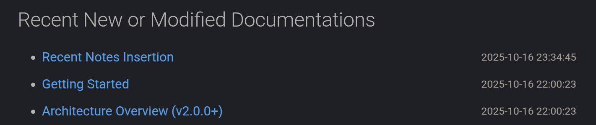

# Recent Notes Insertion



Mkdocs Note support inserting the links which refer to the recent new or modified documentations to the marked placeholder which can be configured in `mkdocs.yml` as below.

## Setup Where to Insert

The first step is to configure where to insert the link(s) of recent new or modified documentations.

### Marker

To setup the markers to mark the placeholder where to insert the links of recent, you can configure the `recent_notes_config` option in `mkdocs.yml` as follows:

```yaml
plugins:
  - mkdocs-note:
      recent_notes_config:
        insert_marker: "<!-- recent_notes -->"
```

By default, the marker is `<!-- recent_notes -->`.

In the index file which under the notes root directory, you should add the marker as follows in where you want to insert the links if you use the default marker we have just talk about above:

```markdown
---
date: xxxx-xx-xx xx:xx:xx
title: My Documentation
permalink: 
publish: true
---

# My Documentation

## Recent Updates

<!-- recent_notes -->
```

## Max Number of Documentations to Insert

You can configure the maximum number of notes to insert by setting the `insert_num` option in `mkdocs.yml` as follows:

```yaml
plugins:
  - mkdocs-note:
      recent_notes_config:
        insert_num: 10
```

In the case of default, the maximum number of notes to insert is 10.
